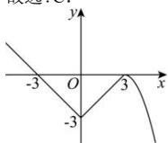

> [!faq]- 全练一本通解析
>
> > [!success]- **【答案】** C
>
> > [!note]- **【分析】**
> > 本题未单列分析。
>
> > [!note]- **【解析】**
> > 解析:由题可得, $f(3)=f(-3)=0$ , $f(x)$ 在 $(-∞,0),(3,+∞)$ 上单调递减，在 $(0,3)$ 上单调递增，则据此可作出函数 $f(x)$ 大致图象如图所示，
> > 令 $f(x)=t$ ，则由题意可得 $t^{2}-at+2=0$ 有2个不同的实数解 $t_{1},t_{2}$ ，且 $t_{1},t_{2}\in(-3,0)$ 则 $\left\{\begin{aligned}\Delta=a^{2}-8>0\\ -6<t_{1}+t_{2}=a<0\\ t_{1}t_{2}=2>0\\ (t_{1}+3)(t_{2}+3)\end{aligned}\right.\Rightarrow-\frac{11}{3}<a<-2\sqrt{2}$ ，观察选项可知，a=-3 满
> > 足题意.
> > 故选:C.
> > 
