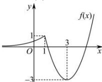

> [!faq]- 全练一本通解析
>
> > [!success]- **【答案】** $\left(0,\frac{1}{3}\right]$
>
> > [!note]- **【分析】**
> > 本题未单列分析。
>
> > [!note]- **【解析】**
> > $F(x)$ 有 5 个零点等价于 $\left[f(x)\right]^{2}-2af(x)+3a-1=0$ 有 5 个不等实根；
> > 作出 $f(x)$ 图象如下图所示，
> > 
> > 设 $f(x) = t$ ，则 $t^2 - 2at + 3a - 1 = 0$ 有两个不等实根， $\therefore \Delta = 4a^2 - 4(3a - 1) > 0$ ；记 $t^2 - 2at + 3a - 1 = 0$ 的两根为 $t_1, t_2$ ， $\therefore \left\{ \begin{array}{l} t_1 = 1 \\ 0 < t_2 < 1 \end{array} \right.$ 或 $\left\{ \begin{array}{l} -3 < t_1 \leq 0 \\ 0 < t_2 < 1 \end{array} \right.$ ；当 $t_1 = 1$ 时， $1 - 2a + 3a - 1 = 0$ ，解得： $a = 0$ ，此时 $t_2 = -1$ ，不满足 $0 < t_2 < 1$ ；
> > 当 $\left\{ \begin{array}{l} -3 < t_1 \leq 0 \\ 0 < t_2 < 1 \end{array} \right.$ 时， $\left\{ \begin{array}{l} 9 + 6a + 3a - 1 > 0 \\ 3a - 1 \leq 0 \\ 1 - 2a + 3a - 1 > 0 \\ \Delta > 0 \end{array} \right.$ ，解得： $0 < a \leq \frac{1}{3}$ ；综上所述：实数 $a$ 的取值范围为 $\left(0, \frac{1}{3}\right]$ . 故答案为： $\left(0, \frac{1}{3}\right]$ .
