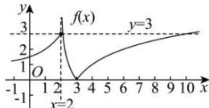

> [!faq]- 全练一本通解析
>
> > [!success]- **【答案】** A
>
> > [!note]- **【分析】**
> > 本题未单列分析。
>
> > [!note]- **【解析】**
> > 解析:作函数 $f(x)$ 的图象如下:
> > 
> > 由函数图象可知：要使关于 $x$ 的方程 $f^2 (x) - (a + 3)f(x) - a = 0$ 有6个不同的实数根，设 $f(x) = t$ ，则关于 $t$ 的方程 $t^2 -(a + 3)t - a = 0$ 在 $(1,3]$ 有两个不同的实数根，因此 $\left\{ \begin{array}{l} \left[-(a + 3)\right]^2 -4\times 1\times (-a) > 0\\ 1 <   \frac{a + 3}{2} <  3\\ 1 - (a + 3) - a > 0\\ 9 - 3(a + 3) - a\geq 0 \end{array} \right.$ ，解得 $a\in \emptyset$ ，
> > 所以实数 $a$ 的取值范围为 $\varnothing$ .
> >
> > 故选 **A**.
