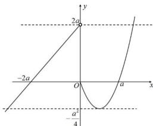

> [!faq]- 全练一本通解析
>
> > [!success]- **【答案】** D
>
> > [!note]- **【分析】**
> > 本题未单列分析。
>
> > [!note]- **【解析】**
> > D解析：若 $a\leq 0$ ，当 $x < 0$ 时， $f(x) = x + 2a < 0$ 恒成立；当 $x\geq 0$ 时，由 $f(x) = x^{2} - ax = x(x - a) = 0$ 得 $x = 0$ ；即 $f(x) = 0$ 仅有 $x = 0$ 一个根；所以由 $f(f(x)) = 0$ 可得 $f(x) = 0$ ，则 $x = 0$ ；即方程 $f(f(x)) = 0$ 仅有一个实根；故不满足 $f(f(x)) = 0$ 有8个不同的实根；若 $a > 0$ 时，画出 $f(x) = \left\{ \begin{array}{ll}x + 2a, & x <   0\\ x^2 -ax, & x\geq 0 \end{array} \right.$ 的大致图象如下，
> > 
> > 由 $f(f(x)) = 0$ 可得 $f_{1}(x) = -2a$ ， $f_{2}(x) = 0$ ， $f_{3}(x) = a$ 又 $f(f(x)) = 0$ 有8个不同的实根，由图象可得， $f_{2}(x) = 0$ 显然有三个根， $f_{3}(x) = a$ 显然有两个根，所以 $f_{1}(x) = -2a$ 必有三个根，而 $-2a <   0$ ， $y = x^{2} - ax = \left(x - \frac{a}{2}\right)^{2} - \frac{a^{2}}{4}\geq -\frac{a^{2}}{4},$ 为使 $f_{1}(x) = -2a$ 有三个根，只需 $-2a > - \frac{a^2}{4}$ ，解得 $a > 8$ ；综上可知， $a > 8$ 故ABC选项都不可能，只有D选项可能.
> >
> > 故选 **D**.
