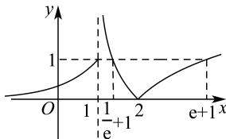

> [!faq]- 全练一本通解析
>
> > [!success]- **【答案】** $\left(-\infty , - \frac{1}{3}\right)$
>
> > [!note]- **【分析】**
> > 本题未单列分析。
>
> > [!note]- **【解析】**
> > 由函数解析式可得如下图象草图，
> > 
> > 令 $t = f(x)$ ，则 t > 1， $f(x)$ 有两个零点； $0 < t \leq 1$ ， $f(x)$ 有三个零点；
> > t=0, f(x)有一个零点；t<0, f(x)有没有零点；
> > 则 $F(x)=g(t)=t^{2}-2at+\frac{3a+1}{2}$ ，若 $\Delta=4a^{2}-2(3a+1)=0$ 可得
> > $a=\frac{3+\sqrt{17}}{4}>1$ 或 $a=\frac{3-\sqrt{17}}{4}<0$ 当 $a<\frac{3-\sqrt{17}}{4}$ 或 $a>\frac{3+\sqrt{17}}{4}$ 时 $\Delta>0$ ，即 $g(t)$ 有两个零点 $t_{1}, t_{2}$ 且 $t_{1}<t_{2}$ ，
> > 对称轴 t=a，
> > 要使 $F(x)$ 有3个不同的零点，有如下情况： $t_{1}<0<t_{2}\leq1$ ，则 $a<\frac{3-\sqrt{17}}{4}$ 且 $\left\{\begin{aligned}&g(0)=\frac{3a+1}{2}<0\\ &g(1)=\frac{3-a}{2}\geq0\end{aligned}\right.$ ，可得 $a<-\frac{1}{3}$ ; $t_{1}=0<1<t_{2}$ ，则 $a>\frac{3+\sqrt{17}}{4}$ 且 $g(0)=\frac{3a+1}{2}=0$ ，无解；
> > 当 $a=\frac{3\pm\sqrt{17}}{4}$ 时 $\Delta=0$ ，即 $g(t)$ 有且仅有一个零点，对称轴 t=a，
> > 此时， $t=f(x)=a$ ，即 $F(x)$ 无零点或两个零点，不合题意；
> > 当 $\frac{3-\sqrt{17}}{4}<a<\frac{3+\sqrt{17}}{4}$ 时 $\Delta<0,F(x)$ 无零点，不合题意；
> > 综上, $F(x)$ 有3个不同的零点，则 $a\in\left(-\infty,-\frac{1}{3}\right)$ .
> > 故答案为： $\left(-\infty,-\frac{1}{3}\right)$
