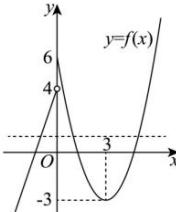

> [!faq]- 全练一本通解析
>
> > [!success]- **【答案】** B
>
> > [!note]- **【分析】**
> > 本题未单列分析。
>
> > [!note]- **【解析】**
> > 解析:由解析式,可得如下 $f(x)$ 图象,
> > 
> > 令 $f(x_{1}) = f(x_{2}) = f(x_{3}) = k$ ，要满足题设，则 $-3 < k < 4$ 若 $x_{1} < x_{2} < x_{3}$ ，则 $x_{2} + x_{3} = 6$ ，令 $3x + 4 = -3$ ，则 $x = -\frac{7}{3}$ 故 $-\frac{7}{3} < x_{1} < 0$ 综上， $x_{1} + x_{2} + x_{3}$ 范围是 $\left(\frac{11}{3}, 6\right)$ .
> >
> > 故选 **B**
