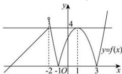
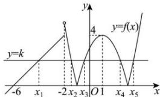

> [!faq]- 全练一本通解析
>
> > [!success]- **【答案】** 4 (-2,2)
>
> > [!note]- **【分析】**
> > 本题未单列分析。
>
> > [!note]- **【解析】**
> > 作出 $f(x)=\left\{\begin{aligned}&\left|x^{2}-2x-3\right|,x>-2,\\&x+6,x\leq-2,\end{aligned}\right.$ 的图象如下,
> > 
> > 因为直线 y=m 与 $f(x)$ 的图象有 4 个交点，所以 m=4；
> > 记 $f(x_{1}) = f(x_{2}) = f(x_{3}) = f(x_{4}) = f(x_{5}) = k$ 则直线 y = k 与 $f(x)$ 的图象有 5 个交点， $x_{1} < x_{2} < x_{3} < x_{4} < x_{5}$ ，如图所示：
> > 
> > 由图可知， $-6<x_{1}<-2$ ，由二次函数的对称关系可得， $x_{3}+x_{4}=x_{2}+x_{5}=2$ 所以 $x_{1} + x_{2} + x_{3} + x_{4} + x_{5} = x_{1} + 4 \in (-2, 2)$ ，即 $x_{1} + x_{2} + x_{3} + x_{4} + x_{5}$ 的取值范围是 $(-2, 2)$ . 故答案为: 4; $(-2, 2)$ .
