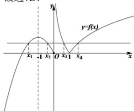

> [!faq]- 全练一本通解析
>
> > [!success]- **【答案】** D
>
> > [!note]- **【分析】**
> > 本题未单列分析。
>
> > [!note]- **【解析】**
> > 解析: 函数 $f(x)=\left\{\begin{aligned}-x^{2}-2x,&x\leq0\\|\log_{2}x|,&x>0\end{aligned}\right.$ 的图象如右图所示,
> > 函数 $y=-x^{2}-2x$ 的图象关于直线 x=-1 对称，则 $x_{1}+x_{2}=-2$ ，故①错误；
> > 由 $f(x_{3})=f(x_{4})$ 得 $\left|\log_{2}x_{3}\right|=\left|\log_{2}x_{4}\right|$ ，∴ $-\log_{2}x_{3}=\log_{2}x_{4}$ 则 $\log_{2}(x_{3}x_{4})=0,\therefore x_{3}x_{4}=1$ ，故②正确；
> > 设 $f(x_{1})=f(x_{2})=f(x_{3})=f(x_{4})=k$ ，由 $y=-x^{2}-2x\leq1$ 所以 0<k<1，由 $\log_{2}x=-1$ 得 $x=\frac{1}{2}$ ，则 $\frac{1}{2}<x_{3}<1$ ∵ $x_{1} + x_{2} + x_{3} + x_{4} = -2 + x_{3} + x_{4} = x_{3} + \frac{1}{x_{3}} - 2$ ∴ $x_{1} + x_{2} + x_{3} + x_{4} = x_{3} + \frac{1}{x_{3}} - 2 \in \left(0, \frac{1}{2}\right)$ ，故③正确；
> > 由 $y=-x^{2}-2x$ 的对称轴方程为 x=-1，由图可知 $x_{1}\in(-2,-1)$ 又 $x_{1}x_{2}x_{3}x_{4}=x_{1}x_{2}=x_{1}(-2-x_{1})=-x_{1}^{2}-2x_{1}$ ∴ $x_{1}x_{2}x_{3}x_{4}=-x_{1}^{2}-2x_{1}\in(0,1)$ ，故④正确.
> > 故选:D.
> > 
