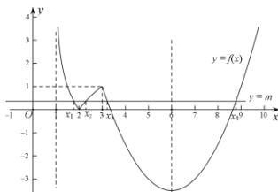

> [!faq]- 全练一本通解析
>
> > [!success]- **【答案】** BCD
>
> > [!note]- **【分析】**
> > 本题未单列分析。
>
> > [!note]- **【解析】**
> > 解析:作出函数 $f(x)$ 的图象, 方程 $f(x)=m$ 有四个不同的实根, 即函数 $y=f(x)$ 与 y=m 有四个不同的交点, 如图所示:
> > 
> > 依题意 $|\log_2(x_1 - 1)| = |\log_2(x_2 - 1)|$ ，且 $1 < x_{1} < 2 < x_{2} < 3$ 依题意 $|\log_2(x_1 - 1)| = |\log_2(x_2 - 1)|$ ，且 $1 < x_1 < 2 < x_2 < 3$ ，
> > 所以 $\log_2(x_1 - 1) = -\log_2(x_2 - 1)$ ，即 $\log_2(x_1 - 1) + \log_2(x_2 - 1) = 0$ ，
> > 所以 $\log_2[(x_1 - 1)(x_2 - 1)] = 0$ ，即 $(x_1 - 1)(x_2 - 1) = 1$ ，
> > 所以 $x_1 + x_2 = x_1x_2$ ，所以 $\frac{1}{x_1} + \frac{1}{x_2} = 1$ ，故选项 $A$ 错误，选项 $B$ 正确；
> > 又 $x_3$ ， $x_4$ 是方程 $\frac{1}{2} x^2 - 6x + \frac{29}{2} = m (0 < m < 1)$ 的两根，
> > 即 $x_3$ ， $x_4$ 是方程 $x^2 - 12x + 29 - 2m = 0$ 的两根，
> > 所以 $x_3 + x_4 = 12$ ， $x_3x_4 = 29 - 2m$ ，
> > 因为方程 $f(x) = m$ 有四个不同的实根，所以由图可知 $m \in (0,1)$ ，
> > 所以 $x_3x_4 = 29 - 2m \in (27.29)$ ，故选项 $C$ ，选项 $D$ 均正确。
> >
> > 故选 **BCD**。
