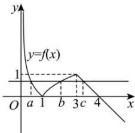

> [!faq]- 全练一本通解析
>
> > [!success]- **【答案】** $\left(0, \frac{1}{3}\right)$
>
> > [!note]- **【分析】**
> > 本题未单列分析。
>
> > [!note]- **【解析】**
> > 作出函数 $f(x)$ 的图象如图,
> > 
> > 故 $-\log_3 a = \log_3 b = -c + 4 \in (0,1)$
> > ∴ ab = 1, 0 < -c + 4 < 1，则 3 < c < 4，∴ abc = c。
> > 所以 $\frac{f(a)f(c)}{abc}=\frac{f(c)f(c)}{c}=\frac{(4-c)^{2}}{c}=\frac{16}{c}+c-8$ 由于函数 $y=c+\frac{16}{c}$ 在 $(3,4)$ 上单调递减，
> > 所以 $\frac{16}{c} + c - 8 \in \left( \frac{16}{4} + 4 - 8, \frac{16}{3} + 3 - 8 \right)$ ，故 $\frac{f(a)f(c)}{abc} \in \left(0, \frac{1}{3}\right)$ ，
> > 故答案为： $\left(0,\frac{1}{3}\right)$ .
