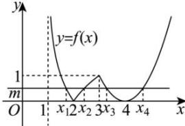

> [!faq]- 全练一本通解析
>
> > [!success]- **【答案】** BD
>
> > [!note]- **【分析】**
> > 本题未单列分析。
>
> > [!note]- **【解析】**
> > 解析:如图:
> > 
> > 由图象可知, 若方程 $f(x)=m$ 有 4 个不同的解, 须有 0<m<1, 故 A 错误; 当 0<m<1 时, 方程 $f(x)=m$ 有 4 个不同的解, 且 $x_{1}<x_{2}<x_{3}<x_{4}$ .
> > 所以 $1 < x_{1} < 2 < x_{2} < 3$ , 且 $-\log_{2}(x_{1}-1)=\log_{2}(x_{2}-1)\Rightarrow\frac{1}{x_{1}-1}=x_{2}-1\Rightarrow(x_{1}-1)(x_{2}-1)=1\Rightarrow$ $x_{1}+x_{2}=x_{1}x_{2}$ ，故 B 正确；
> > 又 $3 < x_{3} < 4 < x_{4} < 5$ ，且 $x_{3}, x_{4}$ 关于直线 x=4 对称，所以 $x_{3} + x_{4} = 8$ ，故 C 错误；
> > 由 $x_{1} + x_{2} = x_{1}x_{2} \Rightarrow \frac{1}{x_{1}} + \frac{1}{x_{2}} = 1$ ，又 $x_{3} + x_{4} = 8$ 。所以 $\left(\frac{1}{x_{1}}+\frac{1}{x_{2}}\right)(x_{3}+x_{4})=8$ ，故 D 正确。
> >
> > 故选 **BD**
