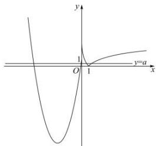
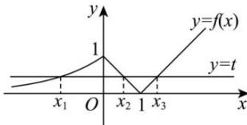

> [!faq]- 全练一本通解析
>
> > [!success]- **【答案】** ABD
>
> > [!note]- **【分析】**
> > 本题未单列分析。
>
> > [!note]- **【解析】**
> > (0,99]
> > 解析:函数 $f(x)$ 图象如图所示:
> > 
> > ∵关于 x 的方程 $f(x)=a(a\in R)$ 有四个实数解，
> > ∴函数 $y=f(x)$ 的图象与直线 y=a 有四个交点, 交点的横坐标分别为 $x_{1}$ , $x_{2}$ , $x_{3}$ , $x_{4}$ , 且 $x_{1}<x_{2}<x_{3}<x_{4}$ , $0<a\leq1$
> > $$
> > x \leq 0
> > $$
> > $$
> > y = x ^ {2} + 1 0 x + 1
> > $$
> > $$
> > \therefore x _ {1} + x _ {2} = - 1 0
> > $$
> > $$
> > x > 0
> > $$
> > $$
> > \left| \lg x _ {3} \right| = \left| \lg x _ {4} \right| = a
> > $$
> > $$
> > 0 <   x _ {3} <   1, x _ {4} > 1
> > $$
> > $$
> > \left| \lg x _ {4} \right| = \lg x _ {4}
> > $$
> > $$
> > \therefore - \lg x _ {3} = \lg x _ {4} = a
> > $$
> > $$
> > \therefore \lg x _ {3} + \lg x _ {4} = 0, \therefore \lg \left(x _ {3} x _ {4}\right) = 0, x _ {3} x _ {4} = 1, x _ {4} = \frac {1}{x _ {3}},
> > $$
> > $$
> > \therefore \left(x _ {1} + x _ {2}\right) \left(x _ {3} - x _ {4}\right) = - 1 0 \left(x _ {3} - \frac {1}{x _ {3}}\right)
> > $$
> > 又∵ $0 < a \leq 1$ ，∴ $0 < -\lg x_{3} \leq 1$ ，∴ $\frac{1}{10} \leq x_{3} < 1$ 。
> > 令 $g(x) = -10\left(x - \frac{1}{x}\right)$ ，当 $x \in \left[\frac{1}{10}, 1\right)$ 时，函数 $g(x)$ 单调递减，
> > $$
> > \therefore g (1) <   g \left(x _ {3}\right) \leq g \left(\frac {1}{1 0}\right)
> > $$
> > $$
> > 0 <   - 1 0 \left(x _ {3} - \frac {1}{x _ {3}}\right) \leq 9 9
> > $$
> > $$
> > \therefore \left(x _ {1} + x _ {2}\right) \left(x _ {3} - x _ {4}\right) \in (0, 9 9 ]
> > $$
> > $$
> > (0, 9 9 ]
> > $$
> > 解析: 当 x<0 时, 函数 $y=2^{x}$ 单调递增, 函数值集合为 $(0,1)$ ,
> > 当 $0 \leq x \leq 1$ 时, 函数 y = 1 - x 单调递减, 函数值集合为 [0,1],
> > 当 $x \geq 1$ 时, 函数 y = x - 1 单调递增, 函数值集合为 $[0, +\infty)$ ,
> > 令 $f(x_{1}) = f(x_{2}) = f(x_{3}) = t,\quad x_{1} < x_{2} < x_{3}$ ，因此函数 $y = f(x)$ 的图象及直线
> > y=t 有 3 个交点, 显然 0<t<1,
> > 作出函数 $y = f(x)$ 的图象与直线 $y = t$ ，如图，
> > 
> > 观察图象知， $x_{1} <   0 <   x_{2} <   1 <   x_{3}$ ，B正确；
> > 由 $1 - x_{2} = t = x_{3} - 1$ ，得 $x_{2} + x_{3} = 2$ ，A正确；
> > 当 $x_{1} = -2$ 时， $t = \frac{1}{4}$ ，由 $1 - x_{2} = \frac{1}{4} = x_{3} - 1$ ，得 $x_{2} = \frac{3}{4},x_{3} = \frac{5}{4}$ ，此时 $\left|x_1\right|$ 最大，C错误；
> > 显然 $x_{2}f(x_{1}) = x_{2}f(x_{2}) = x_{2}(1 - x_{2}) = -(x_{2} - \frac{1}{2})^{2} + \frac{1}{4}\in (0,\frac{1}{4}),\mathrm{D}$ 正确.
> >
> > 故选 **ABD**
