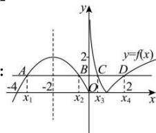

> [!faq]- 全练一本通解析
>
> > [!success]- **【答案】** BC
>
> > [!note]- **【分析】**
> > 本题未单列分析。
>
> > [!note]- **【解析】**
> > 
> > 作出函数 $f(x) = \left\{ \begin{array}{l} -\frac{1}{2} x^2 - 2x, x \leq 0 \\ |\log_2 x|, x0 \end{array} \right.$ 的图像如图.
> > 对于选项A,根据二次函数的对称性知， $x_1 + x_2 = 2 \times (-2) = -4$ ，故A项错误；
> > 对于选项B,因 $x_1 < x_2 < 0$ ，由上述分析知 $x_1 + x_2 = -4$ ，则 $0 < x_1 x_2 = (-x_1) \cdot (-x_2) \leq \left(\frac{-x_1 - x_2}{2}\right)^2 = 4$ ，
> > 因 $x_1 \neq x_2$ ，故有 $0 < x_1 x_2 < 4$ ，即B项正确；
> > 对于选项C,如图,因 $x \leq 0$ 时， $f(x) = -\frac{1}{2} x^2 - 2x = -\frac{1}{2}(x + 2)^2 + 2 \leq 2$ ， $x > 0$ 时， $f(x) = |\log_2 x|$ ，
> > 依题意须使 $0 < |\log_2 x| < 2$ ，由 $|\log_2 x| > 0$ 得 $x \neq 1$ ，由 $|\log_2 x| < 2$ 解得： $\frac{1}{4} < x < 4$ ，故有 $\frac{1}{4} < x_3 < 1, 1 < x_4 < 4$ ，即C项正确；
> > 对于选项D,由图知 $-\log_2 x_3 = \log_2 x_4$ ，可得 $x_3 x_4 = 1$ ，故 $x_4 = \frac{1}{x_3}$ ，则 $x_3 + 2x_4 = x_3 + \frac{2}{x_3}$ ， $\frac{1}{4} < x_3 < 1$ ，
> > 不妨设 $y = x + \frac{2}{x}, x \in (\frac{1}{4}, 1)$ ，显然函数 $y = x + \frac{2}{x}$ 在 $(\frac{1}{4}, 1)$ 上单调递减，故 $3 < x + \frac{2}{x} < \frac{33}{4}$ ，即 $x_3 + 2x_4$ 的取值范围是 $(3, \frac{33}{4})$ ，故D项错误.
> >
> > 故选 **BC**.
