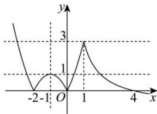

> [!faq]- 全练一本通解析
>
> > [!success]- **【答案】** ABC
>
> > [!note]- **【分析】**
> > 本题未单列分析。
>
> > [!note]- **【解析】**
> > 解析:作出 $f(x)$ 的图象, 如图所示. 由图可知, $a \in (0,1)$ , A 正确.
> > 由对称性可得 $\frac{m+t}{2}=\frac{n+k}{2}=-1$ ，所以 $m+n+k+t=-4$ ，B 正确.
> > 令 $\frac{4}{x}-1=1$ ，解得 x=2，令 $\frac{4}{x}-1=0$ ，解得 x=4，
> > 则 $2<c<4, b=a(m+n+k+t+c)=a(c-4), a=\frac{4}{c}-1$ 则 $b=\left(\frac{4}{c}-1\right)(c-4)=8-c-\frac{16}{c}, c\in(2,4)$ ,
> > 因为函数 $y=c+\frac{16}{c}$ 在 $(2,4)$ 上单调递减，
> > 所以 $c+\frac{16}{c}\in(8,10)$ ，则 $b\in(-2,0)$ ，C 正确. $s=a(m+t+c)=(c-2)\left(\frac{4}{c}-1\right)=6-c-\frac{8}{c}, c+\frac{8}{c}\geq2\sqrt{c\cdot\frac{8}{c}}=4\sqrt{2}$ （当且仅当 $c=\frac{8}{c}=2\sqrt{2}$ 时，等号成立），
> > 因为 $6-4-\frac{8}{4}=0,6-2-\frac{8}{2}=0$ ，所以 $s\in(0,6-4\sqrt{2}]$ ，D 错误.
> > 
> >
> > 故选 **ABC**
