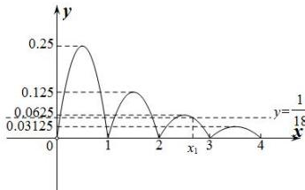

> [!faq]- 全练一本通解析
>
> > [!success]- **【答案】** B
>
> > [!note]- **【分析】**
> > 本题未单列分析。
>
> > [!note]- **【解析】**
> > 解析: 因为 $f(x+1)=\frac{1}{2}f(x)$ ，当 $x\in(0,1]$ 时， $f(x)=x(1-x)$ .
> > 所以当 $x \in (k, k + 1]$ ， $k \in N^{*}$ 时， $f(x)=\frac{1}{2}f(x-1)=\left(\frac{1}{2}\right)^{2}f(x-2)=\cdots=\left(\frac{1}{2}\right)^{k-1}f(x-k+1)=\left(\frac{1}{2}\right)^{k}f(x-k)$ 因为 $k < x \leq k + 1$ ，所以 $0 < x - k \leq 1$ ，所以 $f(x - k) = (x - k)(1 - x + k)$ ，
> > 所以当 $x \in (k, k + 1]$ ， $k \in N^{*}$ 时， $f(x)=\left(\frac{1}{2}\right)^{k}(x-k)(1-x+k)$ 当 $x \in (-2, -1]$ 时， $f(x)=2f(x+1)=-2\times2(x+1)\left[(x+1)+1\right]=-4(x+1)(x+2)$ 又 $f\left(\frac{1}{2}\right)=\frac{1}{4}$ ，且对任意 $x \in [m, +\infty)$ ，都有 $f(x) \leq \frac{1}{18}$ ，所以 $m > \frac{1}{2}$ ，
> > 作出函数 $f(x)$ 在 $(0, +\infty)$ 上的图象，
> > 
> > 要使 $f(x) \leq \frac{1}{18}$ , 则需 $x \geq x_1$ , 其中 $2.5 < x_1 < 3$ , $f(x_1) = \frac{1}{18}$ , 所以 $\frac{1}{4}(x_1 - 2)(3 - x_1) = \frac{1}{18}$ , 解得 $x_1 = \frac{8}{3}$ , 所以 $m \geq \frac{8}{3}$ ,
> >
> > 故选 **B**.
