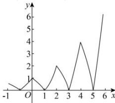

> [!faq]- 全练一本通解析
>
> > [!success]- **【答案】** ABC
>
> > [!note]- **【分析】**
> > 本题未单列分析。
>
> > [!note]- **【解析】**
> > 解析: 当 $x \in [0,2]$ 时, $f(x) = |2^x - 2|$ , 则在 $x \in [0,1)$ , $f(x)$ 单调递减, $x \in [1,2]$ , $f(x)$ 单调递增, 此时 $f(x) \in [0,2]$ .
> > 由定义在 R 上的函数 $f(x)$ 满足 $f(x + 2) = 2f(x)$ 得, $f(x)$ 在 $[0,2]$ 的图象向右移动 $2k(k \in \mathbf{N}^*)$ 个单位时, 图象纵坐标拉伸为原来的 $2^k$ 倍, 对应值域为 $[0,2^k]$ ;
> > 向左移动 $2k(k \in \mathbf{N}^*)$ 个单位时, 图象纵坐标压缩为原来的 $\frac{1}{2^k}$ 倍, 对应值域为 $[0, \frac{1}{2^k}]$ .
> > 图象如图所示
> > 
> > 若对任 $x \in (-\infty, m]$ 都有 $f(x) \leq 6$ ，由 $2^2 < 6 < 2^3$ 及图象可得 $f(m_{\max}) = 6$ ， $m_{\max} \in [4, 6]$ ，又当 $x \in [4, 6]$ 时， $f(x) = 4 \left| 2^{x-4} - 2 \right|$ ，故有 $f(m_{\max}) = 4 \left| 2^{m_{\max}-4} - 2 \right| = 6 \Rightarrow m_{\max} = 4 + \log_2 \frac{7}{2}$ ，故实数 $m$ 的取值范围为 $\left(-\infty, 4 + \log_2 \frac{7}{2}\right]$ .
> >
> > 故选 **ABC**.
