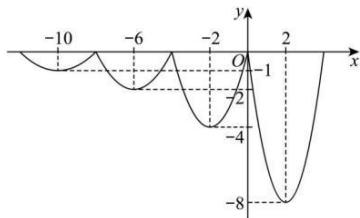

> [!faq]- 全练一本通解析
>
> > [!success]- **【答案】** $(- \infty, -7]$
>
> > [!note]- **【分析】**
> > 本题未单列分析。
>
> > [!note]- **【解析】**
> > 依题意，当 $x \in (0, 4]$ 时， $f(x) = 2x^2 - 8x$ ， $f(x)$ 的定义域为 $\mathbf{R}$ ，且 $f(x+4) = 2f(x)$ ，
> > 所以 $f(x)=2f(x-4)$ ，即：从左向右，从区间 $(0,4]$ 开始，每隔 4 个单位长度，
> > 纵坐标放大为原来的 2 倍.
> > 同时 $f(x)=\frac{1}{2}f(x+4)$ ，即：从右向左，从区间 $(0,4]$ 开始，每隔 4 个单位长度，
> > 纵坐标缩小为原来的 $\frac{1}{2}$ 倍.
> > 由此画出 $f(x)$ 的图象如下图所示.
> > 当 $x \in (-8, -4]$ 时， $x + 4 \in (-4, 0], x + 8 \in (0, 4]$ ,
> > 所以此时 $f(x)=\frac{1}{2}f(x+4)=\frac{1}{2}\left[\frac{1}{2}f(x+8)\right]=\frac{1}{4}f(x+8)$ $=\frac{1}{4}\times\left[2(x+8)^{2}-8(x+8)\right]=\frac{1}{2}(x^{2}+12x+32)=\frac{1}{2}(x+6)^{2}-2.$ 由 $\left\{\begin{aligned}\frac{1}{2}\left(x^{2}+12x+32\right)&=-\frac{3}{2}\\ x&<-6\end{aligned}\right.$ 解得 x=-7，
> > 由图可知，当 $t \leq -7$ 时，对于 $\forall x \in (-\infty, t]$ ，都有 $f(x) \geq -\frac{3}{2}$ ，
> > 所以 t 的取值范围是 $(-∞,-7]$ .
> > 故答案为： $(-∞,-7]$
> > 
