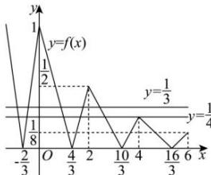
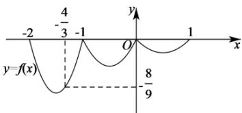

> [!faq]- 全练一本通解析
>
> > [!success]- **【答案】** D
>
> > [!note]- **【分析】**
> > 本题未单列分析。
>
> > [!note]- **【解析】**
> > 解析: 函数 $f(x)$ 的部分图象如图所示.
> > 由方程 $12\left[f(x)\right]^{2}-7f(x)+1=0$ ，解得 $f(x)=\frac{1}{3}$ 或 $f(x)=\frac{1}{4}$ .
> > 当 $f(x)=\frac{1}{3}$ 时，有 5 个实根，当 $f(x)=\frac{1}{4}$ 时，有 6 个实根，
> > 故方程 $12\left[f(x)\right]^{2}-7f(x)+1=0$ 的实根个数为 11. 故选：C.
> > 
> > 解析: 因为函数 $f(x)$ 的定义域是 R，满足 $2f(x+1)=f(x)$ ，则 $f(x+1)=\frac{1}{2}f(x)$ ，
> > 且当 $x \in (0,1]$ 时， $f(x) = x(x-1) = \left( x - \frac{1}{2} \right)^2 - \frac{1}{4} \in \left[ -\frac{1}{4}, 0 \right]$ ，
> > 当 $x \in (-1,0]$ 时， $0 < x + 1 \leq 1$ ，则 $f(x) = 2f(x + 1) \in \left[-\frac{1}{2}, 0\right]$ ，
> > 当 $x \in (-2, -1]$ 时， $-1 < x + 1 \leq 0$ ，则 $f(x) = 2f(x + 1) \in [-1,0]$ ，
> > 且当 $x \in (-2, -1]$ 时， $0 < x + 2 \leq 1$ ，
> > 则 $f(x)=2f(x+1)=4f(x+2)=4(x+2)(x+1)$ 令 $f(x)=4(x+1)(x+2)=-\frac{8}{9}$ ，解得 $x=-\frac{4}{3}$ 或 $x=-\frac{5}{3}$ ，如下图所示：
> > 
> > 因为对任意 $x \in [m, +\infty)$ ，都有 $f(x) \geq -\frac{8}{9}$ ，由图可知， $m \geq -\frac{4}{3}$ ，因此，实数 $m$ 的取值范围是 $\left[-\frac{4}{3}, +\infty\right)$ .
> >
> > 故选 **D**.
