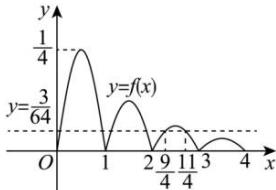

> [!faq]- 全练一本通解析
>
> > [!success]- **【答案】** $\left(-\infty, \frac{11}{4}\right]$
>
> > [!note]- **【分析】**
> > 本题未单列分析。
>
> > [!note]- **【解析】**
> > 根据 $f(x + 1) = \frac{1}{2} f(x)$ ，可知 $f(x) = \frac{1}{2} f(x - 1)$ ，当 $x \in (0,1]$ 时， $f(x) = x(1 - x) \in \left[0, \frac{1}{4}\right]$ ，当 $x \in (1,2]$ 时， $x - 1 \in (0,1]$ ，所以 $f(x) = \frac{1}{2} f(x - 1) = \frac{1}{2}(x - 1)(2 - x) \in \left[0, \frac{1}{8}\right]$ ，当 $x \in (2,3]$ 时， $x - 1 \in (1,2]$ ，所以 $f(x) = \frac{1}{2} f(x - 1) = \frac{1}{4}(x - 2)(3 - x) \in \left[0, \frac{1}{16}\right]$ ，当 $x \in (3,4]$ 时， $x - 1 \in (2,3]$ ，所以 $f(x) = \frac{1}{2} f(x - 1) = \frac{1}{8}(x - 3)(4 - x) \in \left[0, \frac{1}{32}\right]$ ，此时 $f(x) < \frac{3}{64}$ 恒成立. 画出局部函数图象如图所示：当 $x \in (2,3]$ 时， $\frac{1}{4}(x - 2)(3 - x) = \frac{3}{64}$ ，解得： $x = \frac{9}{4}$ ，或 $x = \frac{11}{4}$ ，要存在 $x \in [m, +\infty)$ ，使得 $f(x) = \frac{3}{64}$ 有解，只需 $m \leq \frac{11}{4}$ ，故答案为： $\left(-\infty, \frac{11}{4}\right]$ .
> > 
