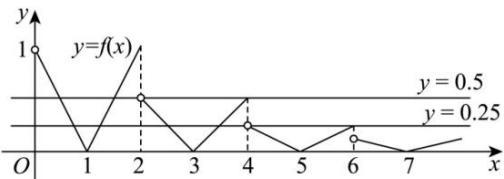

> [!faq]- 全练一本通解析
>
> > [!success]- **【答案】** 16
>
> > [!note]- **【分析】**
> > 本题未单列分析。
>
> > [!note]- **【解析】**
> > 由 $g(x)=0$ ,即 $[2f(x)-1][4f(x)-1]=0$ ,得 $f(x)=\frac{1}{2}$ 或 $f(x)=\frac{1}{4}$ ,
> > 则函数 $y=g(x)$ 的零点,即函数 $y=f(x)$ 的图象与直线 $y=\frac{1}{2}$ 和 $y=\frac{1}{4}$ 的交点横坐标,
> > 而 $f(x)$ 是 $(-∞,0)∪(0,+∞)$ 上的偶函数,于是只需求出当x>0时
> > $y=f(x)$ 的图象与直线 $y=\frac{1}{2}$ 和 $y=\frac{1}{4}$ 的交点个数，
> > 当 $0 < x \leq 2$ 时， $f(x) = |x - 1| \in [0,1]$ ，
> > 当 $2 < x \leq 4$ ，即 $0 < x - 2 \leq 2$ 时， $f(x) = \frac{1}{2} f(x - 2) = \frac{1}{2} |x - 3| \in [0, \frac{1}{2}]$ ，
> > 当 $4 < x \leq 6$ ，即 $2 < x - 2 \leq 4$ 时， $f(x) = \frac{1}{2} f(x - 2) = \frac{1}{4} |x - 5| \in [0, \frac{1}{4}]$ ，
> > 当 $6 < x \leq 8$ ，即 $4 < x - 2 \leq 6$ 时， $f(x) = \frac{1}{2} f(x - 2) = \frac{1}{8} |x - 7| \in [0, \frac{1}{8}]$ ，
> > 显然当 $x > 6$ 时， $0 \leq f(x) \leq \frac{1}{8}$ ，作出函数 $y = f(x)$ 在(0,8]上的图象及直线 $y = \frac{1}{2}$ 和 $y = \frac{1}{4}$ ，如图，
> > 
> > 观察图象知, 函数 $y = f(x)$ 的图象与直线 $y = \frac{1}{2}$ 有 3 个交点, 与直线 $y = \frac{1}{4}$ 有 5 个交点,
> > 因此当 $x > 0$ 时， $y = f(x)$ 的图象与直线 $y = \frac{1}{2}$ 和 $y = \frac{1}{4}$ 的交点共有8个，则偶函数 $y = f(x)$ 在 $(- \infty, 0) \cup (0, +\infty)$ 的图象与直线 $y = \frac{1}{2}$ 和 $y = \frac{1}{4}$ 的交点共有16个，所以函数 $g(x) = 8(f(x))^2 - 6f(x) + 1$ 的零点个数为16. 故答案为：16
