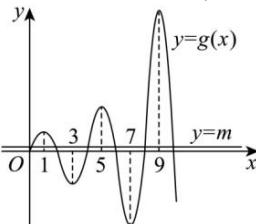

> [!faq]- 全练一本通解析
>
> > [!success]- **【答案】** 38
>
> > [!note]- **【分析】**
> > 本题未单列分析。
>
> > [!note]- **【解析】**
> > 由 $f(x)+x^{2}$ 是奇函数, $f(x)-2x$ 是偶函数, 可得
> > $$
> > \left\{ \begin{array}{l} f (- x) + x ^ {2} = - f (x) - x ^ {2} \\ f (- x) + 2 x = f (x) - 2 x \end{array} \right.,
> > $$
> > 解得 $f(x)=-x^{2}+2x$
> > 如图, 作出函数 $g(x) = \begin{cases} -x^2 + 2x, & 0 \leq x \leq 2 \\ -2g(x - 2), & x > 2 \end{cases}$ 的部分图象和直线 $y = m$ .
> > 
> > 设 $g(x) = m$ 的实数根从小到大依次为 $x_{1}, x_{2}, x_{3}, x_{4}, \ldots, x_{2n}$
> > 则数形结合可得
> > $x_{1} + x_{2} = 2$ ， $x_{3} + x_{4} = 10$ ， $x_{5} + x_{6} = 18$ ，…， $x_{2n - 1} + x_{2n} = 8n - 6$
> > 所以 $2+10+18+\cdots+(8n-6)=380$ ，解得 n=10，
> > 故答案为:38.
> > 结合图象可得 k 的最小值为 $(8 \times 10 - 6) \div 2 + 1 = 38$ .
