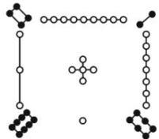

<!-- question-source:start -->
【23】（2022·高二单元测试）洛书，古称龟书，是阴阳五行术数之源，在古代传说中有神龟出于洛水，其甲壳上有此图象，如图，结构是戴九履一，左三右七，二四为肩，六八为足，以五居中，五方白圈皆阳数，四隅黑点为阴数（图中白圈为阳数，黑点为阴数）。现利用阴数和阳数构成一个四位数，规则如下：（从左往右数）第一位数是阳数，第二位数是阴数，第三位数和第四位数一阴一阳和为7，则这样的四位数的个数有（）

第一节 分类加法与分步乘法计数原理

A. 120 B. 90 C. 48 D. 12
<!-- question-source:end -->

![[Q00014071A1]]
