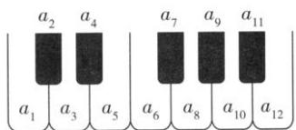

<!-- question-source:start -->
【35】(2022·高二课时练习)如图, 将钢琴上的12个键依次记为 $a_{1}, a_{2}, \ldots, a_{12}$ . 设 $1 \leq i < j < k \leq 12$ , 若 k - j = 3 且 j - i = 4, 则称 $a_{i}, a_{j}, a_{k}$ 为大三和弦; 若 k - j = 4 且 j - i = 3, 则称 $a_{i}, a_{j}, a_{k}$ 为小三和弦. 用这12个键可以构成的大三和弦与小三和弦的个数之和为（）

A. 5 B. 8 C. 10 D. 15
<!-- question-source:end -->

![[Q00014083A1]]
