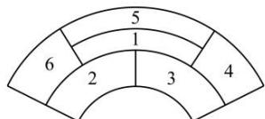

<!-- question-source:start -->
【38】（2022·高二课时练习）某城市在中心广场建造一个花圃，花圃分为6个部分，如图所示。现要栽种4种不同颜色的花，每部分栽种一种且相邻部分不能栽种同样颜色的花，则不同的栽种方法有（）

A.80种 B.120种C.160种 D.240种
<!-- question-source:end -->

![[Q00014086A1]]
