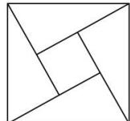

<!-- question-source:start -->
【40】（23-24 高二下·安徽池州·期中）如图为我国数学家赵爽（约 3 世纪初）在为《周髀算经》作注时验证勾股定理的示意图，现在提供 5 种颜色给其中 5 个小区域涂色，规定每个区域只涂一种颜色，相邻区域颜色不相同，则不同的涂色方案种数为（）

A. 120 B. 26 C. 340 D. 420
<!-- question-source:end -->

![[Q00014088A1]]
