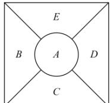

<!-- question-source:start -->
【41】（25-26 高三上·上海·单元测试）如题图所示是某展区的一个菊花布局图, 现有 5 个不同品种的菊花可供选择, 要求相邻的两个展区不使用同一种菊花, 则不同的布置方法有（）.

A. 240 种 B. 300 种 C. 360 种 D. 420 种
<!-- question-source:end -->

![[Q00014089A1]]
