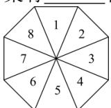

<!-- question-source:start -->
【42】（24-25 高三上·陕西渭南·阶段练习）中国是世界上最早发明雨伞的国家，伞是中国劳动人民一个重要的创造。如图所示的雨伞，其伞面被伞骨分成8个区域，每个区域分别印有数字1, 2, 3, …, 8。现准备给该伞面的每个区域涂色，要求每个区域涂一种颜色，相邻两个区域所涂颜色不能相同，对称的两个区域（如区域1与区域5）所涂颜色相同。若有6种不同颜色的颜料可供选择，则不同的涂色方案有\_\_\_\_种。

第一节 分类加法与分步乘法计数原理
<!-- question-source:end -->

![[Q00014090A1]]
