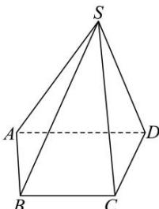

<!-- question-source:start -->
【44】(23-24 高二·湖南衡阳·期中) 如图, 已知四棱锥 S-ABCD.

（1）从 5 种颜色中选出 3 种颜色, 涂在四棱锥 S-ABCD 的 5 个顶点上, 每个顶点涂 1 种颜色, 并使同一条棱上的 2 个顶点异色, 求不同的涂色方法数;
（2）从 5 种颜色中选出 4 种颜色, 涂在四棱锥 S-ABCD 的 5 个顶点上, 每个顶点涂 1 种颜色, 并使同一条棱上的 2 个顶点异色, 求不同的涂色方法数.
<!-- question-source:end -->

![[Q00014092A1]]
