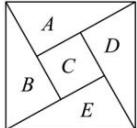

> [!faq]- 全练一本通解析
>
> > [!success]- **【答案】** D
>
> > [!note]- **【分析】**
> > 本题未单列分析。
>
> > [!note]- **【解析】**
> > 【详解】根据题意, 如图, 设 5 个区域依次为 A、B、C、D、E,
> > 
> > 分 4 步进行分析:
> > - **①**：, 对于区域 A, 有 5 种颜色可选;
> > - **②**：, 对于区域 B, 与 A 区域相邻, 有 4 种颜色可选;
> > - **③**：, 对于区域 C, 与 A、B 区域相邻, 有 3 种颜色可选;
> > - **④**：, 对于区域 D、E, 若 D 与 B 颜色相同, E 区域有 3 种颜色可选,
> > 若 D 与 B 颜色不相同, D 区域有 2 种颜色可选, E 区域有 2 种颜色可选, 则区域 D、E 有 $3 + 2 \times 2 = 7$ 种选择,
> > 所以不同的涂色方案有 $5 \times 4 \times 3 \times 7 = 420$ 种. 故选: D.
> > ##
