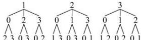
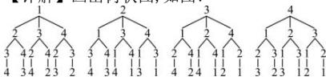

> [!faq]- 全练一本通解析
>
> > [!success]- **【答案】** B
>
> > [!note]- **【分析】**
> > 本题未单列分析。
>
> > [!note]- **【解析】**
> > （1）正确（2）错误（3）正确 （4）错误
> > 【详解】（1）判断是否为排列问题就是看是否与顺序有关，正确.
> > (2) 根据排列的定义可知, 在排列问题中总体内元素不能重复, 故错误.
> > (3) 根据排列的定义可以判断 123 与 321 中数字顺序不同, 是不同的排列, 正确.
> > （4）在圆上任取两点作弦与顺序无关,所以不是排列问题,故错误,
> > 故答案为: 正确; 错误; 正确; 错误;
> > 【2】（1）不是排列问题
> > (2) 是排列问题.
> > （3）选 3 个座位不是排列问题；选 3 个座位安排三位客人是排列问题.
> > (4) 确定直线不是排列问题, 确定射线是排列问题
> > 【详解】(1)来回的票价是一样的,不存在顺序问题,所以不是排列问题.
> > （2）A 给 B 写信与 B 给 A 写信是不同的两件事,所以存在着顺序,属于排列问题.
> > （3）任选 3 个座位,与顺序无关,不是排列问题;选 3 个座位安排三位客人,与顺序有关,故是排列问题.
> > （4）直线与两点的顺序无关, 故确定直线不是排列问题, 射线与两点的顺序有关, 故确定射线是排列问题.
> > 【4】A
> > 【详解】①选出的 2 人有不同的劳动内容, 相当于有顺序, ①属于排列问题;
> > - **②**：选出的2人劳动内容相同,无顺序,②不属于排列问题,
> > - **③**：选出 5 人组成一个篮球队, 无顺序, ③不属于排列问题,
> > - **④**：选出的两个数作为底数或指数, 其结果不同, 有顺序, ④属于排列问题, 所以属于排列问题的为①④. 故选: A
> > 【5】AC
> > 【详解】对于A,学生与书都不相同,故与顺序有关,是排列问题,A正确;对于B,取出5本书后,即确定了取法,与顺序无关,故是组合问题,故B错误;对于C,因为是相互发一微信,因此与顺序有关,故是排列问题,C正确;对于D,因为是互相通一次电话,与顺序无关,故是组合问题,D错误.故选:AC.
> > 【6】BD
> > 【详解】对于 A: 因为加法满足交换律, 所以 A 不是排列问题; 故 A 错误; 对于 B: 因为除法不满足交换律, 如 $\frac{5}{3} \neq \frac{3}{5}$ , 所以 B 是排列问题;
> > 对于 C: 若方程 $\frac{x^{2}}{a^{2}} + \frac{y^{2}}{b^{2}} = 1$ 表示焦点在 x 轴上的椭圆, 则必有 a > b, a, b 的大小关系一定. 所以 C 不是排列问题;
> > 对于 D: 在双曲线 $\frac{x^{2}}{a^{2}} - \frac{y^{2}}{b^{2}} = 1$ 中不管 a > b 还是 a < b, 方程均表示焦点在 x 轴上的双曲线, 且是不同的双曲线, 故 D 是排列问题. 故选: BD.
> > 【7】18个, 答案见解析.
> > 【详解】画出树形图, 如图:
> > 
> > 由树形图知, 符合条件的三位数共有 18 个,
> > 它们是 102, 103, 120, 123, 130, 132, 201, 203, 210, 213, 230, 231, 301, 302, 310, 312, 320, 321.
> > 【8】24个,答案见解析.
> > 【详解】画出树状图, 如图:
> > 
> > 由树状图知, 所有的四位数
> > 为:1234, 1243, 1324, 1342, 1423, 1432, 2134, 2143, 2314, 2341, 2413, 2431, 3124, 3142, 3214, 3241, 3412, 3421, 4123, 4132, 4213, 4231, 4312, 4321, 共 24 个没有重复数字的四位数.
> > 【9】（1）64；（2）348；
> > $$
> > \mathrm{A} _ {4} ^ {1} + \mathrm{A} _ {4} ^ {2} + \mathrm{A} _ {4} ^ {3} + \mathrm{A} _ {4} ^ {4} = 4 + 4 \times 3 + 4 \times 3 \times 2 + 4 \times 3 \times 2 \times 1 = 6 4 \tag {1}
> > $$
> > (2) $4\mathrm{A}_4^2 +5\mathrm{A}_5^3 = 4\times 4\times 3 + 5\times 5\times 4\times 3 = 348$
> > 【10】 $\frac{5}{27}$
> > 【详解】 $\frac{A_{8}^{5}+A_{8}^{4}}{A_{9}^{6}-A_{9}^{5}}=\frac{4A_{8}^{4}+A_{8}^{4}}{4A_{9}^{5}-A_{9}^{5}}=\frac{5A_{8}^{4}}{3A_{9}^{5}}=\frac{5A_{8}^{4}}{3\times9A_{8}^{4}}=\frac{5}{27}$ ；故答案为： $\frac{5}{27}$
> > 【11】1
> > 【详解】 $\frac{2A_{8}^{5}+7A_{8}^{4}}{A_{8}^{8}-A_{9}^{5}}=\frac{2\times8\times7\times6\times5\times4+7\times8\times7\times6\times5}{8\times7\times6\times5\times4\times3\times2\times1-9\times8\times7\times6\times5}=\frac{8+7}{24-9}=1$
> > 【12】D
> > 【详解】因 $n \in N^{*}$ 且 n < 20， $(20 - n)(21 - n)(22 - n) \cdots (100 - n)$ 表示 81 个连续正整数的乘积，其中最大因数为 100 - n，最小因数为 20 - n，
> > 由排列数公式的意义得结果为 $A^{81}$
> > 所以 $(20-n)(21-n)(22-n)\cdots(100-n)=A_{100-n}^{81}$ . 故选: D
> > 【13】CD
> > 【详解】对选项 A, $m!A_{n}^{m}=\frac{m! \cdot n!}{(n-m)!}\neq n!$ ，故 A 错误.
> > 对选项 B, $A_{n+1}^{n}=\frac{(n+1)!}{(n+1-n)!}=(n+1)!\neq n!$ ，故 B 错误.
> > 对选项 C, $A_{n}^{n-1}=\frac{n!}{(n-n+1)!}=n!$ , 故 C 正确.
> > 对选项 D, $nA_{n-1}^{n-1}=n\cdot(n-1)!=n!$ ，故 D 正确。故选: CD
> > 【14】ABD
> > 【详解】 $\mathrm{A}_{15}^{5} - 15\mathrm{A}_{14}^{4} + 14\mathrm{A}_{13}^{3} = 15\mathrm{A}_{14}^{4} - 15\mathrm{A}_{14}^{4} + 14\mathrm{A}_{13}^{3} = 14\mathrm{A}_{13}^{3}$ ，B正确，C不正确；而 $14\mathrm{A}_{13}^{3} = \mathrm{A}_{14}^{4} = \frac{14!}{10!}$ ，即 $\mathrm{A}_{15}^{5} - 15\mathrm{A}_{14}^{4} + 14\mathrm{A}_{13}^{3} = \mathrm{A}_{14}^{4} = \frac{14!}{10!}$ ，A正确，D正确.故选：ABD
> > 【15】1
> > 【详解】
> > $$
> > \frac {A _ {n - 1} ^ {m - 1} \cdot A _ {n - m} ^ {n - m}}{A _ {n - 1} ^ {n - 1}} = \frac {(n - 1) !}{\lceil (n - 1) - (m - 1) \rceil !} \times (n - m)! \times \frac {1}{(n - 1) !} = \frac {(n - 1) !}{(n - m) !} \times (n - m)! \times \frac {1}{(n - 1) !} = 1
> > $$
> > 故答案为:1.
> > 【详解】由已知可得 $\left\{\begin{aligned}n+3&\leq2n\\ n+1&\leq4\end{aligned}\right.$ ，解得n=3。
> > 所以 $A_{2n}^{n+3}-A_{4}^{n+1}=A_{6}^{6}-A_{4}^{4}=720-24=696$
> > $$
> > 2 0 2 4! - 2
> > $$
> > 【详解】因为 $n\mathrm{A}_{n}^{n}=(n+1)\mathrm{A}_{n}^{n}-\mathrm{A}_{n}^{n}=\mathrm{A}_{n+1}^{n+1}-\mathrm{A}_{n}^{n}$ （即 $n\cdot n!=(n+1)!-n!$ ）
> > 所以原式 $=3! - 2! + 4! - 3! + \cdots + 2024! - 2023! = 2024! - 2$
> > 【18】 $\mathrm{A}_{n + 1}^{n + 1} - 1$
> > 【详解】因为 $kA_{k}^{k}=(k+1)A_{k}^{k}-A_{k}^{k}=A_{k+1}^{k+1}-A_{k}^{k}$
> > 所以 $A_{1}^{1} + 2A_{2}^{2} + 3A_{3}^{3} + \cdots + nA_{n}^{n} = A_{2}^{2} - A_{1}^{1} + A_{3}^{3} - A_{2}^{2} + \cdots + A_{n+1}^{n+1} - A_{n}^{n} = A_{n+1}^{n+1} - 1$ 故答案为： $A_{n+1}^{n+1}-1$
> > 【19】（1）证明见详解， $1-\frac{1}{10!}$ ；（2） $1-\frac{1}{(n+1)!}$ .
> > 【详解】（1）解：证明：由 $n!=n\times(n-1)\times(n-2)\times\cdots\times2\times1$ 可得 $(n+1)!\=(n+1)\times n!$ ,
> > 则 $\frac{n}{(n + 1)!} = \frac{(n + 1) - 1}{(n + 1)!} = \frac{n + 1}{(n + 1)!} -\frac{1}{(n + 1)!} = \frac{1}{n!} -\frac{1}{(n + 1)!}$
> > 所以 $\frac{1}{2!} +\frac{2}{3!} +\frac{3}{4!} +\dots +\frac{9}{10!} = \frac{1}{1!} -\frac{1}{2!} +\frac{1}{2!} -\frac{1}{3!} +\dots +\frac{1}{9!} -\frac{1}{10!} = 1 - \frac{1}{10!}$
> > （2）解：因为 $\frac{n}{(n+1)!}=\frac{(n+1)-1}{(n+1)!}=\frac{n+1}{(n+1)!}-\frac{1}{(n+1)!}=\frac{1}{n!}-\frac{1}{(n+1)!}$
> > $$
> > \frac {1}{2 !} + \frac {2}{3 !} + \frac {3}{4 !} + \dots + \frac {n}{(n + 1) !} = \frac {1}{1 !} - \frac {1}{2 !} + \frac {1}{2 !} - \frac {1}{3 !} + \dots + \frac {1}{n !} - \frac {1}{(n + 1) !} = 1 - \frac {1}{(n + 1) !}
> > $$
> > 【20】证明见解析
> > 【详解】左边 $=\mathrm{A}_{n}^{n}=n\times(n-1)\times(n-2)\times\cdots3\times2\times1=n!$
> > $$
> > \text {边} = \mathrm{A} _ {n} ^ {m} \mathrm{A} _ {n - m} ^ {n - m} = n \times (n - 1) \times (n - 2) \times \dots (n - m + 1) \times (n - m) \times \dots 2 \times 1 = n!
> > $$
> > 所以 $A_{n}^{n}=A_{n}^{m}A_{n-m}^{n-m}$ ，即证.
> > 【21】证明见解析
> > 【详解】证明： $A_{n}^{m} + mA_{n}^{m-1} = \frac{n!}{(n-m)!} + \frac{m \times n!}{(n-m+1)!} = \frac{(n-m+1) \times n! + m \times n!}{(n-m+1)!}$ $=\frac{(n+1)!}{(n-m+1)!}=A_{n+1}^{m}$
> > 【22】见解析
> > 【详解】 $\because A_{n+1}^{m}-A_{n}^{m}=\frac{(n+1)!}{(n+1-m)!}-\frac{n!}{(n-m)!}=\frac{n!}{(n-m)!}\cdot\left(\frac{n+1}{n+1-m}-1\right)$
> > $= \frac{n!}{(n - m)!} \cdot \frac{m}{(n + 1 - m)} = m \cdot \frac{n!}{(n + 1 - m)!} = mA_{n}^{m-1}$ , $\therefore A_{n+1}^{m} - A_{n}^{m} = mA_{n}^{m-1}$ .
> > 【23】（1）证明见解析；（2）证明见解析.
> > 【详解】（1）
> > 右式 $= nA_{n-1}^{m-1} = n \times \frac{(n-1)!}{[(n-1)-(m-1)]!} = \frac{n \times (n-1)!}{(n-m)!} = \frac{n!}{(n-m)!} = A_{n}^{m} =$ 左式，故等式成立；（2）左式 $= 8! - 8 \times 7! + 7 \times 6! = 8! - 8! + 7! = 7! = A_{7}^{7} =$ 右式，故等式成立.
> > 【24】详见解析
> > 【详解】（1）左边 $= A_{n+1}^{n+1} - A_{n}^{n} = n(n+1)A_{n-1}^{n-1} - nA_{n-1}^{n-1} = (n^{2} + n - n)A_{n-1}^{n-1} = n^{2}A_{n-1}^{n-1} =$ 右边，
> > ∴结论成立，即 $A_{n+1}^{n+1} - A_{n}^{n} = n^{2}A_{n-1}^{n-1}$ ；（2）当 $k \leq n$ 时，左边 $= \frac{(n+1)!}{k!} - \frac{n!}{(k-1)!} = \frac{(n+1)n!}{k!} - \frac{kn!}{k(k-1)!} = \frac{(n+1)n! - kn!}{k!} = \frac{(n-k+1)n!}{k!} =$ 右边，
> > ∴结论成立，即 $\frac{(n+1)!}{k!} - \frac{n!}{(k-1)!} = \frac{(n-k+1) \cdot n!}{k!}(k \leq n)$ .
> > 【25】详见解析
> > 【详解】（1）由 $A_{x}^{2} = 56$ ，则 $x(x-1) = 56$ ，解得 $x = 8$ （2）由 $A_{x}^{2} = 7A_{x-4}^{2}$ ，则 $x(x-1) = 7(x-4)(x-5)$ 且 $x - 4 \geq 2$ ，解得 $x = 7$ 或 $x = \frac{10}{3}$ （舍）.
> > 【26】 $x = 3$ 【详解】由 $A_{2x}^{4} = 60A_{x}^{3}$ 可得 $2x(2x-1)(2x-2)(2x-3) = 60x(x-1)(x-2)$ ，由于 $x$ 为大于不小于3的自然数，所以 $(2x-1)(2x-3) = 15(x-2)$ ，化简得 $4x^{2}-23x+33=0$ ，解得 $x = 3$ ，
> > 【27】 $x = 5$ 【详解】列方程求解即可.
> > 由题设 $3 \times \frac{x!}{(x-3)!} = 2 \times \frac{(x+1)!}{(x-1)!} + 6 \times \frac{x!}{(x-2)!}$ ，则 $\frac{2(x+1)}{(x-1)(x-2)} + \frac{6}{x-2} = 3$ ， $\therefore 2(x+1) + 6(x-1) = 3(x-1)(x-2)$ ，则 $3x^{2}-17x+10=(3x-2)(x-5)=0$ 又 $x \in N^{*}$ ，故 $x = 5$ .
> > 【28】 $n = 6$ 或 $n = 7$ 因为 $A_{7}^{n}< 12A_{7}^{n-2}(n \geq 3)$ ，所以 $\frac{7!}{(7-n)!} < 12 \times \frac{7!}{(9-n)(8-n)(7-n)!}$ . 因为 $3 \leq n \leq 7$ ，所以 $(9-n)(8-n) < 12$ 即 $n^2 - 17n + 60 < 0$ ，解得 $5 < n < 12$ 所以 $5 < n \leq 7$ ，又 $n \in N^{*}$ ，所以 $n = 6$ 或 $n = 7$ .
> > 【29】 $\{3,4,5\}$ 【详解】因为 $3A_{x}^{3} \leq 2A_{x+1}^{2} + 6A_{x}^{2}$ ，所以 $\left\{\begin{array}{l}3\times\frac{x!}{(x-3)!}\leq 2\times\frac{(x+1)!}{(x-1)!}+6\times\frac{x!}{(x-2)!},\\ x\geq 3,x\in N^{*}\end{array}\right.$ ，化简可得 $\left\{\begin{array}{l}\left(3x-2\right)(x-5)\leq 0\\ x\geq 3,x\in N^{*}\end{array}\right.$ ，解得 $x \in \{3,4,5\}$ ，所以不等式解集为 $\{3,4,5\}$ .
> > 【30】（1） $\{3,4,5\}$ ；（2） $x = 3$ ．
> > 【详解】（1）由题意可知， $x \in N$ 且 $x \geq 3$ 因为 $A_{x}^{3}=x(x-1)(x-2)$ ， $A_{x+1}^{2}= (x+1)x$ ， $A_{x}^{2}= x(x-1)$ ，所以原不等式可化为 $3x(x-1)(x-2)\leq 2x(x+1)+6x(x-1)$ ，整理得 $(3x-2)(x-5)\leq 0$ ，所以， $3 \leq x \leq 5$ ，所以原不等式的解集为 $\{3,4,5\}$ ；
> > （2）易得 $\left\{\begin{array}{l}2x+1\geq 4\\ x\geq 3\\ x\in N\end{array}\right.$ ，所以 $x \geq 3$ ， $x \in N$ ，由 $A_{2x+1}^{4}=140A_{x}^{3}$ 得 $(2x+1)\cdot 2x\cdot (2x-1)(2x-2)=140x(x-1)(x-2)$ ，整理得 $4x^{2}-35x+69=0$ ，即 $(4x-23)(x-3)=0$ ，解得 $x=3$ 或 $x=\frac{23}{4}$ （舍去）.所以，原方程的解为 $x=3$ ．
> > 【31】8
> > 【详解】
> > $\because A_{35 - a}^{m} = (35 - a)(34 - a)(33 - a)\dots (36 - a - m),\therefore 28 - a = 36 - a - m$ ，解得： $m = 8$ .故答案为：8.
> > 【32】6【详解】 $\because A_8^{m + 2} = \frac{8!}{(6 - m)!},A_8^m = \frac{8!}{(8 - m)!}$ $\therefore \frac{8!}{(6 - m)!} <  6\times \frac{8!}{(8 - m)!}$ $\therefore \frac{6}{(7 - m)(8 - m)} >1$ ，解得： $5 <   m <   10$ 又 $m + 2\leq 8$ ，即 $m\leq 6$ $\therefore 5 <   m\leq 6$ $\because m\in N^{*}$ $\therefore m = 6$
> > ## 重点题型专练
> > 【33】（1）4320（2）14400（3）2880（4）7200（5）10080（6）14400（7）36000（8）30960（9）40320（10）6720（11）1440
> > 【详解】（1）（捆绑法）因为三个女生必须排在一起，所以可以先把她们看成一个整体，
> > 这样同五个男生合在一起共有六个元素，排成一排有 $A_{6}^{6}$ 种不同的排法，对于其中的每一种排法，三个女生之间又有 $A_{3}^{3}$ 种不同的排法.
> > 因此共有 $A_{6}^{6} \cdot A_{3}^{3} = 4320$ （种）不同的排法.
> > （2）（插空法）要保证女生全分开，可先把五个男生排好，每两个相邻的男生之间留出一个空位，这样共有四个空位，加上两边男生外侧的两个位置，共有六个位置，再把三个女生插入这六个位置中，
> > 只要保证每个位置至多插入一个女生，就能保证任意两个女生都不相邻，
> > 由于五个男生排成一排有 $A_{5}^{5}$ 种不同排法，
> > 对于其中任意一种排法，从上述六个位置中选出三个让三个女生插入都有 $A_{6}^{3}$ 种排法，
> > 因此共有 $A_{5}^{5} \cdot A_{6}^{3} = 14400$ （种）不同的排法.
> > （3）（插空法）要保证女生全分开，可先把五个男生排好，每两个相邻的男生之间留出一个空位，由于两端不能拍女生，所以不算两端的空位，这样共有四个空位，
> > 再把三个女生插入这六个位置中，
> > 只要保证每个位置至多插入一个女生，就能保证任意两个女生都不相邻，
> > 由于五个男生排成一排有 $A_{5}^{5}$ 种不同排法，
> > 对于其中任意一种排法，从上述四个位置中选出三个让三个女生插入都有 $A_{4}^{3}$ 种排法，
> > 因此共有 $A_{5}^{5} \cdot A_{4}^{3} = 2880$ （种）不同的排法.
> > （4）分三步：
> > - **①**：捆绑法，现将女生甲与女生乙捆绑在一起，有 $A_{2}^{2} = 2$ （种）；
> > - **②**：将女生甲和女生乙看成整体，与其他人（除去男生甲和男生乙）排列，有 $A_{5}^{5} = 120$ （种）；
> > - **③**：插空法，在其他人排好的基础上，将男生甲和乙插空（共有 6 个空位置），有 $A_{6}^{2} = 30$ （种），
> > 所以根据分步乘法原理可知共有 $2 \times 120 \times 30 = 7200$ （种）.
> > （5）（位置分析法）先安排甲，左、右两个位置可供甲选择，有 $A_{2}^{1}$ 种排法，
> > 其余 7 人全排列，有 $A_{7}^{7}$ 种排法，由乘法原理得共有 $A_{2}^{1}A_{7}^{7} = 10080$ （种）
> > （6）方法一（位置分析法），因为两端都不能排女生，所以两端只能挑选五个男生中的两个，
> > 有 $A_{5}^{2}$ 种不同的排法，对于其中的任意一种不同的排法，其余六个位置都有 $A_{6}^{6}$ 种不同的排法，
> > 所以共有 $A_{5}^{2} \cdot A_{6}^{6} = 14400$ （种）不同的排法.
> > 方法二（元素分析法），从中间六个位置挑选三个让三个女生排入，有 $A_{6}^{3}$ 种不同的排法，
> > 对于其中的任意一种排法，其余五个位置又都有 $A_{5}^{5}$ 种不同的排法，
> > 所以共有 $A_{6}^{3} \cdot A_{5}^{5} = 14400$ （种）不同的排法.
> > （7）方法一（位置分析法），因为只要求两端不都排女生，所以如果首位排了男生，
> > 那么末位就不再受条件限制了，这样可有 $A_{5}^{1} \cdot A_{7}^{7}$ 种不同的排法；
> > 如果首位排女生, 有 $\mathrm{A}_{3}^{1}$ 种排法, 那么末位就只能排男生, 这样可有 $\mathrm{A}_{3}^{1} \cdot \mathrm{A}_{5}^{1} \cdot \mathrm{A}_{6}^{6}$ 种不同的排法,
> > 因此共有 $\mathrm{A}_{5}^{1} \cdot \mathrm{A}_{7}^{7} + \mathrm{A}_{3}^{1} \cdot \mathrm{A}_{5}^{1} \cdot \mathrm{A}_{6}^{6} = 36000$ （种）不同的排法.
> > 方法二（间接法), 三个女生和五个男生排成一排共有 $\mathrm{A}_{8}^{8}$ 种不同的排法,
> > 从中扣除两端都是女生的排法 $\mathrm{A}_{3}^{2} \cdot \mathrm{A}_{6}^{6}$ 种, 就得到两端不都是女生的排法种数.
> > 因此共有 $\mathrm{A}_{8}^{8} - \mathrm{A}_{3}^{2} \cdot \mathrm{A}_{6}^{6} = 36000$ （种）不同的排法.
> > （8）方法一（元素分析法）当甲在右端时, 乙可以随意站, 则有 $\mathrm{A}_{7}^{7} = 5040$ 种站法;
> > 当甲不在左端也不在右端时, 有 $\mathrm{A}_{6}^{1}$ 种, 乙不能在右端, 故有 $\mathrm{A}_{6}^{1}$ 种, 剩下同学随意站有 $\mathrm{A}_{6}^{6}$ 种,
> > 共有 $\mathrm{A}_{6}^{1} \times \mathrm{A}_{6}^{1} \times \mathrm{A}_{6}^{6} = 25920$ 种,
> > 故甲不在最左边, 乙不在最右边, 共有 $25920 + 5040 = 30960$ 种站法,
> > 方法二（间接法), 三个女生和五个男生排成一排共有 $\mathrm{A}_{8}^{8}$ 种不同的排法,
> > 从中扣除甲在左端的 $\mathrm{A}_{7}^{7}$ 种排法和乙在右端的 $\mathrm{A}_{7}^{7}$ 种排法,
> > 但甲在左端乙在右端的排法在扣除甲在左端的情况时被扣去一次,
> > 在扣除乙在右端的情况时又被扣去一次, 所以还需加回来一次,
> > 由于甲在左端乙在右端有 $\mathrm{A}_{6}^{6}$ 种不同的排法,
> > 所以共有 $\mathrm{A}_{8}^{8} - 2\mathrm{A}_{7}^{7} + \mathrm{A}_{6}^{6} = 30960$ （种）不同的排法.
> > （9）与无任何限制的排列相同, 即8个元素的全排列, 有 $\mathrm{A}_{8}^{8} = 40320$ （种）
> > 排法;
> > （10）（定序排列）8名学生排成一行, 分两步:
> > 第一步, 设固定甲、乙、丙从左至右顺序的排列总数为 $N$ ;
> > 第二步, 对甲、乙、丙进行全排列. 由乘法原理得 $\mathrm{A}_{8}^{8} = N \times \mathrm{A}_{3}^{3}$ , 所以 $N = \frac{\mathrm{A}_{8}^{8}}{\mathrm{A}_{3}^{3}} = 6720$ （种）;
> > （11）男生甲、乙排好有 $A_{2}^{2}$ 种排法，从三个女生中选两人排在甲、乙之间有 $A_{3}^{2}$ 种排法，
> > 再把甲、乙及中间两个女生看成一个整体捆绑在一起, 和另外四人排成一队有 $A_{5}^{5}$ 种排法,
> > 所以共有 $A_{2}^{2}\cdot A_{3}^{2}\cdot A_{5}^{5}=1440$ （种）不同的排法.
> > $$
> > \mathrm{A} _ {2} ^ {2} \mathrm{A} _ {5} ^ {5} = 2 4 0
> > $$
> > $$
> > \mathrm{A} _ {3} ^ {3} = 6
> > $$
> > 有 4 个空位,
> > 在 4 个空位种任选 3 个, 安排甲、乙、丙 3 人, 有 $A_{4}^{3}=24$ 种情况,
> > 则共有 $A_{3}^{3}A_{4}^{3}=144$ 种排法.
> > （3）甲站在排尾时, 剩余 5 人进行全排列, 安排在其他 5 个位置, 有 $A_{5}^{5}=120$ 种排法,
> > 甲不站在排尾时, 则甲有 4 个位置可选, 有 $A_{4}^{1}=4$ 种排法,
> > 乙不能在排尾, 也有 4 个位置可选, 有 $A_{4}^{1}=4$ 种排法,
> > 剩余 4 人进行全排列, 安排在其他 4 个位置, 有 $A_{4}^{4}=24$ 种排法,
> > 此时有 $A_{4}^{1}A_{4}^{1}A_{4}^{4}=384$ 种排法;
> > 故甲不站排头, 乙不站排尾的排法有 $A_{5}^{5}+A_{4}^{1}A_{4}^{1}A_{4}^{4}=504$ 种.
> > （4）先将甲、乙全排列, 有 $A_{2}^{2}=2$ 种情况,
> > 在剩余的 4 个人中任选 1 个, 安排在甲乙之间, 有 $A_{4}^{1}=4$ 种选法,
> > 将三人看成一个整体, 与其他 3 人进行全排列, 有 $A_{4}^{4}=24$ 种排法,
> > 则甲、乙中间有且只有 1 人共有 $A_{2}^{2}A_{4}^{1}A_{4}^{4}=192$ 种排法.
> > （5）定序问题, $\frac{A_{6}^{6}}{A_{3}^{3}}=120$ 种.
> > 【35】ABD
> > 【详解】对于 A, 将 A, C, D 三位同学从左到右按照由高到矮的顺序站,
> > 共有 $\frac{A_{6}^{6}}{A_{3}^{3}}=120$ 种站法,
> > 故 A 正确;
> > 对于 B, 先排 B, D, E, F, 共有 $A_{4}^{4}$ 种站法, A与C同学插空站,有 $A_{5}^{2}$ 种站
> > 法,
> > 故共有 $A_{4}^{4}\cdot A_{5}^{2}$ 种站法, 故 B 正确;
> > 对于 C, 将 A, C, D 三位同学捆绑在一起, 且 A 只能在 C 与 D 的中间, 有 2 种情况,
> > 捆绑后有 $A_{4}^{4}$ 种站法, 故共有 $2\times A_{4}^{4}=48$ 种站法, 故 C 错误;
> > 对于 D, 当 A 在排尾时, B 随意站, 则有 $A_{5}^{5}=120$ 种站法;
> > 当 A 不在排头也不在排尾时, 有 $A_{4}^{1}$ 种, B 有 $A_{4}^{1}$ 种, 剩下同学随意站有 $A_{4}^{4}$ 种, 共有 $A_{4}^{1} \times A_{4}^{1} \times A_{4}^{4} = 384$ 种,
> > 故 A 不在排头, B 不在排尾, 共有 $120 + 384 = 504$ 种站法, 故 D 正确;
> > 故选: ABD.
> > 【36】(1) 2500; (2) 96; (3) 20; (4) 36; (5) 88
> > 【详解】(1) 各个数位上数字允许重复, 首位上不能为 0, 故采用分步乘法计数原理,
> > 有 $4 \times 5 \times 5 \times 5 = 2500$ 个.
> > （2）考虑特殊位置“万位”, 从 1、2、3、4 中任选一个填入万位, 共有 4 种填法,
> > 其余四个位置, 4 个数字全排列, 故共有 $A_{4}^{1}A_{4}^{4} = 96$ 个.
> > （3）构成 3 的倍数的三位数, 其各个位上数字之和是 3 的倍数,
> > 则由 0,1,2 和 0,2,4 ,1,2,3 以及 2,3,4 组成三位数,
> > 由 0,1,2 和 0,2,4 组成的三位数有 $2A_{2}^{1}A_{2}^{2} = 8$ 个,
> > 由 1,2,3 以及 2,3,4 组成三位数有 $2A_{3}^{3} = 12$ 个, 故共有 $8 + 12 = 20$ 个;
> > （4）考虑特殊位置个位和万位, 先填个位, 从 1、3 中选一个填入个位有 $A_{2}^{1}$ 种填法,
> > 然后从剩余 3 个非 0 数中选一个填入万位, 有 $A_{3}^{1}$ 种填法, 包含 0 在内还有 3 个数
> > 在中间三个位置上全排列, 排列数为 $A_{3}^{3}$ , 故共有 $A_{2}^{1}A_{3}^{1}A_{3}^{3} = 36$ 个.
> > （5）本小问的本质就是不大于 42130 的数有多少.
> > 按分类加法计数原理, 当万位数字为 1、2、3 时均满足, 共有 $A_{3}^{1}A_{4}^{4}$ 三个数,
> > 当万位数字为 4, 千位数为 0、1 时均满足, 共有 $A_{2}^{1}A_{3}^{3}$ 个数,
> > 当万位数字为 4, 千位数字为 2, 而百位数字为 0 和 1 时均满足, 共有 $A_{2}^{1}A_{2}^{2}$ 在中间三个位置上全排列, 排列数为 $A_{3}^{3}$ , 故共有 $A_{2}^{1}A_{3}^{1}A_{3}^{3} = 36$ 个.
> > （5）本小问的本质就是不大于42130的数有多少.
> > 按分类加法计数原理, 当万位数字为1、2、3时均满足, 共有 $A_{3}^{1}A_{4}^{4}$ 三个数,
> > 当万位数字为4, 千位数为0、1时均满足, 共有 $A_{2}^{1}A_{3}^{3}$ 个数,
> > 当万位数字为4, 千位数字为2, 而百位数字为0和1时均满足, 共有 $A_{2}^{1}A_{2}^{2}$ 个, 所以42130是第 $A_{3}^{1}A_{4}^{4} + A_{2}^{1}A_{3}^{3} + A_{2}^{1}A_{2}^{2} = 88$ 个数.
> > 【37】C
> > 【详解】第一类,0 在个位,共有 $A_{5}^{3}=60$ 种;
> > 第二类,0 不在个位,从2、4中选一个数排个位， $A_{2}^{1}$ 种方法;
> > 从余下的数字中选一个排千位， $A_{4}^{1}$ 种方法;再排十位、百位， $A_{4}^{2}$ 种方法;
> > 所以共有 $A_{2}^{1}A_{4}^{1}A_{4}^{2}=96$ 种;所以这样的四位偶数共有 $60+96=156$ 种,所以
> > C 正确;故选:C.
> > 【38】B
> > 【详解】用数字0,1,2,3,4,5组成的没有重复数字的六位数的个数为 $5A_{5}^{5}=600$ .
> > 以1为十万位的没有重复数字的六位数的个数为 $A_{5}^{5}=120$ ,
> > 由于201345是以2为十万位的没有重复数字的六位数中最小的一个,
> > 所以没有重复数字且大于201345的六位数的个数为600-120-1=479.
> > 故选:B
> > 【39】660
> > 【详解】若末位为0，则可组成 $A_{6}^{4}$ 个满足题意的五位数; 若末位为5，
> > 则可组成 $A_{5}^{1}A_{5}^{3}$ 个满足题意的五位数; ∴共可组成满足题意的五位数
> > 有： $A_{6}^{4} + A_{5}^{1}A_{5}^{3} = 660$ 个.
> > 【40】C
> > 【详解】因为各位数字之和为7的四位数叫幸运数，所以按首位数字分别计算
> > 当首位数字为7，则剩余三位数分别是0,0,0，共有1个幸运数；
> > 当首位数字为6，则剩余三位数分别是1,0,0，共有3个幸运数；
> > 当首位数字为5，则剩余三位数分别是1,1,0;2,0,0，共有3+3=6个幸运数；
> > 当首位数字为4，则剩余三位数分别是2,1,0;3,0;0;1,1,1，共有 $A_{3}^{3} + 3 + 1 = 10$ 个幸运数；
> > 当首位数字为3，则剩余三位数分别是3,1,0；4,0,0;1,1,2;2,2,0，
> > 共有 $A_{3}^{3} + 3 + 3 + 3 = 15$ 个幸运数；
> > 当首位数字为2，则剩余三位数分别是4,1,0；5,0,0;1,1,3;2,2,0;2,2,1，
> > 共有 $A_{3}^{3} + 3 + 3 + A_{3}^{3} + 3 = 21$ 个幸运数；
> > 当首位数字为1，则剩余三位数分别是5,1,0；6,0,0;1,1,4;4,2,0;3,2,1;3,3,0;2,2,2，
> > 共有 $A_{3}^{3} + 3 + 3 + A_{3}^{3} + A_{3}^{3} + 3 + 1 = 28$ 个幸运数；
> > 则共有 $1 + 3 + 6 + 10 + 15 + 21 + 28 = 84$ 个幸运数；故选：C.
> > 【41】BC
> > 【详解】对于A，因为百位数上的数字不能为零，
> > 所以组成的三位数的个数为 $A_{4}^{1}A_{4}^{2}=4\times4\times3=48$ ，故A不正确；
> > 对于B，将所以三位数的偶数分为两类，①个位数为0，则有
> > $A_{4}^{2} = 4 \times 3 = 12$ 种，
> > - **②**：个位数为2或4，则有 $A_2^1 A_3^1 A_3^1 = 2 \times 3 \times 3 = 18$ 种，所以在组成的三位数中，偶数的个数为 $12 + 18 = 30$ ，故B正确；对于C、D,将这些“凹数”分为三类，①十位为0，则有 $A_4^2 = 4 \times 3 = 12$ 种，②十位为1，则有 $A_3^2 = 3 \times 2 = 6$ 种，③十位为2，则有 $A_2^2 = 2 \times 1 = 2$ 种，所以在组成的三位数中，“凹数”的个数为 $12 + 6 + 2 = 20$ ，故C正确，D不正确.故选：BC.
> > 【42】D 【详解】定序问题 $\frac{\mathrm{A}_7^7}{\mathrm{A}_5^5} = 42$ ，故不同的比赛顺序共有 $6 \times 7 = 42$ 种.故选：D
> > 【43】D 【详解】解：小李可选的旅游路线分两种情况：①最后去甲景区旅游，则可选的路线有 $\mathrm{A}_3^3$ 条；
> > - **②**：不最后去甲景区旅游，则可选的路线有 $2\mathrm{A}_2^2$ 条.所以小李可选的旅游路线的条数为 $\mathrm{A}_3^3 + 2\mathrm{A}_2^2 = 10$ .故选：D.
> > 【详解】先把3家小吃店捆绑全排共有 $\mathrm{A}_3^3 = 6$ 种排法，再把小吃店与玩具店全排共有 $\mathrm{A}_2^2 = 2$ 种排法，然后把2家文创店插空全排共有 $\mathrm{A}_3^2 = 6$ 种排法，所以共有 $6\times 2\times 6 = 72$ 种故选：B.
> > 【4.5】A
> > 【详解】语文与生物要相邻, 将语文与生物捆绑看作一个整体.
> > 数学与物理不能相邻, 采用插空法, 后排.
> > 第一步, 将语文与生物捆绑看作一个整体后, 与英语、化学共3个, 排列种类为 $A_{3}^{3}$ ;
> > 第二步, 第一步完成后共有4个位置, 将物理和数学排好, 排列种类为 $A_{4}^{2}$ ;
> > 第三步, 语文与生物的排列种类为 $A_{2}^{2}$ .
> > 所以, 总的排列顺序有 $A_{3}^{3}\cdot A_{4}^{2}\cdot A_{2}^{2}=6\times12\times2=144$ . 故选: A.
> > 【详解】先排除去《大学》《论语》《周易》之外的6部经典名著的讲座，共有 $A_{6}^{6}$ 种排法，将《大学》《论语》看作一个元素，二者内部全排列有 $A_{2}^{2}$ 种排法，
> > 排完的6部经典名著的讲座后可以认为它们之间包括两头有7个空位，从7个空位中选2个，排《大学》《论语》捆绑成的一个元素和《周易》的讲座，有 $A_{7}^{2}$ 种排法，故总共有 $A_{6}^{6}A_{2}^{2}A_{7}^{2}$ 种排法，故选：C.
> > 【详解】因为恰有5个连续空位，即5个连续空位与另一个空位中间至少有1人，至多有4人；
> > 若5个连续空位与另一个空位中间有1人，此时共有 $\mathrm{A}_4^1\mathrm{A}_2^2\mathrm{A}_4^4 = 192$ 种；
> > 若5个连续空位与另一个空位中间有2人，此时共有 $\mathrm{A}_4^2\mathrm{A}_2^2\mathrm{A}_3^3 = 144$ 种；
> > 若5个连续空位与另一个空位中间有3人，此时共有 $\mathrm{A}_4^3\mathrm{A}_2^2\mathrm{A}_2^2 = 96$ 种；
> > 若5个连续空位与另一个空位中间有4人，此时共有 $\mathrm{A}_4^4\mathrm{A}_2^2 = 48$ 种；
> > 所以共有 $192 + 144 + 96 + 48 = 480$ 种.故选：D.
> > 【48】ACD
> > 【详解】对于 A 选项, 不同安排方法种数为 $A_{3}^{3} \times A_{4}^{4} = 144$ ;
> > 对于 B 选项, 不同安排方法种数为 $A_{3}^{3} \times A_{3}^{3} \times 2 = 72$ ;
> > 对于 C 选项, 采用间接法, 6 人的面试顺序的不同安排方法种数为 $A_{6}^{6}$ , 3 名女生全相邻时, 将 3 名女生看成一个整体, 与 3 名男生一起看作 4 个对象,
> > 共有 $A_{3}^{3} \times A_{4}^{4}$ 种不同的安排方法,
> > 所以 3 名女生的面试顺序不同时相邻时, 不同的安排方法种数为 $A_{6}^{6}-A_{3}^{3}A_{4}^{4}=576$ ;
> > 对于 D 选项, 采用间接法, 6 人的面试顺序的不同安排方法种数为 $A_{6}^{6}$ ,
> > 男生甲在第一个面试或男生乙在最后一个面试的不同安排方法种数均为 $A_{5}^{5}$ ,
> > 男生甲在第一个面试且男生乙在最后一个面试的不同安排方法种数为 $A_{4}^{4}$ ,
> > 则符合条件的安排方法种数为 $A_{6}^{6}-A_{5}^{5}-A_{5}^{5}+A_{4}^{4}=504$ ,
> > 故选: ACD.
> > 【49】30
> > 【详解】若 A 球放在 A 只食子中，则 B 球可放在 2 只或 3 只或 5 只食子【详解】若 A 球放在 4 号盒子内, 则 B 球可放在 2 号或 3 号或 5 号盒子
> > 内, 此时共有 $3A_{3}^{3}=18$ 种不同的方法;
> > 若 A 球放在 3 号或 5 号盒子内, 则 B 球只能放在 4 号盒子内, 此时共有 $2A_{3}^{3}=12$ 种不同的放法.
> > 综上所述, 共有 $12+18=30$ 种不同的放法. 故答案为: 30.
> > 【详解】先满足特殊元素, 即甲和乙分别不能完成第一和第二种工作, 分三种情况:
> > $$
> > \mathrm{A} _ {3} ^ {2} \mathrm{A} _ {3} ^ {3}
> > $$
> > 第二类:甲完成第二种工作,乙完成后三种工作中的一种,有 $A_{3}^{1}A_{3}^{3}$ 种;第三类:乙完成第一种工作,甲完成后四种工作中的一种,有 $A_{4}^{1}A_{3}^{3}$ 种.由分类加法计算原理知,不同的分配方法共有 $A_{3}^{2}A_{3}^{3}+A_{3}^{1}A_{3}^{3}+A_{4}^{1}A_{3}^{3}=78$ 种.
> > 【51】（1）1440；（2）30240；（3）2880.
> > 【详解】试题分析：（1）先排歌曲节目，再排其他节目，利用乘法原理，即可得出结论；（2）先排3个舞蹈，3个曲艺节目，再利用插空法排唱歌，即可得到结论；（3）两个唱歌节目相邻，用捆绑法，3个舞蹈节目不相邻，利用插空法，即可得到结论.
> > 试题解析：（1） $A_{2}^{2}A_{6}^{6}=1440$ 种排法．（2） $A_{6}^{6}A_{7}^{2}=30240$ 种排法．（3） $A_{4}^{4}A_{5}^{3}A_{2}^{2}=2880$ 种排法.
> > 【52】（1） $A_{8}^{8}A_{9}^{7}$ 种（2） $\frac{A_{15}^{15}}{A_{5}^{5}\times A_{3}^{3}}\times A_{4}^{4}\times A_{2}^{2}$ 种
> > 【详解】（1）先对高一、高二的节目进行全排列，有 $A_{8}^{8}$ 种不同的排法，再在高一、高二的 8 个节目形成的 9 个空隙中选 7 个排初中的 7 个节目，有 $A_{9}^{7}$ 种排法，
> > 由分步乘法计数原理可得, 共有 $A_{8}^{8}A_{9}^{7}$ 种不同的出场顺序.
> > （2）高一的5个节目全排列，有 $\mathrm{A}_5^5$ 种不同的排法，其中 $A_{1}$ 在其余4个节目前面，有 $\mathrm{A}_4^4$ 种排法.
> > 高二的3个节目全排列有 $\mathrm{A}_3^3$ 种不同的排法，其中 $B_{1}$ 在其余2个节目前面，有 $\mathrm{A}_2^2$ 种排法.
> > 初中、高一和高二的15个节目全排列有 $\mathrm{A}_{15}^{15}$ 种不同的排法.
> > 所以不同的排法共有 $\frac{\mathrm{A}_{15}^{15}}{\mathrm{A}_5^5\times\mathrm{A}_3^3}\times\mathrm{A}_4^4\times\mathrm{A}_2^2$ 种.
> > ## 第三节 组合与组合数
> > ## 核心基础达标
> > 【1】（1）组合问题（2）排列问题（3）组合问题（4）排列问题；组合问题
> > 【详解】（1）4 张票是相同的（都是当日动物园的门票），不同的分配方法取决于从 5 人中选择哪 4 人，这和顺序无关，是组合问题.
> > （2）选出的 2 个数分别作为分子和分母, 结果是不同的, 是排列问题.
> > （3）已知集合中的元素具有无序性, 因此含 3 个元素的子集个数与元素的顺序无关, 是组合问题.
> > （4）飞机票与起点站、终点站有关，故求飞机票的种数是排列问题；票价只与两站的距离有关，故求票价的种数是组合问题.
> > 【2】（1）组合问题（2）排列问题（3）组合问题（4）排列问题
> > 【详解】（1）从 10 名学生中任选 5 名去参观一个展览会, 选出的学生不用排序, 所以这是组合问题.
> > （2）从1、2、3、4、5这5个数字中，每次任取2个不同的数作为一个点的坐标，由于坐标有横纵坐标之分，所以选出的2个不同的数需要排序，故这是排列问题.
> > （3）从红袋和黄袋中各任取一张卡片，求这两张卡片上的数相加所得的和，因为加法满足交换律，故选出的卡片不用排序，所以这是组合问题.
> > （4）因为四本不同的书送给四个人，要求每人一本，
> > 所以这四本书需要排序, 故这是排列问题.
> > 【3】ABC、ABD、ABE、ACD、ACE、ADE、BCD、BCE、BDE、CDE.
> > 不含 A 含 B 的三个元素有: BCD、BCE、BDE,
> > 不含 A、B 的三个元素有: CDE,
> > 所以取 3 个元素的所有组合是 ABC、ABD、ABE、ACD、ACE、ADE、BCD、BCE、BDE、CDE.
> > 【4】（1）AB, AC, AD, BC, BD, CD, BA, CA, DA, CB, DB, DC; （2）
> > AB, AC, AD, BC, BD, CD; (3) $\triangle ABC$ , $\triangle ABD$ , $\triangle BCD$ , $\triangle ACD$
> > 【详解】解：（1）以其中任意两个点为端点的有向线段为一个排列，共有有向线段：AB, AC, AD, BC, BD, CD, BA, CA, DA, CB, DB, DC;
> > （2）以其中任意两个点为端点的线段为一个组合问题, 共有线段: AB, AC, AD, BC, BD, CD;
> > （3）以其中任意三点为顶点的三角形是一个组合问题，共有 $\triangle ABC, \triangle ABD, \triangle BCD, \triangle ACD$ 。
> > 【5】1;7;35;1
> > 【详解】 $C_{7}^{0}=\frac{7!}{7!\times0!}=1$ ， $C_{7}^{1}=\frac{7}{1}=7$ ， $C_{7}^{3}=\frac{7\times6\times5}{3\times2\times1}=35$ ， $C_{7}^{7}=C_{7}^{0}=1$ 。
> > 故答案为:1;7;35;1.
> > 【6】（1）30 （2）21 （3）20 （4）18 （5）55
> > 【详解】（1） $C_{5}^{2}+C_{6}^{3}=\frac{5\times4}{2\times1}+\frac{6\times5\times4}{3\times2\times1}=10+20=30$
> > （2）由组合数计算公式可得 $C_{4}^{0} + C_{5}^{1} + C_{6}^{2} = 1 + 5 + \frac{6 \times 5}{1 \times 2} = 21$ .
> > （3）由题可知： $C_{7}^{3}-C_{6}^{2}=\frac{7\times6\times5}{3!}-\frac{6\times5}{2!}=35-15=20$ ，
> > (4) $2\mathrm{C}_{5}^{2} - \mathrm{A}_{4}^{2} + \mathrm{C}_{10}^{9} = 2\times \frac{5\times 4}{2\times 1} -4\times 3 + \mathrm{C}_{10}^{1} = 8 + 10 = 18$
> > (5) $\mathrm{C}_3^2 +\mathrm{C}_4^2 +\mathrm{C}_5^2 +\mathrm{C}_6^2 +\mathrm{C}_7^2$
> > $$
> > = \frac {3 \times 2}{2 \times 1} + \frac {4 \times 3}{2 \times 1} + \frac {5 \times 4}{2 \times 1} + \frac {6 \times 5}{2 \times 1} + \frac {7 \times 6}{2 \times 1} = 3 + 6 + 1 0 + 1 5 + 2 1 = 5 5
> > $$
> > 【7】 $m + 1$
> > 【详解】 $\frac{(n + 1)C_n^m}{C_{n + 1}^{m + 1}} = \frac{(n + 1)\times\frac{n!}{m!(n - m)!}}{\frac{(n + 1)!}{(m + 1)!(n - m)!}} = m + 1.$ 故答案为： $m + 1$
> > 【8】B
> > 【详解】由 $\frac{n!}{(n - 2)!} = C_n^3 = \frac{n!}{3!(n - 3)!}$ ，得 $n - 2 = 6$ ，所以 $n = 8$ 。故选：B.
> > 【9】4或7或11
> > 【详解】由组合数的意义可知： $\left\{\begin{aligned}&2x-3\geq x-1\\ &x+1\geq2x-3\end{aligned}\right.$ ，解得： $2\leq x\leq4$ 。
> > 又 $x \in \mathbb{N}$ , 所以 $x = 2$ 或 $x = 3$ 或 $x = 4$ .
> > 当 $x = 2$ 时， $\mathrm{C}_{2x - 3}^{x - 1} + \mathrm{C}_{x + 1}^{2x - 3} = \mathrm{C}_1^1 +\mathrm{C}_3^1 = 4$
> > 当 $x = 3$ 时， $\mathrm{C}_{2x - 3}^{x - 1} + \mathrm{C}_{x + 1}^{2x - 3} = \mathrm{C}_3^2 +\mathrm{C}_4^3 = 3 + 4 = 7$
> > 当 x=4 时， $C_{2x-3}^{x-1}+C_{x+1}^{2x-3}=C_{5}^{3}+C_{5}^{5}=10+1=11$ .
> > 故答案为:4 或 7 或 11.
> > 【10】证明见解析
> > 【详解】 $C_{n}^{m}=\frac{n!}{m!(n-m)!}$ ，
> > $$
> > \frac {m + 1}{n - m} \cdot C _ {n} ^ {m + 1} = \frac {m + 1}{n - m} \cdot \frac {n !}{(m + 1) ! (n - m - 1) !} = \frac {m + 1}{(m + 1) !} \cdot \frac {n !}{(n - m) (n - m - 1) !} =
> > $$
> > $\frac{n!}{m!(n-m)!}$ ，所以 $C_{n}^{m}=\frac{m+1}{n-m}\cdot C_{n}^{m+1}$
> > 【11】证明见解析
> > 【详解】根据组合数的运算性质得:右边
> > 【详解】根据组合数的定界性质符：若过 $= \frac{n}{n - m} C_{n - 1}^{m} = \frac{n}{n - m}\cdot \frac{(n - 1)!}{m!(n - 1 - m)!} = \frac{n!}{m!(n - m)!},$
> > 又因为左边 $\mathrm{C}_n^m = \frac{n!}{m!(n - m)!}$ ，所以 $\mathrm{C}_n^m = \frac{n}{n - m}\mathrm{C}_{n - 1}^m$
> > 【12】证明见解析
> > 【详解】证明: 因为
> > $C_{n}^{k}\cdot C_{n - k}^{m - k} = \frac{n!}{k!(n - k)!}\cdot \frac{(n - k)!}{(m - k)!(n - m)!} = \frac{n!}{k!(m - k)!(n - m)!},$ $C_{n}^{m}\cdot C_{m}^{k} = \frac{n!}{m!(n - m)!}\cdot \frac{m!}{k!(m - k)!} = \frac{n!}{k!(n - m)!(m - k)!},$
> > 所以 $C_{n}^{k} \cdot C_{n-k}^{m-k} = C_{n}^{m} \cdot C_{m}^{k}$ .
> > 【13】证明见解析
> > 【详解】（1）证明：
> > 因为 $C_{n}^{m}=\frac{n!}{m!(n-m)!}$ ， $C_{n}^{n-m}=\frac{n!}{(n-m)!(n-(n-m))!}=\frac{n!}{(n-m)!m!}$ 所以 $C_{n}^{m}=C_{n}^{n-m}$
> > （2）根据结论可得 $C_{100}^{98} - C_{50}^{49} = C_{100}^{2} - C_{50}^{1} = \frac{100\times 99}{2} -50 = 4900$
> > 【详解】（1）证明：因为 $C_{n+1}^{m+1}=\frac{(n+1)!}{(m+1)!(n-m)!}$ ,
> > $$
> > C _ {n} ^ {m + 1} + C _ {n} ^ {m} = \frac {n !}{(n - m - 1) ! (m + 1) !} + \frac {n !}{m ! (n - m) !} = \frac {n ! [ (n - m) + (m + 1) ]}{(m + 1) ! (n - m) !}
> > $$
> > $= \frac{(n + 1)!}{(m + 1)!(n - m)!}$ ，所以 $C_n^{m + 1} + C_n^m = C_{n + 1}^{m + 1}$
> > （2）由组合数的性质 $C_{n+1}^{m}=C_{n}^{m}+C_{n}^{m-1}$ ，知左边
> > $$
> > = \mathrm{C} _ {n + 1} ^ {0} + \mathrm{C} _ {n + 1} ^ {1} + \mathrm{C} _ {n + 2} ^ {2} + \dots + \mathrm{C} _ {n + m - 1} ^ {m - 1} = \mathrm{C} _ {n + 2} ^ {1} + \mathrm{C} _ {n + 2} ^ {2} + \dots + \mathrm{C} _ {n + m - 1} ^ {m - 1}
> > $$
> > $= \mathrm{C}_{n + 3}^{2} + \dots +\mathrm{C}_{n + m - 1}^{m - 1} = \mathrm{C}_{n + m}^{m - 1}$ 所以，左边 $=$ 右边，故原式成立.
> > （3）由结论可得
> > $$
> > C _ {4 8} ^ {4 6} + C _ {4 8} ^ {4 5} + C _ {4 9} ^ {4 7} = C _ {4 9} ^ {4 6} + C _ {4 9} ^ {4 7} = C _ {5 0} ^ {4 7} = C _ {5 0} ^ {3} = 1 9 6 0 0
> > $$
> > 【15】见解析
> > 【详解】左边 $= m \cdot \frac{n!}{m!(n - m)!} = \frac{m \cdot n!}{m(m - 1)!(n - m)!} = \frac{n!}{(m - 1)!(n - m)!}$ ；右边 $= n \cdot \frac{(n - 1)!}{(m - 1)![(n - 1) - (m - 1)]!} = \frac{n \cdot (n - 1)!}{(m - 1)!(n - m)!} = \frac{n!}{(m - 1)!(n - m)!}$ ；即左边 $=$ 右边，所以 $mC_{n}^{m} = nC_{n - 1}^{m - 1}(m,n\in \mathbf{N}_{+},n\geq 2)$ 。
> > 【16】210
> > 【详解】根据组合数性质 $C_{n}^{m}=C_{n}^{n-m}$ $\because C_{n}^{10}=C_{n}^{9}$ , $\therefore n=19$ ，所以 $C_{21}^{19}=C_{21}^{2}=\frac{21\times20}{2}=210$ ，故答案为：210.
> > 【17】ACD
> > 【详解】若 $C_{n}^{m}=C_{n}^{k}$ ，则 m=k 或 m=n-k，故 A 对； $A_{12}^{m}=12\times11\times10\times\cdots\times4=\frac{12!}{3!}=\frac{12!}{(12-m)!}\Rightarrow m=9$ ，故 B 错； $A_{n}^{m}+mA_{n}^{m-1}=\frac{n!}{(n-m)!}+m\frac{n!}{(n-m+1)!}=\frac{(n+1)!-m\cdot n!}{(n-m+1)!}+\frac{m\cdot n!}{(n-m+1)!}$ $=\frac{(n+1)!}{(n-m+1)!}=A_{n+1}^{m}$ ，故 C 正确， $nC_{n-1}^{m-1}=n\frac{(n-1)!}{(m-1)!\cdot(n-m)!}=m\frac{n!}{m!\cdot(n-m)!}=mC_{n}^{m}$ ，故 D 正确；故选：ACD
> > 【18】AB
> > 【详解】 $2\leq m\leq n,\quad m\leq n\in N^{*}$ ，由组合的性质 $C_{n}^{m}=C_{n}^{m-1}+C_{n}^{m}$ ，故 A 正确【详解】 $2 \leq m \leq n$ ， $m, n \in N^{*}$ ，由组合的性质 $C_{n+1}^{m} = C_{n}^{m-1} + C_{n}^{m}$ ，故 A 正确；
> > $\therefore mC_{n}^{m}=m\cdot\frac{n!}{m!(n-m)!}=\frac{n!}{(m-1)!(n-m)!}$ , 而 $nC_{n-1}^{m-1}=n\cdot\frac{(n-1)!}{(m-1)!(n-m)!}=\frac{n!}{(m-1)!(n-m)!}$ ,
> > 故 $mC_{n}^{m}=nC_{n-1}^{m-1}$ , 故 B 正确; $\because A_{n}^{m}=n(n-1)(n-2)\cdots(n-m+1)$ , $mA_{n-1}^{m-1}=m(n-1)(n-2)\cdots(n-m+1)$ , 故 C 错误; $\because A_{n}^{m}+mA_{n}^{m-1}=n\cdot(n-1)(n-2)\cdots(n-m+1)+m\cdot n\cdot(n-1)(n-2)\cdots(n-m+2)$ $= [n(n-1)(n-2)\cdots(n-m+2)][(n-m+1)+m]$ $= (n+1)\cdot n(n-1)(n-2)\cdots(n-m+2)$ ;
> > 而 $A_{n-1}^{m}=(n-1)(n-2)\cdots(n-m)$ ,
> > 故 $A_{n}^{m}+mA_{n}^{m-1}\neq A_{n-1}^{m}$ , 故 D 错误. 故选: AB.
> > 【19】 $C_{n+1}^{4}$ 【详解】利用组合数性质为 $C_{n}^{m-1}+C_{n}^{m}=C_{n+1}^{m}$ ;
> > 又易知 $C_{3}^{3}=C_{4}^{4}$ ,
> > 所以 $C_{3}^{3}+C_{4}^{3}+C_{5}^{3}+\cdots+C_{n}^{3}=\left(C_{4}^{4}+C_{4}^{3}\right)+C_{5}^{3}+\cdots+C_{n}^{3}=C_{5}^{4}+C_{5}^{3}+\cdots+C_{n}^{3}$ $= \left(C_{5}^{4}+C_{5}^{3}\right)+\cdots+C_{n}^{3}=C_{6}^{4}+\cdots+C_{n}^{3}=C_{n+1}^{4}$
> > 【20】 462
> > 【详解】因为 $\frac{1}{C_5^m}-\frac{1}{C_6^m}=\frac{7}{10C_7^m}$ ,
> > 所以 $\frac{m!(5-m)!}{5!}-\frac{m!(6-m)!}{6!}=\frac{7}{10}\cdot\frac{m!(7-m)!}{7!}-\left(0\leq m\leq 5,m\in N^*\right)$ ,
> > 所以 $\frac{m!(5-m)!}{5!}-\frac{m!(6-m)!}{6!}=\frac{1}{10}\cdot\frac{m!(7-m)!}{6!}-\left(0\leq m\leq 5,m\in N^*\right)$ ,
> > 所以 $6-(6-m)=\frac{1}{10}(7-m)(6-m)$ , 所以 $m^2 - 23m + 42 = 0$ ,
> > 解得 $m=2$ 或 $m=21$ (舍),
> > 所以 $C_7^m+C_7^{m+1}+C_8^{m+2}+C_9^{m+3}+C_{10}^{m+4}=C_7^2+C_7^3+C_8^4+C_9^5+C_{10}^6$ $= C_8^3+C_8^4+C_9^5+C_{10}^6=C_9^4+C_9^5+C_{10}^6=C_{10}^5+C_{10}^6=C_{11}^6=\frac{11\times 10\times 9\times 8\times 7\times 6}{6!}=462$
> > 【21】 124
> > 【详解】由已知, 得 $n$ 需满足 $\begin{cases}3n\leq 13+n\\17-n\leq 2n\\n\in\mathbf{N}\end{cases}$ , 即 $\begin{cases}n\leq \frac{13}{2}\\n\geq \frac{17}{3},\therefore n=6\\n\in\mathbf{N}\end{cases}$ ,
> > ∴ 原式 $= C_{19}^{18} + C_{18}^{17} + C_{17}^{16} + \cdots + C_{12}^{11} = C_{19}^{1} + C_{18}^{1} + C_{17}^{1} + \cdots + C_{12}^{1} = 19 + 18 + \cdots + 12 = 124$ 。
> > 【22】CD
> > 【详解】 $C_{98}^{96} + 2C_{98}^{95} + C_{98}^{94} = C_{98}^{2} + 2C_{98}^{3} + C_{98}^{4} = (C_{98}^{2} + C_{98}^{3}) + (C_{98}^{3} + C_{98}^{4})$ $= C_{99}^{3} + C_{99}^{4} = C_{100}^{4} = C_{100}^{96}$ 。故选：CD。
> > 【23】B
> > 【详解】由题意， $C_{3}^{3} + C_{4}^{3} + C_{5}^{3} + \cdots + C_{10}^{3} + C_{11}^{3} = C_{4}^{4} + C_{4}^{3} + C_{5}^{3} + \cdots + C_{10}^{3} + C_{11}^{3}$ $= C_{5}^{4} + C_{5}^{3} \cdots + C_{10}^{3} + C_{11}^{3} = C_{6}^{4} + C_{6}^{3} + \cdots + C_{10}^{3} + C_{11}^{3} = \cdots = C_{11}^{4} + C_{11}^{3} = C_{12}^{4}$ 。
> > $$
> > \mathrm{C} _ {5} ^ {2} + \mathrm{C} _ {6} ^ {3} + \mathrm{C} _ {7} ^ {4} + \mathrm{C} _ {8} ^ {5} + \mathrm{C} _ {9} ^ {6} + \mathrm{C} _ {1 0} ^ {7} + \mathrm{C} _ {1 1} ^ {8} = \mathrm{C} _ {6} ^ {2} + \mathrm{C} _ {6} ^ {3} + \mathrm{C} _ {7} ^ {4} + \mathrm{C} _ {8} ^ {5} + \mathrm{C} _ {9} ^ {6} + \mathrm{C} _ {1 0} ^ {7} + \mathrm{C} _ {1 1} ^ {8} - 5 = \mathrm{C} _ {1 2} ^ {8} - 5
> > $$
> > $$
> > \text {式} = \mathrm{C} _ {1 2} ^ {4} - 5 = \frac {1 2 \times 1 1 \times 1 0 \times 9}{4 \times 3 \times 2 \times 1} - 5 = 4 9 0
> > $$
> > $$
> > 1 + \frac {3}{1} + \frac {4 \times 3}{1 \times 2} + \frac {5 \times 4 \times 3}{1 \times 2 \times 3} + \dots + \frac {2 0 \times 1 9 \times \cdots \times 3}{1 \times 2 \times 3 \times \cdots 1 8} = C _ {2} ^ {0} + C _ {3} ^ {1} + C _ {4} ^ {2} + C _ {5} ^ {3} + \dots + C _ {2 0} ^ {1 8}
> > $$
> > $$
> > = C _ {3} ^ {3} + C _ {3} ^ {2} + C _ {4} ^ {2} + C _ {5} ^ {2} + \dots + C _ {2 0} ^ {2} = C _ {2 1} ^ {3}
> > $$
> > $$
> > S _ {n} = 0 \cdot C _ {n} ^ {0} + C _ {n} ^ {1} + 2 C _ {n} ^ {2} + 3 C _ {n} ^ {3} + \dots + n C _ {n} ^ {n}
> > $$
> > $$
> > S _ {n} = n \mathrm{C} _ {n} ^ {n} + (n - 1) \mathrm{C} _ {n} ^ {n - 1} + \dots + 3 \mathrm{C} _ {n} ^ {3} + 2 \mathrm{C} _ {n} ^ {2} + \mathrm{C} _ {n} ^ {1} + 0 \mathrm{C} _ {n} ^ {0}
> > $$
> > $$
> > \mathrm{C} _ {n} ^ {k} = \mathrm{C} _ {n} ^ {n - k}
> > $$
> > $$
> > 2 \mathrm{S} _ {n} = n \left(\mathrm{C} _ {n} ^ {0} + \mathrm{C} _ {n} ^ {1} + \mathrm{C} _ {n} ^ {2} + \dots + \mathrm{C} _ {n} ^ {n}\right) = n \cdot 2 ^ {n}
> > $$
> > 所以 $S_{n}=C_{n}^{1}+2C_{n}^{2}+3C_{n}^{3}+\cdots+nC_{n}^{n}=n\cdot2^{n-1}$
> > 【27】A
> > 【详解】因为 $C_{34}^{x}=C_{34}^{3x-6}$ ，故 x=3x-6 或 $x+3x-6=34$ ，即 x=3 或 x=10 故选：A
> > 【28】4 或 7
> > 【详解】由组合数的性质可得 $C_{11}^{n}=C_{10}^{3}+C_{10}^{4}=C_{11}^{4}$ ，故 n=4 或 7。故答案为：4 或 7。
> > 【29】D
> > 【详解】由 $C_{20}^{x}=C_{20}^{3x-4}$ ，得 $\left\{\begin{aligned}&x\leq20\\ &3x-4\leq20\\ &x\in N_{+}\\ &3x-4=x\end{aligned}\right.$ 或 $\left\{\begin{aligned}&x\leq20\\ &3x-4\leq20\\ &x\in N_{+}\\ &3x-4=20-x\end{aligned}\right.$ ，解得 x=2 或 x=6，所以实数 x 的值为 2 或 6。故选：D。
> > 【30】4
> > 【详解】由题设， $x^{2}+x(x-1)(x-2)=\frac{2x(x-1)(x+1)}{3},x\geq3$ ，整理得： $x^{2}-6x+8=(x-2)(x-4)=0$ ，可得 x=2 或 x=4，又 $x\geq3$ ，故 x=4。故答案为：4
> > 【31】11
> > 【详解】因为 $3C_{x-3}^{4}=5A_{x-4}^{2}$ ，所以 $\frac{3(x-3)!}{4!(x-7)!}=\frac{5(x-4)!}{(x-6)!}$ ，所以 $\frac{3(x-3)}{24}=\frac{5}{x-6}$ ，解得 x=11 或 x=-2，又 $x\geq7$ ，所以 x=11。故答案为：11。
> > 【32】5
> > 【详解】由 $C_{n}^{x}=C_{n}^{2x}$ 可得 x=2x（舍去）或 $x+2x=n$ ，所以 $x=\frac{n}{3}$ ，所以 $C_{n}^{\frac{n}{3}}=\frac{11}{3}C_{n}^{\frac{n}{3}-1}$ ，即 $\frac{n!}{\left(\frac{n}{3}+1\right)!\left(n-\frac{n}{3}-1\right)!}=\frac{11}{3}\cdot\frac{n!}{\left(\frac{n}{3}-1\right)!\left(n-\frac{n}{3}+1\right)!}$ ，化简得 $11\cdot\left(\frac{n}{3}+1\right)\cdot\frac{n}{3}=3\cdot\left(\frac{2n}{3}+1\right)\cdot\frac{2n}{3}$ ，即 $11n(n+3)=6n(2n+3)$ ，解得 n=15（n=0 舍去），所以 x=5，故答案为：5。
> > 【33】{6,7,8,9}
> > 【详解】依题， $n\in N^{*},n\geq6,\frac{n!}{4!(n-4)!}>\frac{n!}{6!(n-6)!}\Leftrightarrow(n-4)(n-5)<6\times5$ ，解 -1<n<10，则 n 的值为 6,7,8,9，所以 n 的值构成的集合为 {6,7,8,9}。
> > ## 重点题型专练
> > 【34】（1）771（2）546（3）120（4）672（5）540
> > 【详解】（1）至少有1名女生入选，选从12任选5名，再排除全是男生种数，故至少有1名女生入选.则 $C_{12}^{5}-C_{7}^{5}=771$ 种.
> > (2)至多有2名女生入选，分为没有女生 $C_{7}^{5}=21$ 种，1名女生 $C_{5}^{1}C_{7}^{4}=175$ 种，2名女生 $C_{5}^{2}C_{7}^{3}=350$ 种，根据分类计数原理得 $21+175+350=546$ 种.
> > (3)男生甲和女生乙入选，在剩下的10人中选出的3人， $C_{2}^{2}C_{10}^{3}=120$ 种.
> > (4)男生甲和女生乙不能同时入选，有 $C_{12}^{5}-C_{2}^{2}C_{10}^{3}=672$ 种.
> > (5)男生甲、女生乙至少有一个人入选，则 $C_{12}^{5}-C_{10}^{5}=540$ 种.
> > 【35】（1）252（2）120（3）246（4）196（5）191
> > 【详解】（1）∵男运动员6名，女运动员4名，共10名
> > ∴任选5人的选法为： $C_{10}^{5}=\frac{A_{10}^{5}}{A_{5}^{5}}=\frac{10\times9\times8\times7\times6}{5\times4\times3\times2\times1}=252$ ∴任选5人，共有252种选法.
> > (2)∵选派男运动员3名，女运动员2名.
> > ∴首先选3名男运动员，有 $C_{6}^{3}$ 种选法，再选2名女运动员，有 $C_{4}^{2}$ 种
> > ∵根据分步计数乘法原理
> > ∴选派男运动员3名，女运动员2名，共有 $C_{6}^{3}\cdot C_{4}^{2}=120$ 种选法.
> > (3)∵至少1名女运动员包括以下几种情况：1女4男，2女3男，3女2男，4女1男.
> > ∴由分类加法计数原理可得有： $C_{4}^{1}\cdot C_{6}^{4}+C_{4}^{2}\cdot C_{6}^{3}+C_{4}^{3}\cdot C_{6}^{2}+C_{4}^{4}\cdot C_{6}^{1}=246$ .
> > ∴至少有1名女运动员有246种选法.
> > (4)∵只有男队长的选法为 $C_{8}^{4}$ 选法，只有女队长的选法为 $C_{8}^{4}$ 选法
> > 又∵男、女队长都入选的选法为 $C_{8}^{3}$ 选法.
> > ∴共有 $2C_{8}^{4}+C_{8}^{3}=196$ 种选法.
> > ∴队长至少有一人参加有：196种选法.
> > （5）∵当有女队长，其他人选法任意，共有 $C_{9}^{4}$ 种选法，
> > ∵不选女队长时，必选男队长，共有 $C_{8}^{4}$ 种选法，
> > 选男队长且不含女运动员有 $C_{5}^{4}$ 种选法.
> > ∴不选女队长时共有 $C_{8}^{4}-C_{5}^{4}$ 种选法.
> > ∴既有队长又有女运动员共有： $C_{9}^{4}+C_{8}^{4}-C_{5}^{4}=191$ 种选法.
> > 【36】（1）8955（2）8955（3）8955
> > 【详解】（1）至少有3名女生的选法可分为如下四类：有3名女生： $C_{6}^{3}C_{10}^{5}$ 种选法；
> > 有4名女生： $C_{6}^{4}C_{10}^{4}$ 种选法；有5名女生： $C_{6}^{5}C_{10}^{3}$ 种选法；有6名女生： $C_{6}^{6}C_{10}^{2}$ 种选法.
> > 所以至少有3名女生共有 $C_{6}^{3}C_{10}^{5}+C_{6}^{4}C_{10}^{4}+C_{6}^{5}C_{10}^{3}+C_{6}^{6}C_{10}^{2}=8955$ 种选法.
> > （2）至少有5名男生的选法可分为如下四类：
> > 有5名男生： $C_{10}^{5}C_{6}^{3}$ 种选法；有6名男生： $C_{10}^{6}C_{6}^{2}$ 种选法；有7名男生： $C_{10}^{7}C_{6}^{1}$ 种选法；有8名男生： $C_{10}^{8}C_{6}^{0}$ 种选法.
> > 所以至少有5名男生共有 $C_{10}^{5}C_{6}^{3}+C_{10}^{6}C_{6}^{2}+C_{10}^{7}C_{6}^{1}+C_{10}^{8}C_{6}^{0}=8955$ 种选法.
> > （3）至多有3名女生的选法可分为如下四类：
> > 不含女生： $C_{10}^{8}$ 种选法；有1名女生： $C_{6}^{1}C_{10}^{7}$ 种选法；有2名女生： $C_{6}^{2}C_{10}^{6}$ 种
> > 选法；有3名女生： $C_{6}^{3}C_{10}^{5}$ 种选法.所以至多有3名女生共有 $C_{6}^{3}C_{10}^{5}+C_{6}^{2}C_{10}^{6}+C_{6}^{1}C_{10}^{7}+C_{10}^{8}=8955$ 种选法.
> > 【27】A
> > $$
> > \mathrm{C} _ {6} ^ {1} \mathrm{C} _ {5} ^ {2} = 6 \times 1 0 = 6 0
> > $$
> > $$
> > \mathrm{C} _ {6} ^ {2} \mathrm{C} _ {5} ^ {1} = 1 5 \times 5 = 7 5
> > $$
> > $$
> > 6 0 + 7 5 = 1 3 5
> > $$
> > 2 男 1 女的选法种数有： $C_{6}^{2}C_{5}^{1}=15\times5=75$ 种. 所以共有选法： $60+75=135$ 种. 故选：A
> > 【38】70
> > 【详解】依题意，两种饮料都至少买 1 种的买法种数为 $C_{4}^{2}C_{5}^{1}+C_{4}^{1}C_{5}^{2}=30+40=70$ . 故答案为：70
> > 【39】C
> > 【详解】由题意，8 件新产品中有 3 件次品，5 件正品，
> > 先从 3 件次品中取出 2 件次品，有 $C_{3}^{2}$ 种抽法，
> > 再从 5 件正品中取出 2 件正品，有 $C_{5}^{2}$ 种抽法，
> > 所以抽出的 4 件产品中恰好有 2 件次品的抽法种数为 $C_{3}^{2}C_{5}^{2}$ . 故选：C.
> > 【40】D
> > 【详解】由题意可知，可以分两种情况，
> > 第一种情况所选取 3 个项目恰有 2 个相同，
> > 第一步，在 8 个项目中选取 2 项，共有 $C_{8}^{2}=28$ 种，
> > 第二步，甲在剩下的 6 个项目中选取 1 项，共有 $C_{6}^{1}=6$ 种，
> > 第三步，乙在剩下 5 个项目中选取 1 项，共有 $C_{5}^{1}=5$ 种，
> > 由分步乘法计算原理可知，共有 $28\times6\times5=840$ 种；
> > 第二种情况所选取的 3 个项目完全相同，
> > 则有 $C_{8}^{3}=56$ 种；
> > 由分类加法计数原理可知，总情况一共有 $840+56=896$ 种. 故选：D
> > 【41】380
> > 【详解】若甲、乙所选的课程有 1 门相同，则有 $C_{6}^{1}\times C_{5}^{2}\times C_{3}^{2}=180$ 种情况；
> > 若甲、乙所选的课程有 2 门相同，则有 $C_{6}^{2}\times C_{4}^{1}\times C_{3}^{1}=180$ 种情况；
> > 若甲、乙所选的课程有 3 门相同，则有 $C_{6}^{3}=20$ 种情况；
> > 综上可得甲、乙所选修的课程中至少有 1 门相同的选法种数为 $180+180+20=380$ . 故答案为：380
> > 【42】26
> > 【详解】从甲、乙两个口袋中，每个口袋至少抽一张卡片，共抽取三张卡片，不同的抽法种数为 $C_{3}^{1}C_{4}^{2}+C_{3}^{2}C_{4}^{1}=18+12=30$ ，
> > 其中，抽取的三张卡片都是奇数的抽法种数为 $C_{4}^{3}=4$ ，
> > 因此，抽到的三张卡片中至少有一张标号为偶数的不同抽法种数为
> > 30-4=26. 故答案为：26.
> > 【43】185
> > 【详解】设两名英，日语都精通的人员为甲，乙，则根据题意可分为三类，
> > 第一类：两名英，日语都精通的人员都不选，则有 $C_{5}^{4}C_{4}^{4}=5$ 种；
> > 第二类：两名英，日语都精通的人员只选 1 人，比如选甲，如果让甲去翻译英语，则有 $C_{5}^{3}C_{4}^{4}=10$ 种，如果让甲去翻译日语，则有 $C_{5}^{4}C_{4}^{3}=20$ 种，所以总共有 $C_{2}^{1}(10+20)=60$ 种；
> > 第三类：两名英，日语都精通的人员都选，如果两人都去翻译英语，则有 $C_{5}^{2}C_{4}^{4}=10$ 种，如果两人都去翻译日语，则有 $C_{5}^{4}C_{4}^{2}=30$ 种，如果两人一个翻译英语，一个翻译日语，则有 $2C_{5}^{3}C_{4}^{3}=80$ 种，所以总共有 $10+30+80=120$ 种，
> > 综上, 这样的 8 人名单共可开出 $5 + 60 + 120 = 185$ 张.
> > 【44】42
> > 【详解】解法一: (排除法) $C_6^2 C_4^2 - 2C_5^1 C_4^2 + C_4^1 C_3^1 = 42$ ;
> > 解法二: 分为两类: 一类为甲不值周一, 也不值周六, 有 $C_4^2 C_3^2$ ;
> > 另一类为甲不值周一, 但值周六, 有 $C_4^1 C_4^2$ ,
> > ∴ 一共有 $C_4^1 C_4^2 + C_4^2 C_3^2 = 42$ 种方法.
> > 【45】(1) 300 (2) 240 (3) 2160
> > 【详解】(1) 因为男选手小王必须参加, 并且坐在第四个位置上, 所以只需再在剩余的 5 男 5 女中, 选 1 男 2 女, 排在前 3 个位置即可,
> > 所以排法种数为: $C_5^1 C_5^2 A_3^3 = 5 \times 10 \times 6 = 300$ 种.
> > (2) 完成这件事可以分两步:
> > 第一步: 先选人, 有 $C_5^1 C_4^1 = 20$ 种选法;
> > 第二步: 再排列, 4 人排列, 小李和小赵不相邻的排法种数为: $A_2^2 A_3^2 = 12$ .
> > 由分步计数乘法原理得: 不同的排法种数为: $20 \times 12 = 240$ .
> > (3) 完成这件事的方法可以分两类:
> > 第一类: 小钱和小周只有一人参加, 方法有: $C_2^1 C_4^1 C_5^2 A_4^4 = 1920$ 种;
> > 第二类: 小钱和小赵都参加, 方法有 $C_2^2 C_5^2 A_4^4 = 240$ .
> > 由分类加法计数原理得: 不同的排法种数为: $1920 + 240 = 2160$ .
> > 【46】C
> > 【详解】从 1, 3, 5, 7, 9 中任取三个数有 $C_5^3$ 种方法,
> > 从 2, 4, 6, 8 中任取两个数有 $C_4^2$ 种方法,
> > 再把取出的 5 个数全排列共有 $C_5^3 C_4^2 A_5^5$ 种,
> > 故一共可以组成数字不重复的五位数的个数是 $C_5^3 C_4^2 A_5^5$ . 故选: C.
> > 【47】480
> > 【详解】由题可得, 先从高二的 5 篇中选 2 篇, 从高一的 4 篇中选 2 篇,
> > 则有 $C_5^2 C_4^2 = 60$ 种不同的选择方案, 再将高二的 2 篇安排在某两个位置,
> > 最后将高一的 2 篇利用插空法进行摆放, 则有 $2A_2^2 A_2^2 = 8$ 种不同的选择方案, 故共有 $60 \times 8 = 480$ 种不同的摆放方案. 故答案为: 480
> > 【48】A
> > 【详解】从 3 名男到师和 2 名女厨师中选出两人, 分别做调料师和营养师, 共有 $C_5^2 A_2^2 = 20$ (种), 没有女厨师被选中的选法共有 $C_3^2 A_2^2 = 6$ (种), 故至少有 1 名女厨师被选中的不同选法有 $20 - 6 = 14$ (种). 故选: A.
> > 【49】B
> > 【详解】按照 $A$ 场地安排人数, 可以分以下两类:
> > 第一类, $A$ 场地安排 1 人, 共 $C_3^1 C_3^2 A_2^2 = 18$ 种安排方法,
> > 第二类, $A$ 场地安排 2 人, 共 $C_3^2 A_2^2 = 6$ 种安排方法,
> > 由分类加法计数原理得, 共有 $18 + 6 = 24$ (种) 不同安排方法. 故选: B
> > 【50】1104
> > 【详解】因为从甲、乙两部门各选 2 名职工, 且所选的 4 名职工是 2 男 2 女, 有 $C_3^2 C_3^2 + C_3^1 C_3^2 C_3^1 C_3^1 + C_2^2 C_2^2 = 46$ 种选法,
> > 又将 $A, B, C, D$ 四个不同新型项目随机分配给每人分管一项, 有 $A_4^4 = 24$ 种分法,
> > 所以不同的分配方案种数为 $(C_3^2 C_3^2 + C_3^1 C_3^1 C_3^1 C_3^1 + C_2^2 C_2^2) A_4^4 = 46 \times 24 = 1104$ .
> > 故答案为: 1104.
> > 【51】(1) 90 (2) 15 (3) 60 (4) 360 (5) 540
> > 【详解】(1) 先从 6 本书中选 2 本给甲, 有 $C_6^2$ 种方法; 再从剩余 4 本书中选 2 本给乙, 有 $C_4^2$ 种方法;
> > 最后从余下的 2 本书中选 2 本给丙, 有 $C_2^2$ 种方法. 根据分步计数原理, 一共有 $C_6^2 C_4^2 C_2^2 = 90$ 种不同分法.
> > (2) 分给甲、乙、丙三人, 每人两本有 $C_6^2 C_4^2 C_2^2$ 种方法, 这个过程可以分两步完成:
> > 第一步分为三份, 每份两本, 设有 $x$ 种方法;
> > 第二步将这三份分给甲、乙、丙三名同学, 有 $A_3^3$ 种方法.
> > 根据分步计数原理, 可得 $C_6^2 C_4^2 C_2^2 = x A_3^3$ , 所以 $x = \frac{C_6^2 C_4^2 C_2^2}{A_3^3} = 15$ , 即共有 15 种不同分法. 也可以通过平均分组的公式理解, 有 3 组平均, 故最后除以 $A_3^3$ , 所以 $\frac{C_6^2 C_4^2 C_2^2}{A_3^3} = 15$ (3) 这是“不均匀分组”问题, 一共有 $C_6^1 C_5^2 C_3^3 = 60$ 种不同分法.
> > (4) 在 (3) 的基础上进行全排列, 一共有 $C_6^1 C_5^2 C_3^3 A_3^3 = 360$ 种不同分法.
> > (5) 可以分为三类情况:
> > - **①**：“2、2、型”先分组再分配 (注意平均分组), 有 $\frac{C_6^2 C_4^2 C_2^2}{A_3^3} \cdot A_3^3 = 90$ 种分法;
> > - **②**：“1、2、3型”先分组再分配，有 $C_{6}^{1}C_{5}^{2}C_{3}^{3}A_{3}^{3}=360$ 种分法；
> > - **③**：“1、1、4型”先分组再分配（注意有2组平均分组），有 $\frac{C_{6}^{1}C_{5}^{1}C_{4}^{4}}{A_{2}^{2}}\cdot A_{3}^{3}=90$ 种分法.
> > 所以一共有 $90+360+90=540$ 种不同分法.
> > 【52】（1）13860；（2）9240（2）5775；（3）34650.
> > 【详解】（1）先从12个人中任选2个人作为一组，有 $C_{12}^{2}$ 种方法，再从余下的10人中任选4个人作为一组，有 $C_{10}^{4}$ 种方法，最后余下的6人作为一组，有 $C_{6}^{6}$ 种方法，由分步乘法计数原理，共有 $C_{12}^{2}\cdot C_{10}^{4}\cdot C_{6}^{6}=13860$ 种方法.
> > （2）∵各组人数分别为3,3,6人，其中有两组平均分组，∴不同的分法有 $\frac{C_{12}^{3}\cdot C_{9}^{3}\cdot C_{6}^{6}}{A_{2}^{2}}=9240$ （3）∵平均分成3个小组，∴不同的分法有 $\frac{C_{12}^{4}\cdot C_{8}^{4}\cdot C_{4}^{4}}{A_{3}^{3}}=5775$ 种.
> > （4）第一步：平均分三组，第二步：让三个小组分别进入三个不同车间，故有 $\frac{C_{12}^{4}\cdot C_{8}^{4}\cdot C_{4}^{4}}{A_{3}^{3}}\cdot A_{3}^{3}=C_{12}^{4}\cdot C_{8}^{4}\cdot C_{4}^{4}=34650$ 种不同的分法.
> > 【详解】将其余4名同学分为3组,每组的人数分别为2、1、1,然后再将这三组同学分配给成绩前三名的同学,
> > 不同的辅导分配方案种数为 $\frac{C_{4}^{2}C_{2}^{1}C_{1}^{1}}{A_{2}^{2}}A_{3}^{3}=36$ 种. 故选:B.
> > 【54】B
> > 【详解】将 5 名大学生分为 1,2,2 三组，共有 $\frac{C_{5}^{2}C_{3}^{2}C_{1}^{1}}{A_{2}^{2}}=15$ 种方法，
> > 则将这三组分配给观看冰球，速滑，花滑三场比赛，共有 $15 \times A_{3}^{3} = 90$ 种方法，则这 5 人观看比赛的方案种数为 90 种，故选：B
> > 【详解】由题知，6名教师分3组，有3种分法，即1,2,3;1,1,4;2,2,2，共有 $C_{6}^{1}C_{5}^{2}C_{3}^{3}+\frac{C_{6}^{1}C_{5}^{1}C_{4}^{4}}{A_{2}^{2}}+\frac{C_{6}^{2}C_{4}^{2}C_{2}^{2}}{A_{3}^{3}}=90$ 种分法，再分配给3所学校，可得 $90\times A_{3}^{3}=540$ 种.故选：D.
> > 【详解】由题意可知6个人分成三组且每组最多3名学生，所以可以分成1,2,3或2,2,2两类，
> > 当6人分成1,2,3三组，有 $C_{6}^{1}C_{5}^{2}C_{3}^{3}A_{3}^{3}=360$ 种分法，
> > 当6人分成2,2,2三组，有 $\frac{C_{6}^{2}C_{4}^{2}C_{2}^{2}A_{3}^{3}}{A_{3}^{3}}=90$ 种分法，
> > 所以不同的安排方法种数为 $360+90=450$ 种，故选：C
> > 【57】D
> > 【详解】先将每天读书的本数分组，有1,2,2和3,1,1两种分组方案，
> > 当按1,2,2分组时，有 $\frac{C_{5}^{2}C_{3}^{2}}{A_{2}^{2}}A_{3}^{3}=90$ 种方法，
> > 当按按3,1,1分组时，有 $\frac{C_{5}^{3}C_{2}^{1}C_{1}^{1}}{A_{2}^{2}}A_{3}^{3}=60$ 种方法，
> > 所以不同的选择方式有 $90+60=150$ 种. 故选：D.
> > 【58】A
> > 【详解】6名应届大学毕业生，分配给甲、乙、丙、丁四个部门，
> > 甲部门必须安排2人有 $C_{6}^{2}=15$ 种，
> > 剩余4个人分配到乙、丙、丁三个部门有 $\frac{C_{4}^{2}C_{2}^{1}C_{1}^{1}}{A_{2}^{2}}A_{3}^{3}=36$ 种，
> > 故由分步乘法计数原理得 $C_{6}^{2}\frac{C_{4}^{2}C_{2}^{1}C_{1}^{1}}{A_{2}^{2}}A_{3}^{3}=540$ ，故选：A.
> > 【59】D
> > 【详解】因为甲没有选景点A，所以甲有 $C_{3}^{1}=3$ 种选法，
> > 其余5名学生可以选3个景点或4个景点.
> > 当其余5名学生选3个景点时，有 $\left(\frac{C_{5}^{1}C_{4}^{1}C_{3}^{3}}{A_{2}^{2}}+\frac{C_{5}^{1}C_{4}^{2}C_{2}^{2}}{A_{2}^{2}}\right)A_{3}^{3}=150$ 种选法；
> > 当其余5名学生选4个景点时，有 $C_{5}^{2}A_{4}^{4}=240$ 种选法.
> > 故共有 $(150+240)\times3=1170$ 种不同的选法. 故选：D.
> > 【60】B
> > 【详解】当有2人选择去南昌时，剩余4人的分配方式为 $1+1+2$ ，选法
> > 种数为： $C_{6}^{2}\cdot\frac{C_{4}^{1}C_{3}^{1}C_{2}^{2}}{A_{2}^{2}}\cdot A_{3}^{3}=540$
> > 当有3人选择去南昌时，剩余3人的分配方式为 $1 + 1 + 1$ ，选法种数为： $\mathrm{C}_6^3\cdot \frac{\mathrm{C}_3^1\mathrm{C}_2^1\mathrm{C}_1^1}{\mathrm{A}_3^3}\cdot \mathrm{A}_3^3 = 120$ ，
> > ∴至少有2人选择南昌的选法种数为 $540 + 120 = 660$ .故选：B.
> > 【61】C【详解】（1）如果参加接待工作只有一人，则只能为甲，再把其余4人分组有两类情况：1:3和2:2.把4人按1:3分组，有 $\mathbf{C}_4^3$ 种分组方法，按2:2分组，有 $\frac{\mathrm{C}_4^2\mathrm{C}_2^2}{\mathrm{A}_2^2}$ 种分组方法因此不同分组方法数为 $\mathrm{C}_4^3 +\frac{\mathrm{C}_4^2\mathrm{C}_2^2}{\mathrm{A}_2^2}$ 再把两组人安排到其余两类志愿者服务工作，有 $\mathbf{A}_2^2$ 种方法，所以不同分配方法种数是 $\left(C_4^3 +\frac{C_4^2C_2^2}{\mathrm{A}_2^2}\right)\mathrm{A}_2^2 = (4 + 3)\times 2 = 14$ （2）如果参加接待工作有2人，则除了甲之外，还需要再安排一人有 $\mathbf{C}_4^1$ 种情况，再把其余3人分组成1:2，有 $\mathbf{C}_3^2$ 种分组方法，再把两组人安排到其余两类志愿者服务工作，有 $\mathbf{A}_2^2$ 种方法，所以不同分配方法种数是 $\mathrm{C}_4^1\mathrm{C}_3^2\mathrm{A}_2^2 = 4\times 3\times 2 = 24$ （3）如果参加接待工作有3人，则除了甲之外，还需要再安排两人有 $\mathbf{C}_4^2$ （3）如果参加接待工作有3人，则除了甲之外，还需要再安排两人有 $C_{4}^{2}$ 种情况，
> > 再把其余2人安排到其余两类志愿者服务工作，有 $A_{2}^{2}$ 种方法，
> > 所以不同分配方法种数是 $C_{4}^{2}A_{2}^{2}=6\times2=12$ .
> > 综上, 不同的志愿者分配方案的种数是 $14 + 24 + 12 = 50$ . 故选: C.
> > 【详解】去 A, B, C 三个不同的景区游览, 每个人去一个景区, 每个景区都有人去游览, 因此先分组再分配,
> > 5 个人可以分为 3 组, 分别是 $(1,1,3)$ 、 $(2,2,1)$ ,
> > 当为 $(1,1,3)$ 时，有 $\frac{C_{5}^{1}C_{4}^{1}C_{3}^{3}}{A_{2}^{2}}=10$ 种组合，
> > 当为 $(2,2,1)$ 时，有 $\frac{C_{5}^{2}C_{3}^{2}C_{1}^{1}}{A_{2}^{2}}=15$ 种组合，
> > 再分配到三个不同的景区，有 $(10+15)\times A_{3}^{3}=150$ 种；
> > 将甲乙捆绑起来作为一个元素，此时有四个元素去三个不同的景区，此时只有(1,1,2)这种组合，因此有 $\frac{\mathrm{C}_4^1\mathrm{C}_3^1\mathrm{C}_2^2}{\mathrm{A}_2^2} = 6$ 种组合，再分配给三个不同的景区，有 $6\times \mathrm{A}_3^3 = 36$ 种；因此满足题意的有： $150 - 36 = 114$ 种.故选：B
> > 【63】AD 【详解】对于A，若每人都安排一项工作，每人有4种安排方法，则有 $4^{5}$ 种安排方法，A正确；对于B，先将5人分为4组，再将分好的4组全排列，安排4项工作，有 $\mathrm{C}_5^2\mathrm{A}_4^4$ 种安排方法，B错误；对于C，先将5人分为3组，有 $\left(\frac{\mathrm{C}_2^3\mathrm{C}_2^1}{\mathrm{A}_2^2} +\frac{\mathrm{C}_5^2\mathrm{C}_3^2}{\mathrm{A}_2^2}\right)$ 种分组方法，将分好的三组安排翻译、导游、礼仪三项工作，有 $\mathrm{A}_3^3$ 种情况，则有 $\left(\frac{\mathrm{C}_5^3\mathrm{C}_2^1}{\mathrm{A}_2^2} +\frac{\mathrm{C}_5^2\mathrm{C}_3^2}{\mathrm{A}_2^2}\right)\mathrm{A}_3^3$ 种安排方法，C错误；对于D，①从丙，丁，戊中选出1人开车，②从丙，丁，戊中选出2人开车，则有 $\mathrm{C}_3^1\mathrm{C}_4^2\mathrm{A}_3^3 +\mathrm{C}_3^2\mathrm{A}_3^3$ 种安排方法，D正确.故选：AD.
> > 【64】（1）10（2）40（3）30（4）56【详解】（1）解：先把6个相同的小球排成一行，在首尾两球外侧放置一块隔板，然后在小球之间5个空隙中任选3个空隙各插一块隔板，共有 $\mathbf{C}_5^3 = 10$ （种）方法.（2）解：恰有一个空盒子，插板分两步进行.先在首尾两球外侧放置一块隔板，并在5个空隙中任选2个空隙各插一块隔板，如 $|0|000|00|$ ，有 $\mathbf{C}_5^2$ 种插法；然后将剩下的一块隔板与前面任意一块并放形成空盒，如 $|0|000||00|$ ，有 $\mathbf{C}_4^1$ 种插法，故共有 $\mathbf{C}_5^2\cdot \mathbf{C}_4^1 = 40$ （种）方法.（3）解：恰有两个空盒子，插板分两步进行.先在首尾两球外侧放置一块隔板，并在5个空隙中任选1个空隙插一块隔板，有 $\mathbf{C}_5^1$ 种插法，如 $|00|0000|$ ，然后将剩下的两块隔板插入形成空盒.①这两块板与前面三块板形成不相邻的两个盒子，如 $000000|$ ，有 $\mathbf{C}_3^2$ 种插法.
> > - **②**：将两块板与前面三块板之一并放, 如 $\left|00\left|0000\right|\right|$ , 有 $C_{3}^{1}$ 种插法. 故共有 $\mathrm{C}_{5}^{1}\cdot\left(\mathrm{C}_{3}^{2}+\mathrm{C}_{3}^{1}\right)=30$ （种）方法.
> > （4）分两步：第一步先将2号盒子放入1个球，3号盒子放入2个球，4号盒子放入3个球，第二步：接下来将剩下的9个球放入到4个盒子中，不能有盒子不放，用隔板法，9个球不算两端，形成8个空，插入3个板，形成4组，则放法有 $C_{8}^{3}=56$ 种.
> > 【详解】（1）根据题意知，每个盒子里有且只有一个小球，所求放法种数为 $A_{4}^{4}=24$ （种）；
> > （2）先将 4 个小球分为 3 组，各组的球数分别为 2、1、1，然后分配给 4 个盒子中的 3 个盒子，
> > 由分步乘法计数原理可知，所求的放法种数为 $C_{4}^{2}A_{4}^{3}=144$ （种）；
> > （3）考查编号为 1 的盒子中放入编号为 1 的小球，则其它 3 个球均未放入相应编号的盒子，
> > 那么编号为 2、3、4 的盒子中放入的小球编号可以依次为 3、4、2 或 4、2、3，
> > 因此，所求放法种数为 $2\times4=8$ （种）；
> > （4）按两步进行，空盒编号有 4 种情况，然后将 4 个完全相同的小球放入其它 3 个盒子，没有空盒，则只需在 4 个完全相同的小球所形成的 3 个空（不包括两端）中插入 2 块板，由分步乘法计数原理可知，所求的放法种数为 $4C_{3}^{2}=12$ （种）.
> > 【66】66
> > 【详解】本题相当于 10 个名额和 2 个虚名额分配给 3 个班级，利用隔板法解决，从 12 个位置中选 2 个位置放隔板，共有 $C_{12}^{2}=66$ 种分配方法。
> > 故答案为:66
> > 【详解】根据题意, 先将 13 个名额分能给一班、二班每班 2 个, 三班、四班每班 1 个, 而由于五班可以不分配名额, 则将剩下的 7 个名额加上 1 个空名额, 再分成 5 组, 每组至少 1 个名额, 由于有 $7 + 1 = 8$ , 利用“隔板法”, 有 $\mathrm{C}_7^4 = 35$ 种分配方式. 故选: B.
> > 【详解】若每个班至少3人参加，由于1班有2个志愿者队长，故只需先满足每个班级有2个名额，还剩10个名额，再将10个名额分配到6个班级，每个班级至少1个名额，故只需在10个名额中的9个空上放置5个隔板即可，有 $C_{9}^{5}=126$ 种分配方法。故选：C。
> > 【69】120
> > 【详解】先在编号为2,3的盒内分别放入1个，2个球，还剩17个小球，三个盒内每个至少再放入1个，将17个球排成一排，有16个空隙，插入2块挡板分为三堆放入三个盒中，共有 $C_{16}^{2}=120$ 种方法。故答案为：120
> > 【70】15;72.
> > 【详解】第一空，隔板法，将7个名额排成一排，在除去两端的6个空位中选择2个空位插入隔板，共有 $C_{6}^{2}=15$ 种分配方式；
> > 第二空，先将3女分配到3个乡村，有 $A_{3}^{3}=6$ 种，
> > 再将4男分成3组，有 $\frac{C_{4}^{2}C_{2}^{1}C_{1}^{1}}{A_{2}^{2}}=6$ 种，将有男性甲的一组分配到A乡村有1种，然后将剩余两组分配到其他两个乡村，有 $A_{2}^{2}=2$ 种分法，所以共有 $6\times6\times1\times2=72$ 种分配方式。故答案为：15;72.
> > 【71】B
> > 【详解】根据题意将5个完全相同的球放入3个不同的盒子中，每个盒子中至少有一个球，利用隔板法共有 $C_{4}^{2}=6$ 种放法，所以M=6；
> > 将5个完全不同的球放入3个相同的盒子中，每个盒子中至少有一个球，可以将5个球分成3组，有 $(1,1,3)$ 和 $(1,2,2)$ 两种分组方法，
> > 按 $(1,1,3)$ 分组时，有 $\frac{C_{5}^{1}C_{4}^{1}C_{3}^{3}}{A_{2}^{2}}=10$ 种放法，按 $(1,2,2)$ 分组时，有 $\frac{C_{5}^{1}C_{4}^{2}C_{2}^{2}}{A_{2}^{2}}=15$ 种放法，所以 $m=10+15=25$ ，所以 $|M-m|=\left|6-25\right|=19$ 。
> > 故选：D
> > 【72】126;512
> > 【详解】解:由题知,关于空1:若10块相同的巧克力,每天至少吃一块,5天吃完,将10块巧克力排成一排,共有9个空格,
> > 分成5份,只需4个隔板,
> > 所以共有 $C_{9}^{4}=126$ 种方法;
> > 关于空2:若10块相同的巧克力,每天至少吃一块,直到吃完为止,
> > 至多吃10天,至少吃1天,
> > 当1天吃完时,共 $1=C_{9}^{0}$ 种方法,
> > 当2天吃完时,将10块巧克力排成一排,共有9个空格,
> > 分成2份，只需1个隔板，所以有 $C_{9}^{1}$ 种方法，
> > 当3天吃完时，需要分成3份，只需2个隔板，所以有 $C_{9}^{2}$ 种方法，
> > 当4天吃完时，需要分成4份，只需3个隔板，所以有 $C_{9}^{3}$ 种方法，
> > 当10天吃完时，需要分成10份，只需9个隔板，所以有 $C_{9}^{9}$ 种方法，
> > 综上：共有 $C_{9}^{0}+C_{9}^{1}+C_{9}^{2}+C_{9}^{3}+\cdots+C_{9}^{9}=2^{9}=512$ 种方法。
> > 【详解】由题意, 则方程 $w + x + y + z = 10$ 的正整数解的不同组数为 $C_{9}^{3} = 84$ ,
> > 若 w, x, y, z 中没有 0，则有 $C_{9}^{3} = 84$ 种，
> > 若 w, x, y, z 中有 1 个为 0，则有 $C_{4}^{1}C_{9}^{2} = 144$ 种，
> > 若 w, x, y, z 中有 2 个为 0，则有 $C_{4}^{2}C_{9}^{1} = 54$ 种，
> > 若 w, x, y, z 中有 3 个为 0，则有 $C_{4}^{3} = 4$ 种，
> > 该方程自然数解的不同组数为 $84 + 144 + 54 + 4 = 286$ 。故答案为:84;286.
> > 【74】84
> > 【详解】本问题等价于将6个相同的小球,放入4个不同的盒子,且可以有空盒出现,有多少种不同的方法?
> > 因此我们将6个小球排成一排,用3个隔板将小球隔成4段,
> > 因为盒子可以为空,因此隔板可以相邻,将第1,2,3,4段放入x,y,z,t这四个盒子中即可,因为小球没有区别,隔板也没有区别,因此等价于将6个小球和3个隔板排成一列,则共有 $C_9^3 = 84$ 种方法,故答案为:84.
> > 【75】36
> > $$
> > x, y, z \in \mathrm{N}
> > $$
> > $$
> > x \geq 1, y \geq 2, z \geq 3
> > $$
> > $$
> > y - 1 \geq 1, z - 2 \geq 1
> > $$
> > $$
> > x + y + z = 1 3
> > $$
> > $$
> > x + (y - 1) + (z - 2) = 1 0
> > $$
> > 即在10个1中间插入两个隔板, 共有 $C_{9}^{2}=36$ 种. 故答案为: 36.
> > 【76】126
> > 【详解】先将10拆成10个1, 并排成一排, 于是正整数 $x_{1}, x_{2}, x_{3}, x_{4}, x_{5}$ 表示在这10个1中占有1的个数,
> > 然后用四个隔板把这一列1分为五组, 由于这一列数中间有9个空,
> > 因此四个隔板的放置方法种数为 $C_{9}^{4}=126$ （种）. 因此不同的有序实数
> > 对 $(x_{1},x_{2},x_{3},x_{4},x_{5})$ 有126种可能. 故答案为: 126
> > 【77】84;286
> > 【详解】将问题转化为有10个小球排成一排, 利用隔板法可求正整数解、
> > 非负整数解的组数. $x_{1}+x_{2}+x_{3}+x_{4}=10$ 的正整数解的组数相当于在10个小球之间的9个空
> > 隙中插入3个隔板,
> > 把球分为4组的方法数, 即一共有 $C_{9}^{3}=\frac{9\times8\times7}{3\times2}=84$ 种,
> > 故第1空答案为84; $x_{1}+x_{2}+x_{3}+x_{4}=10$ 非负整数解的组数相当于 $(x_{1}+1)+(x_{2}+1)+(x_{3}+1)+(x_{4}+1)=14$ 的正整数解的组数, 即 $y_{1}+y_{2}+y_{3}+y_{4}=14$ 的正整数解组数,
> > 同样的方法看成14个小球排成一排, 在13个空隙中插入3个隔板分成
> > 4组的方法数,
> > 则共有: $C_{13}^{3}=\frac{13\times12\times11}{3\times2\times1}=286$ 种. 故答案为: 84;286.
> > 【78】120
> > 【详解】设 $a_{1},a_{2},a_{3},a_{4}$ 对应个位到千位上的数字, 则 $a_{4}\in N^{*},\quad a_{i}\in N(i=1,2,3)$ 且 $a_{1}+a_{2}+a_{3}+a_{4}=8$ , 相当于8个相同的球排成
> > 一排, 先拿一个球装入 $a_{4}$ ,
> > 转化为7个球装入4个盒子, 每盒可空, 等价于11个球用3个隔板分成
> > 4组（各组不可为空）, 故共 $C_{10}^{3}=120$ 种. 故答案为: 120
> > 【79】1540
> > 【详解】设挑选出的三名学生的学号分别为x,y,z,不妨设x<y<z,
> > 则有恒等式 $x+(y-x)+(z-y)+(30-z)=30(*)$ ,
> > 其中 $x\geq1,\quad y-x\geq5,\quad z-y\geq5,\quad 30-z\geq0$ ,
> > 即 $x\geq1,\quad y-x-4\geq1,\quad z-y-4\geq1,\quad 31-z\geq1$ ,
> > 故 (\*)式为 $x+(y-x-4)+(z-y-4)+(31-z)=23$ ,
> > 上式四个正整数的和为23, 相当于23个1分成四组, 运用隔板法, 在22
> > 个空中放3块板, 故有 $C_{22}^{3}=1540$ 种方法. 故答案为: 1540.
> > # 第四节 排列组合常见 11 种方法汇总
> > # 方法策略总结
> > ##
> > 【1】B
> > 【解析】完成此事共分六步:把第一名实习生分配到车间有7种分法,把第二名实习生分配到车间也有7种分法……依此类推,由分步计数原理可得,共有 $7^{6}$ 种不同的分法,故选B.
> > ##
