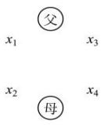

> [!faq]- 全练一本通解析
>
> > [!success]- **【答案】** ABC
>
> > [!note]- **【分析】**
> > 本题未单列分析。
>
> > [!note]- **【解析】**
> > 【详解】先让男生排好有 $A_{3}^{3}$ 种排法，在让女生插空必须选择中间的 2 个空和左、右 2 端中的一个，所以排法分别是 $A_{2}^{2} \cdot A_{3}^{3}$ ，再根据分步计算原理的总的排法 $A_{3}^{3} \cdot A_{2}^{2} \cdot A_{3}^{3} = 72$ 。故选：C
> > ##
> > 【11】B
> > 【解析】第一节课从除了语文之外的5科中选1科, 其它3节课从5科中选3科排列,
> > 则一共有 $A_{s}^{1}A_{s}^{3}=5\times5\times4\times3=300$ （种）. 故选:B.
> > ##
> > 【12】D
> > ## 【详解】
> > 特殊元素优先安排, 先让甲从头、尾中选取一个位置, 有 $A_{2}^{1}$ 种选法, 乙、丙相邻, 捆绑在一起看作一个元素, 与其余四个元素全排列, 最后乙、丙可以换位, 故共有 $A_{2}^{1}A_{5}^{5}A_{2}^{2}=480$ （种）. 故选: D
> > ##
> > 【13】180
> > 【详解】根据题意, 可将四位数分成两类:
> > 第一类, 数字 0 被取到, 则可从 2, 4 中任选一个, 再从 1, 3, 5 中任选两个, 接着从除 0 外的另外三个数中取一个排在首位, 剩下的在三个数位上全排, 此时共有 $C_{2}^{1}C_{3}^{2}C_{3}^{1}A_{3}^{3}=108$ 个四位数;
> > 第二类, 数字 0 没被取到, 故 2, 4 全被取到, 只需从 1, 3, 5 中任选两个,再与 2,4 共 4 个数字在四个数位上全排, 此时共有 $C_{3}^{2}A_{4}^{4}=72$ 个四位数. 根据分类加法计数原理, 不同的四位数的个数是 $108+72=180$ . 故答案为: 180.
> > ##
> > 【14】20
> > 【详解】若该六位数的个位是0，百位和万位为偶数有 $A_{2}^{2}$ 种，其余奇数位有 $A_{3}^{3}$ 种，则满足条件的六位数有 $A_{3}^{3}A_{2}^{2}$ 个；
> > 若个位是 5，因六位数要求奇数与偶数相间，则首位为偶数，
> > 从 2,4 中选一个在首位有 $A_{2}^{1}$ 种，其余偶数位有 $A_{2}^{2}$ 种，奇数位有 $A_{2}^{2}$ 种，
> > 满足条件的六位数有 $A_{2}^{1}A_{2}^{2}A_{2}^{2}$ 个. 故共有 $A_{3}^{3}A_{2}^{2} + A_{2}^{1}A_{2}^{2}A_{2}^{2} = 20$ 个.
> > 故答案为：20.
> > ##
> > 【15】84
> > 【解析】隔板法也就是档板法. 分两步. 第一步: 每班分配 1 个名额, 只有 1 种分法; 第二步: 将剩下的 3 个名额分配给 7 个班. 取 7-1=6 块相同隔板, 连同 3 个相同名额排成一排, 共 9 个位置. 由隔板法知, 在 9 个位置中任取 6 个位置排上隔板, 有 $C_9^6$ 种排法. 每一种插板方法对应一种分法, 由分步计数原理知, 共有 $C_9^6 = 84$ 种分法.
> > ##
> > 【16】D
> > ## 【详解】
> > 根据题意, 先在 2 号盒子里放入 1 个小球, 3 号盒子放入 2 个小球, 原问题即可以转化为将剩下的 7 个小球放入 3 个小盒, 每个小盒至少放一个的问题, 将剩下的 7 个小球排成一排, 排好后有 6 个空位可选, 在 6 个空位中任选 2 个, 插入挡板即可, 则有 $C_6^2 = 15$ 种不同的放法; 故选: D.
> > ##
> > 【17】840
> > 【解析】对于某几个元素顺序一定的排列问题, 可先把这几个元素与其他元素一起进行排列, 然后用总排列数除以这几个元素之间的全排列数, 则共有 $\frac{A_{7}^{7}}{A_{3}^{3}}$ 种不同的方法.
> > ##
> > 【18】B
> > 【详解】增加2个互动节目后，一共有8个节目，这8个节目的不同排法有 $A_{8}^{8}$ 种，而原有的6个节目对应的不同排法有 $A_{6}^{6}$ 种，所以不同的排法有 $\frac{A_{8}^{8}}{A_{6}^{6}}=56$ （种）. 故选：B.
> > ##
> > 【19】B
> > 【详解】在8个人全排列的方法数减去甲，乙，丙全相邻的方法数，就得到甲，乙，丙三人不全相邻的方法数，即 $A_{8}^{8}-A_{6}^{6}\cdot A_{3}^{3}$ .故选：B.
> > ##
> > 【20】B
> > 【详解】若每名大学生只去一个学校, 每个学校至少去 1 名, 则不同的安排方法有 $C_{4}^{2}A_{3}^{3}=36$ 种,
> > 若甲、乙安排在同一所学校, 则不同的安排方法有 $A_{3}^{3}=6$ 种,
> > 所以甲、乙不能安排在同一所学校, 则不同的安排方法有 36-6=30 种.
> > 故选:B.
> > ##
> > 【21】B
> > 【详解】用排除法, 5 本书的全排列减去语文书和数学书中只有一种是两本相邻的排列数, 再减去语文书相邻数学书也相邻的排列数即可得. $A_{5}^{5}-2A_{2}^{2}A_{3}^{2}A_{2}^{2}-A_{2}^{2}A_{2}^{2}A_{3}^{3}=48$ 故选: B.
> > ##
> > 【22】5040
> > 【详解】围桌而坐与坐成一排的不同点在于坐成圆形没有首尾之分，所以固定一人并从此位置把圆形展成直线，其余7人，共有 $(8-1)$ !=7!= $7\times6\times5\times4\times3\times2\times1=5040$ 种不同的坐法.
> > ##
> > 【23】60
> > 【详解】此题与围桌而坐的情况不同点是：a,b,c,d,e,f 与 f,e,d,c,b,a 在围桌而坐中是 2 种排法，而在钻石圈中是 1 种排法，即钻石圈是没有正反之分的，故有 $\frac{(6-1)!}{2}=\frac{5!}{2}=60$ 种不同的钻石圈.
> > 【24】（1）120（2）48（3）24（4）12
> > 【详解】（1）父、母与四个孩子围圆桌而坐，可看成六个元素的回排列，因此有： $(6-1)!=5!=120$ 种坐法.
> > （2）若父、母是相邻而坐的，可将父母看成一组，与其余四个元素的圆排列，则有 $(5-1)!=4!=24$ 种坐标，对于上述的每一种坐法，父、母的坐法又有两种，因此共有： $24\times2=48$ 种坐法.
> > （3）若父, 母要相对而坐, 那么父、母之中, 有一位的位置确定, 另一位的位置也随之而确定, 其余四个孩子的排列数共有 $4! = 24$ 种坐法.
> > （4）若最小的孩子坐在父母之间，则可将这三人看成一组，与其余三人的圆排列，有 $(4-1)!=3!=6$ 种坐法，对于上述的每一种坐法，父、母的坐法又有两种，因此共有： $6\times2=12$ 种坐法.
> > 
> > 【25】192
> > 【详解】（1）正、副班长选一人，有 $C_{2}^{1}$ 种选法.
> > (2) 4 名战士选三人, 有 $C_{4}^{3}$ 种选法.
> > （3）给选出的4人分配四种不同任务，有 $A_4^4$ 种分配法.由分步计数原理得 $C_2^1 C_4^3 A_4^4 = 192$ ：
> > 【详解】依题意,可分两步安排:
> > 第一步, 将 5 人分为 3 个小组, 按小组人数可分为 2 人、2 人、1 人和 3 人、1 人、1 人两类,
> > 2 人、2 人、1 人分组, 甲、乙同组, 另外 3 人中, 选出 2 人同组, 有 $C_{3}^{2}$ 种方法,
> > 3 人、1 人、1 人分组, 除甲、乙的另外 3 人中, 选出 1 人与甲、乙同组, 剩余 2 人各自一组, 有 $C_{3}^{1}$ 种方法,
> > $$
> > \mathrm{C} _ {3} ^ {2} + \mathrm{C} _ {3} ^ {1}
> > $$
> > 第二步, 将 3 组分别安排到三个岗位, 有 $A_{3}^{3}$ 种方法,
> > $$
> > \left(\mathrm{C} _ {3} ^ {2} + \mathrm{C} _ {3} ^ {1}\right) \mathrm{A} _ {3} ^ {3} = (3 + 3) \times 6 = 3 6
> > $$
> > 【详解】（1）两个偶数2,4在1,5之间是一个不能打破的小集团，3在这个小集团之外.
> > (2) 把 1, 5, 2, 4 当作一个小集团与 3 排列, 有 $A_{2}^{2}$ 种排法.
> > （3）再排小集团内部.1,5有 $A_{2}^{2}$ 种排法；2,4也有 $A_{2}^{2}$ 种排法.由分步计数原理得 $A_{2}^{2}A_{2}^{2}A_{2}^{2} = 8$
> > 【28】5760
> > 【详解】4幅油画是一个小集团，内部有 $A_4^4$ 种排法；5幅国画也是一个小集团，内部有 $A_5^5$ 种排法；两个小集团排列，有 $A_2^2$ 种排法；将1幅水彩画插入两个小集团排列后形成的一个空中，有1种排法.由分步计数原理得 $A_4^4 A_5^5 A_2^2 \times 1 = 5760$ ：
> > 【29】A
> > 【详解】先将6名学生分为3组,有 $\frac{C_{6}^{2}C_{4}^{2}C_{2}^{2}}{A_{3}^{3}}=15$ 种（平均分组），因为甲所在小组不能去敬老院，所以安排的方法有 $C_{2}^{1}A_{2}^{2}=4$ 种，故不同的安排共有 $15\times4=60$ 种，故选：A.
> > 解: 先将 4 名同学分为两组, 两组人数为可能为 1, 3 人或 2, 2 人,
> > 当两组人数为 1, 3 时, 有 $C_{4}^{1}C_{3}^{3}=4$ 种方案（不平均分组）,
> > 当两组人数为 2, 2 时, 有 $\frac{C_{4}^{2}C_{2}^{2}}{A_{2}^{2}}=3$ 种方案（平均分组）, 所以将 4 名同学分为两组, 共有 7 种方案, 再将两组同学分配到两个文明实践站, 有 $A_{2}^{2}=2$ 种, 所以根据乘法原理得共有 $7\times2=14$ 种不同的方法. 故选: B
> > 【31】B
> > 【详解】由题意, 先将 5 个服务管理小组分成 3 组, 每组管理小组的数目可能为 2, 2, 1; 1, 1, 3
> > 有 $\frac{C_{5}^{2}C_{3}^{2}C_{1}^{1}}{A_{2}^{2}}+\frac{C_{5}^{1}C_{4}^{1}C_{3}^{3}}{A_{2}^{2}}$ 种分组方式, 再将三组分配到三个影厅有 $A_{3}^{3}$ 种方法, 故总共有 $(\frac{C_{5}^{2}C_{3}^{2}C_{1}^{1}}{A_{2}^{2}}+\frac{C_{5}^{1}C_{4}^{1}C_{3}^{3}}{A_{2}^{2}})A_{3}^{3}=150$ 种分配方法. 故选: B
> > 【32】B
> > 【详解】(1) 张同学单独一组:由于张同学不去乙小区,所以先排张同学共有 $C_{1}^{1}=2$ 种,再将其余 5 人分成两组共有 $C_{1}^{1}+C_{2}^{2}=15$ 中,分配到另外【详解】（1）张同学单独一组：由于张同学不去乙小区，所以先排张同学共有 $C_{2}^{1}=2$ 种，再将其余5人分成两组共有 $C_{5}^{1}+C_{5}^{2}=15$ 中，分配到另外两个小区共有 $A_{2}^{2}=2$ ，所以此类情况共有 $2\times15\times2=60$ 种；
> > （2）张同学与其他同学一组：先安排张同学共有 $C_{2}^{1}=2$ 种，然后将其余5人分成三组共有 $\frac{C_{5}^{1}C_{4}^{1}C_{3}^{3}}{A_{2}^{2}}+\frac{C_{5}^{1}C_{4}^{2}C_{2}^{2}}{A_{2}^{2}}=25$ 种，再将三组分配到三个小区共 $A_{3}^{3}=6$ 种，所以此类情况共有 $2\times25\times6=300$ 种.
> > 综上, 不同的分配方案共有 360 种. 故选: B
> > ## 综合巩固练习
> > ##
> > 【33】B
> > 【详解】把6个节目按照先后出场顺序依次记为编号1,2,3,4,5,6，则3名男教师只有 $(1,3,5),(1,3,6),(1,4,6),(2,4,6)$ 共4种位置安排，由于夫妻教师的节目又不能相邻，可得以上4种安排的每种安排里，3名女教师的安排均是1种，故该6名教师的节目不同的编排顺序共有 $4A_{3}^{3}=24$ 。故选：B.
> > ##
> > 【34】A
> > 【详解】首位为1的有 $A_{5}^{3}=60$ 个, 前两位为20的有 $A_{4}^{2}=12$ 个, 前两位为21的有 $A_{4}^{2}=12$ 个, 所以第85个数字是前两位为23的最小数, 即为2301. 故选: A
> > 【详解】采取对丙和甲进行捆绑的方法：
> > 如果不考虑“乙不在正月初一值班”，则安排方案有： $A_{6}^{6}A_{2}^{2}=1440$ 种，
> > 如果“乙在正月初一值班”，则安排方案有： $C_{1}^{1}A_{4}^{1}A_{2}^{2}A_{4}^{4}=192$ 种，
> > 若“甲在除夕值班”，则“丙在初一值班”，则安排方案有： $A_{5}^{5}=120$ 种.
> > 则不同的安排方案共有 1440-192-120=1128 （种）. 故选：D.
> > 【详解】由题知共有两种情况, 第一种情况: 美术、街舞都不选, 则需从剩余的四个社团中选择三个, 共有 $C_{4}^{3}=4$ 种选择方法;
> > 第二种情况: 美术、街舞中选择一个, 则还需从剩余的四个社团中选择两个, 共有 $C_{2}^{1}C_{4}^{2}=12$ 种选择方法, 故不同的选择方法共有 $4+12=16$ 种. 故选: B
> > 【详解】（1）若四位数中含有数字0不含数字5，则选法是 $C_{3}^{2}C_{4}^{1}$ ，可以组成四位数 $C_{3}^{2}C_{4}^{1}A_{3}^{3}=12\times6=72$ 个；
> > （2）若四位数中含有数字 5 不含数字 0，则选法是 $C_{3}^{1}C_{4}^{2}$ ，可以组成四位数 $C_{3}^{1}C_{4}^{2}A_{3}^{3}=18\times6=108$ 个；
> > （3）若既含数字0，又含数字5，选法是 $\mathrm{C}_3^1\mathrm{C}_4^1$ ，排法是若0在个位，有 $\mathrm{A}_3^3 = 6$ 种，
> > 若 5 在个位, 有 $2A_{2}^{2}=4$ 种, 故可以组成四位数 $C_{3}^{1}C_{4}^{1}\times(6+4)=120$ 个.
> > 根据加法原理, 共有 $72 + 108 + 120 = 300$ 个. 故选: B.
> > 【38】B
> > 【详解】4人去3个敬老院,则有1个敬老院会有两个人去,
> > - **①**：若甲去 B 敬老院: 当 B 敬老院有两人去, 则分配方式有 $C_{2}^{1}A_{2}^{2}$ 种; 当 B 敬老院只有甲去, 分配方式有 $C_{3}^{2}A_{2}^{2}$ 种;
> > - **②**：若甲去 C 敬老院: 当乙去 A 敬老院, 分配方式有 $1 + C_{2}^{1}C_{2}^{1}$ 种; 当乙也去 C 敬老院, 分配方式有 $A_{2}^{2}$ 种, 所以不同的分配方式共有 $C_{2}^{1}A_{2}^{2} + C_{3}^{2}A_{2}^{2} + 1 + C_{2}^{1}C_{2}^{1} + A_{2}^{2} = 17$ 种. 故选: B
> > 【详解】若乙、丙、丁3人体验的项目各不相同，则有 $C_{2}^{1}A_{3}^{3}=12$ 种体验方法，若乙、丙、丁3人有2人体验的项目相同，则有 $C_{2}^{1}C_{3}^{2}A_{2}^{2}=12$ 种体验方法，故不同的体验方法共有24种.故选：C.
> > 【40】A
> > 【详解】设男生人数为n，则女生人数为8-n，
> > 由题意可知 $C_{n}^{2}C_{8-n}^{1}A_{3}^{3}=90$ ，即 $C_{n}^{2}C_{8-n}^{1}=15$ ，即 $n(n-1)(8-n)=30$ ，解得n=3，所以男、女生人数为3,5.故选：A.
> > 【41】C
> > 【详解】将0,1,2,10四个数字排成一行，且数字0不在首位，则有 $3A_{3}^{3}=18$ 种，数字1和0相邻且1在0之前的排法有 $A_{3}^{3}=6$ 种，去掉重复的（类似10102这样的数），满足题意的不同的5位数的个数为 $18-\frac{6}{2}=15$ ，故选：C
> > 【详解】第一:选派2名快递员的时候:
> > 首先, 快递员的选法有 $C_{3}^{2}=3$ 种不同选法, 其中一名快递员从四个区域中选 2 个区域, 有 $C_{4}^{2}=6$ 种选法, 剩余快递员的选法只有 1 种,
> > 所以不同安排方案有: $3 \times 6 \times 1 = 18$ 种;
> > 第二:选派3名快递员的时候:
> > 先从四个区域中选2个区域,有 $C_{4}^{2}=6$ 种选法,将其看做一个区域,现在3个区域安排给三个人有 $A_{3}^{3}=6$ 种方法,
> > 所以不同安排方案有: $6 \times 6 = 36$ 种.
> > 综上, 不同安排方案有: $18 + 36 = 54$ 种. 故选:B
> > 【详解】依题意, 可将这样的六位数分成三类:
> > 第一类, 首位是 1, 则第二位必须是 4, 其余四个数位可将另外四个数字全排即可, 有 $A_4^4 = 24$ 种方法;
> > 第二类, 首位是 4, 则第二位必须是 1, 其余四个数位可将另外四个数字全排即可, 有 $A_4^4 = 24$ 种方法;
> > 第三类, 首位从 2,3,5 中人去一个, 有 $A_3^1$ 种, 再将 1,4 看成一个元素, 与另外三个数字在四个位置上全排有 $A_4^4$ 种,
> > 再考虑 1,4 的顺序, 有 $A_2^2$ 种, 故由分步乘法计数原理, 有 $A_3^1 A_4^4 A_2^2 = 3 \times 24 \times 2 = 144$ 种方法.
> > 由分类加法计数原理可知, 这样的六位数共有 $24 + 24 + 144 = 192$ 个.
> > 故选: A.
> > 【44】D
> > 【详解】按甲的安排进行分类讨论. ①甲排第一, 则乙, 丙等四人有 $A_4^4 = 24$ (种);
> > - **②**：甲排第二, 则乙、丙排后 3 位中的两位, 有 $A_3^2 \times A_2^2 = 12$ (种);
> > - **③**：甲第三, 则乙, 丙排最后 2 位; 有 $A_2^2 \times A_2^2 = 4$ (种). 故共有 $24 + 12 + 4 = 40$ (种). 故选: D.
> > 【45】A
> > 【详解】根据题意, 由于节目甲必须排在前三位, 分 3 种情况讨论:
> > - **①**：、甲排在第一位, 节目丙、丁必须排在一起, 则丙丁相邻的位置有 4 个,
> > 考虑两者顺序, 有 2 种情况, 将剩下的 3 个节目全排列, 安排在其他三个位置,
> > 有 $A_3^3 = 6$ 种安排方法, 则此时有 $4 \times 2 \times 6 = 48$ 种编排方法;
> > - **②**：、甲排在第二位, 节目丙、丁必须排在一起, 则丙丁相邻的位置有 3 个,
> > 考虑两者的顺序, 有 2 种情况, 将剩下的 3 个节目全排列,
> > 安排在其他三个位置, 有 $A_3^3 = 6$ 种安排方法, 则此时有 $3 \times 2 \times 6 = 36$ 种编
> > 排方法;
> > - **③**：、甲排在第三位, 节目丙、丁必须排在一起, 则丙丁相邻的位置有 3 个,
> > 考虑两者的顺序, 有 2 种情况, 将剩下的 3 个节目全排列,
> > 安排在其他三个位置, 有 $A_3^3 = 6$ 种安排方法, 则此时有 $3 \times 2 \times 6 = 36$ 种编
> > 排方案; 则符合题意要求的编排方法有 $36 + 36 + 48 = 120$ 种; 故选: A.
> > 【46】D
> > 【详解】因为由于环状排列没有首尾之分, 将 n 个不同元素围成的环状
> > 排列剪开看成 n 个元素排成一排, 即共有 n! 种排法,
> > 由于 n 个不同元素共有 n 种不同的剪法, 则环状排列共有 $\frac{n!}{n} = (n - 1)!$ 种
> > 排法.
> > 甲、乙两人相邻而坐, 可将此 2 人当作 1 人看, 即 5 人围一圆桌, 有 (5 - 1)!
> > 种坐法,
> > 又因为甲、乙 2 人可换位, 有 2! 种坐法, 故所求坐法为 (5 - 1)! $\times$ 2!=48 种.
> > 故选: D
> > 【47】C
> > 【详解】将 6 人进行编号, 分别为 A,B,C,D,E,F ,其中 A,B 为双胞
> > 胎, C,D 为双胞胎, E,F 为双胞胎,
> > 从左到右站位, 分别为 1,2,3,4,5,6 ,
> > 先从 3 对双胞胎中选择一对令两人相邻, 且两人可内部排列, 故有 $C_3^1 A_2^2$ 种选择,
> > 再依次进行求解, 若这对双胞胎分别站在 1,2 位, 此时 3 号位可以从剩余
> > 的 4 人中进行选择,
> > 那么 4 号位可以从剩余的双胞胎中选择 1 人, 5,6 号位置将固定排剩余 2
> > 人, 此时共有 $C_3^1 A_2^2 C_4^1 C_2^1 = 48$ 种选择,
> > 若这对双胞胎分别站在 2,3 位, 则 1 号位置有 4 种选择, 4 号位可以从剩
> > 余的双胞胎中选择 1 人,
> > 5,6 位置将固定排剩余 2 人, 此时共有 $C_3^1 A_2^2 C_4^1 C_2^1 = 48$ 种选择,
> > 若这对双胞胎分别站在 3,4 位, 则 2 号位置有 4 种选择, 1 号位可以从剩
> > 余的双胞胎中选择 1 人,
> > 5,6 位置可将剩余 2 人进行全排列, 此时共有 $C_3^1 A_2^2 C_4^1 C_2^1 = 96$ 种选择,
> > 若这对双胞胎分别站在 4,5 或 5,6 , 可利用同种方法得到共有 $C_3^1 A_2^2 C_4^1 C_2^1 = 48$ 种选择, 综上, 共有 $48 \times 4 + 96 = 288$ 种排法. 故选: C
> > 【48】C
> > 【详解】若 5 人中有且仅有 3 人被录用, 满足条件的录用情况有 $A_5^3 = 60$ 种,
> > 若 5 人中有且仅有 4 人被录用, 满足条件的录用情况有 $C_5^4 \frac{C_4^1 C_3^1}{A_2^2} A_3^3 = 180$ 种,
> > 若5人都被录用，满足条件的录用情况有 $\frac{\mathrm{C}_2^1\mathrm{C}_4^1}{\mathrm{A}_2^2}\mathrm{A}_3^3 +\frac{\mathrm{C}_5^2\mathrm{C}_3^2}{\mathrm{A}_2^2}\mathrm{A}_3^3 = 150$ 种，由分类加法计数原理可得符合要求的不同的录用情况种数是390.故选：C.
> > 【49】A【详解】因为生物创新实验模块因实验材料条件限制只能有最多两个人参加，所以参加生物创新实验模块的为1人和2人两种情况，（1）当参加生物创新实验模块的为1人时，若这个人为 $A$ ，则一共有 $\frac{\mathrm{C}_4^2}{\mathrm{A}_2^2}\cdot \mathrm{A}_2^2 +\mathrm{C}_4^3\cdot \mathrm{A}_2^2 = 14$ 种不同的分配方式；若这个人不是 $A$ ，则 $A$ 只能参加现代农业技术模块，一共有 $\mathrm{C_4^1(1 + C_3^2\cdot A_2^2)} = 28$ 种不同的分配方式；（2）参加生物创新实验模块的为2人时，若这两人中有 $A$ ，则一共有 $\mathrm{C_4^1\cdot C_3^2\cdot A_2^2} = 24$ ，若这两人中没有 $A$ ，则 $A$ 只能参加现代农业技术模块，一共有 $\mathrm{C_4^2(1 + C_2^1)} = 18$ 种不同的分配方式；综上，一共由 $14 + 28 + 24 + 18 = 84$ 种不同的分配方式；故选：A
> > 【50】B【详解】不考虑甲乙是否同一天加班的特殊情况，5位员工安排在3天加班，可分为 $2 + 2 + 1$ 与 $3 + 1 + 1$ 两种情况， $① 2 + 2 + 1:\frac{\mathrm{C}_5^2\mathrm{C}_3^2}{\mathrm{A}_2^2}\mathrm{A}_3^3 = 90$ ； $② 3 + 1 + 1:\frac{\mathrm{C}_5^3\mathrm{C}_2^1}{\mathrm{A}_2^2}\mathrm{A}_3^3 = 60$ ，共有150种情况.若甲、乙在同一天加班，分他们都在2人组和都在3人组两种情况， $①$ 都在2人组： $\mathrm{C}_3^2\times \mathrm{A}_3^3 = 18$ ； $②$ 都在3人组： $\frac{\mathrm{C}_3^1\mathrm{C}_2^1}{\mathrm{A}_2^2}\mathrm{A}_3^3 = 18$ ，考虑两人的特殊要求之后，共有 $150 - 18 - 18 = 114$ （种）不同的值班安排方法.故选：B
> > 【51】C【详解】第1步：先将相邻的 $A,B$ 进行“捆绑”排列，首先排 $A,B$ ，由题意可将 $A,B$ 两人看作一个整体，先站到正中间，共有 $\mathbf{A}_2^2$ 种站法；第2步：将不能相邻的 $C,D$ 插入合适的位置进行排列，其次再排 $C,D$ ，因为 $C,D$ 两人不能相邻，所以只能排到 $A,B$ 的两侧，若 $C$ 在 $A,B$ 左侧，则有 $\mathrm{C}_2^1$ 种站法，此时 $D$ 只能在 $A,B$ 右侧，有 $\mathbf{C}_2^1$ 种站法，共 $\mathrm{C}_2^1\mathrm{C}_2^1 = 4$ 种站法，同理 $C$ 在 $A,B$ 的右侧， $D$ 在 $A,B$ 左侧，有 $\mathbf{C}_2^1\mathbf{C}_2^1 = 4$ 种站法，故 $C,D$ 共有8种站法；第3步：将剩下的 $E,F$ 进行排列并计算所求，剩下的 $E,F$ 有 $\mathbf{A}_2^2$ 种站法，所以不同的站法共有 $\mathbf{A}_2^2\times 8\times \mathbf{A}_2^2 = 32$ 种.故选：C.
> > 【52】C【详解】3男3女站成一排拍照，左右两端的恰好是一男一女，先排左右两端，有 $\mathrm{C}_3^1\mathrm{C}_3^1\mathrm{A}_2^2 = 18$ 种排法，再排中间4个位置，有 $\mathbf{A}_4^4 = 24$ 种排法，所以不同的排法种数为 $18\times 24 = 432$ 种.故选：C.
> > 【53】C【详解】由题意可知甲、乙都不能安排第三天值班，故可以分步完成：第一步，在除了第三天之外的四天中选两天给甲乙，有 $\mathbf{A}_4^2 = 12$ 种方法；第二步，在剩下的三个位置上安排另外三个人，有 $\mathbf{A}_3^3 = 6$ 种方法.由分步乘法计数原理，不同的值班安排共有 $12\times 6 = 72$ 种.故选：C.
> > 【54】D【详解】解：根据题意，由于任务 $A$ 必须排在前三位，分3种情况讨论： $①.A$ 排在第一位，任务 $E$ 、 $F$ 必须排在一起，则任务 $E$ 、 $F$ 相邻的位置有4个，考虑两者的顺序，有2种情况，将剩下的3个任务全排列，安排在其他三个位置，有 $\mathbf{A}_3^3 = 6$ 种安排方法，则此时有 $4\times 2\times 6 = 48$ 种安排方案； $②.A$ 排在第二位，任务 $E$ 、 $F$ 必须排在一起，则任务 $E$ 、 $F$ 相邻的位置有3个，考虑两者的顺序，有2种情况，将剩下的3个任务全排列，安排在其他三个位置，有 $\mathbf{A}_3^3 = 6$ 种安排方法，则此时有 $3\times 2\times 6 = 36$ 种安排方案； $③.A$ 排在第三位，任务 $E$ 、 $F$ 必须排在一起，则任务 $E$ 、 $F$ 相邻的位置有3个，考虑两者的顺序，有2种情况，
> > 将剩下的3个任务全排列, 安排在其他三个位置, 有 $A_{3}^{3}=6$ 种安排方法, 则此时有 $3\times2\times6=36$ 种安排方案; 则符合题意要求的安排方案有 $36+36+48=120$ 种; 故选: D.
> > 【55】A
> > 【详解】根据第一场安排的比赛是否为跳绳, 分为如下两种情况:
> > 第一种: 若第一场安排跳绳, 则最后一场安排不受限制, 共有: $1 \times A_{5}^{5} = 120$ 种;
> > 第二种: 若第一场不安排跳绳, 则也不能是长跑, 则第一场有4种安排; 再安排最后一场, 其不能为跳绳, 故有4种安排, 故共有: $4 \times 4 \times A_{4}^{4} = 384$ 种; 故不同的安排方案共有: $120 + 384 = 504$ 种. 故选:A.
> > 【详解】若丙在第一或第五位, 甲乙进行捆绑, 内部可以全排列,
> > 甲乙看作一个整体, 和剩余的两个学生进行全排列,
> > 故不同的浇水顺序有 $2A_{2}^{2}A_{3}^{3}=24$ 种,
> > 若丙在第二位或第四位, 甲乙进行捆绑, 内部可以全排列, 且甲乙只能有两个位置可以选择,
> > 再将剩余的两为同学进行排列,
> > 则不同的浇水顺序有 $2 \times 2A_{2}^{2}A_{2}^{2}=16$ 种,
> > 则不同的浇水顺序共有 $24+16=40$ 种. 故选:C
> > 【57】B
> > 【详解】根据题意, 分两种情况:
> > - **①**：8 排在第一位, 则第二位也是 8 , 再从剩下 4 个位置选出 2 个, 安排两个 2 , 最后安排 7 和 1 , 此时有 $C_{4}^{2}A_{2}^{2}=12$ 个不同的密码;
> > - **②**：8 不排成第一位, 则第一位安排 7 或 1, 将两个 8 看成一个整体, 与两个 2 和 7 或 1 中剩下的数排列, 此时有 $\frac{1}{2}C_{4}^{2}A_{4}^{4}=24$ 个不同的密码; 则一有 $12+24=36$ 个不同的密码. 故选: B.
> > 则一有 $12 + 24 = 36$ 个不同的密码.故选：B.
> > 【58】C【详解】有10只不同的盲盒，其中有4只文具盲盒，第6次抽到其中任一只文具盲盒有 $\mathrm{C_4^1}$ 种情况，前5次有3次是文具盲盒，2次是零食盲盒，共有 $\mathrm{C}_3^3\mathrm{C}_6^2$ 种可能，前5次打开盲盒的顺序有 $\mathrm{A}_5^5$ 种可能，由分步计数原理可得共有 $\mathrm{C_4^1C_3^3C_6^2A_5^5} = 7200$ 种.故选：C.
> > 【59】C
> > 【详解】第一步:先将3名母亲全排,共有 $A_{3}^{3}$ 种排法;
> > 第二步:将3名女宝“捆绑”在一起,共有 $A_{3}^{3}$ 种排法;
> > 第三步:将“捆绑”在一起的3名女宝作为一个元素,在第一步形成的2个空中选择1个插入,有 $A_{2}^{1}$ 种排法;
> > 第四步:首先将2名男宝之中的一人,插入第三步后相邻的两个妈妈中间,然后将另一个男宝插入由女宝与妈妈形成的2个空中的其中1个,共有 $C_{2}^{1}C_{2}^{1}$ 种排法.∴不同的排法种数有： $A_{3}^{3}A_{3}^{3}A_{2}^{1}C_{2}^{1}C_{2}^{1}=288$ 种.故选:C.
> > 【60】A
> > 【详解】将六个数0、1、2、9、19、20将任意次序排成一行,拼成一个8位数,由于首位不能为0,则有 $5\times A_{5}^{5}=600$ 个,
> > 其中“20”出现2次,即“2”与“0”相邻且“2”在“0”前的排法有 $\frac{A_{5}^{5}}{A_{2}^{2}}=60$ 种,
> > “19”出现2次,即“1”与“9”相邻且“1”在“9”前的排法有 $\frac{4A_{4}^{4}}{A_{2}^{2}}=48$ 种,
> > “20”和“19”都出现2次的排法有 $\frac{A_{4}^{4}}{A_{2}^{2}A_{2}^{2}}=6$ 种,因此满足条件的8位数的个数为:600-60-48+6=498.故选:A.
> > 【61】A
> > 【详解】英文单词“sentence”中字母e有3个,字母n有2个,字母s、t、c各有一个,优先考虑无限制的字母,注意重复字母需除去顺序,共有 $\frac{A_{6}^{6}}{A_{3}^{3}}=120$ 种,再插入2个字母n,共有 $C_{7}^{2}=21$ 种,所以一共有 $120\times21=2520$ 种,故选:A.
> > 【62】C
> > 【详解】从后排8人中抽2人有 $C_{8}^{2}$ 种方法;
> > 将抽出的2人调整到前排,前排4人的相对顺序不变有 $\frac{A_{6}^{6}}{A_{4}^{4}}$ 种,由分步乘法计数原理可得:共有 $C_{8}^{2}\cdot\frac{A_{6}^{6}}{A_{4}^{4}}=28\times6\times5=840$ 种,故选:C.
> > 【63】A
> > 【详解】因为方程 $x_{1}+x_{2}+x_{3}+x_{4}=8$ ,其中 $x_{2}=2$ ,
> > 则 $x_{1} + x_{3} + x_{4} = 6$ ，将其转化为有 6 个完全相同的小球，排成一列，
> > 利用挡板法将其分成3组, 第一组小球数目为 $x_{1}$ ; 第二组小球数目为 $x_{3}$ ;
> > 第三组小球数目为 $x_{4}$ ，共有 $C_{5}^{2}=10$ 种方法，故方程的正整数解的个数为10，故选：A.
> > 【64】B
> > 【详解】由题意, 五张知识展板并排放在文化橱窗里共有 $A_{5}^{5}$ 种排法,
> > 小雪站在首位或大雪站在末位有 $2A_{4}^{4}$ 种排法,
> > 小雪站在首位且大雪站在末位有 $A_{3}^{3}$ 种排法,
> > 则小雪不站首位, 大雪不站在末位的站法共有 $A_{5}^{5}-2A_{4}^{4}+A_{3}^{3}=78$ 种,
> > 而小雪不站首位, 大雪不站在末位, 冬至在正中间的情况分两类,
> > 小雪不站首位, 大雪不站在末位, 冬至在正中间, 小雪不站末位, 有 $A_{2}^{1}\cdot A_{2}^{1}\cdot A_{2}^{2}=8$ ,
> > 小雪不站首位, 大雪不站在末位, 冬至在正中间, 小雪站末位, 有 $A_{3}^{3}=6$ ,
> > 故小雪不站首位, 大雪不站在末位, 冬至不在正中间的站法共
> > 有: 78-8-6=64 种. 故选: B.
> > 【65】A
> > 【详解】15个人围坐在圆桌旁从中任取4人,他们两两互不相邻,则可先把11个人入坐好,再让其余4人插空,共有 $\frac{A_{11}^{11}}{11}\cdot A_{11}^{4}$ 种不同的围坐方法,
> > 所以所求概率是 $\frac{\frac{A_{11}^{11}}{11}\cdot A_{11}^{4}}{\frac{A_{15}^{15}}{15}}=\frac{30}{91}$ , 故选 A.
> > 【66】25200
> > 【详解】一共有10条灯谜, 共有 $A_{10}^{10}$ 种方法, 由题意可知而其中按2,3,3,2组成的4列相对位置不变, 所以结合倍缩法可知共有 $\frac{A_{10}^{10}}{A_{2}^{2}A_{3}^{3}A_{3}^{3}A_{2}^{2}}=25200$ 种, 也即是这10条灯谜依次被选中的所有不同顺序方法有25200种
> > 故答案为: 25200.
> > 【67】30240
> > 【详解】先将10人全排, 即为 $A_{10}^{10}$ , 再将甲、乙、丙、丁、戊五人全排, 即为 $A_{5}^{5}$ , 故有 $\frac{A_{10}^{10}}{A_{5}^{5}}=30240$ 种排法. 故答案为: 30240.
> > 【68】60
> > 【详解】将6只灯笼全排, 即 $A_{6}^{6}$ ,
> > 因为每次只能取其中一串最下面的一只灯笼内的谜题, 每次取灯的顺序确定, 取谜题的方法有 $\frac{A_{6}^{6}}{A_{3}^{3}\cdot A_{2}^{2}}=60$ . 故答案为: 60
> > 【69】43200
> > 【详解】甲和乙必须相邻, 采用捆绑法, 将其看作一个整体, 与除丙丁外的其他6人排成一圈, 共有 $A_{2}^{2}\cdot\frac{A_{7}^{7}}{7}=1440$ 种排列.
> > 甲和丙, 丁不能相邻, 采用插空法, 甲和乙与除了丙丁外的其他6人排成一圈后形成7个空, 但甲与丙丁不能相邻, 故丙丁只有6个空位可选, 有 $A_{6}^{2}=30$ 种选择, 根据分步乘法原理可知, 不同的排法总数为 $30\times1440=43200$ . 故答案为: 43200.
> > 【70】840
> > 【详解】设4名乘客中分别有 $z_{1}, z_{2}, z_{3}, z_{4}$ 个人在第1个、第2个、第3个、第4个安检口通过, 则 $z_{1}+z_{2}+z_{3}+z_{4}=4$ , 即问题转化为求方程 $z_{1}+z_{2}+z_{3}+z_{4}=4$ 的非负整数解的组数, $z_{1}+1+z_{2}+1+z_{3}+1+z_{4}+1=8$ , 于是问题转化为正整数 $z_{1}+1, z_{2}+1, z_{3}+1, z_{4}+1$ , 满足 $(z_{1}+1)+(z_{2}+1)+(z_{3}+1)+(z_{4}+1)=8$ , 则不同的有序实数对 $(z_{1}+1,z_{2}+1,z_{3}+1,z_{4}+1)$ 有多少种可能.
> > 于是把8个1排成1列, 放入3个隔板即可, 共有 $C_{7}^{3}$ 种情况, 每一种进站情况的4个位置由4个人去站有 $A_{4}^{4}$ 种方法, 由分步乘法计数原理得不同的进站方案有 $A_{4}^{4}C_{7}^{3}=840$ 种, 所以一个4人小组进站的不同方案种数是840种.
> > # 第五节 二项式定理
> > ## 核心基础达标
> > 【1】C
> > 【详解】因 $(a+b)^{n}$ 的展开式有n+1项,故n+1=9,解得n=8.故选:C.
> > 【2】A
> > 【详解】 $(a+b)^{5}$ 的二项展开式的通项公式 $T_{r+1}=C_{5}^{r}a^{5-r}b^{r}$ ，令r=2，得展开式的第3项为 $T_{3}=C_{5}^{2}a^{3}b^{2}$ .故选:A
> > 【3】A
> > 【详解】 $(1-5x)^{5}$ 展开式中的第2项为 $C_{5}^{1}\cdot(-5x)=-25x$ .故选:A
> > 【4】D
> > 【详解】由题意知， $(x^{2}-\frac{2}{x})^{6}$ 展开式的通项公式为 $T_{r+1}=C_{6}^{r}(x^{2})^{6-r}(-\frac{2}{x})^{r}=(-2)^{r}C_{6}^{r}x^{12-3r}$ ,
> > 令 r=3 , 得 $T_{3+1}=(-2)^{3}C_{6}^{3}x^{12-3\times3}=-160x^{3}$ ，即第四项为 $-160x^{3}$ . 故选:D
> > 【5】 $10x^{3}y^{6}$ 【详解】 $\left(x-y^{3}\right)^{5}$ 展开式中的通项为 $T_{k+1}=C_{5}^{t}x^{5-k}\left(-1\right)^{k}y^{3k}=C_{5}^{t}\left(-1\right)^{k}x^{5-k}y^{3k}$ ，
> > 所以第3项为： $T_{3}=C_{5}^{2}\left(-1\right)^{2}x^{5-2}y^{3\times2}=10x^{3}y^{6}$ ，故答案为： $10x^{3}y^{6}$ .
> > 【6】 $x^{4}-8x^{3}y+24x^{2}y^{2}-32xy^{3}+16y^{4}$ 【详解】 $(x-2y)^{4}=C_{4}^{0}x^{4}+C_{4}^{1}x^{3}\cdot(-2y)+C_{4}^{2}x^{2}\cdot(-2y)^{2}+C_{4}^{3}x\cdot(-2y)^{3}+C_{4}^{4}\left(-2y\right)^{4}=x^{4}-8x^{3}y+24x^{2}y^{2}-32xy^{3}+16y^{4}$
> > 【7】 $81x^{2}+108x+54+\frac{12}{x}+\frac{1}{x^{2}}$ 【详解】 $\left(3\sqrt{x}+\frac{1}{\sqrt{x}}\right)^{4}=C_{4}^{0}\left(3\sqrt{x}\right)^{4}\left(\frac{1}{\sqrt{x}}\right)^{0}+C_{4}^{1}\left(3\sqrt{x}\right)^{3}\cdot\left(\frac{1}{\sqrt{x}}\right)^{1}+C_{4}^{2}\left(3\sqrt{x}\right)^{2}\left(\frac{1}{\sqrt{x}}\right)^{2}+C_{4}^{3}\left(3\sqrt{x}\right)\left(\frac{1}{\sqrt{x}}\right)^{3}+C_{4}^{4}\left(3\sqrt{x}\right)^{0}\cdot\left(\frac{1}{\sqrt{x}}\right)^{4}=81x^{2}+108x+54+\frac{12}{x}+\frac{1}{x^{2}}$
> > 【8】 $1-5-3+10-6-10-9+5-12-15$
> > $$
> > 1 - 5 x ^ {3} + 1 0 x ^ {6} - 1 0 x ^ {9} + 5 x ^ {1 2} - x ^ {1 5}
> > $$
> > 【详解】 $(1 - x)^{5}\left(1 + x + x^{2}\right)^{5} = \left[(1 - x)\left(1 + x + x^{2}\right)\right]^{5} = \left(1 - x^{3}\right)^{5}$ $= \mathrm{C}_5^0\times 1^5\left(-x^3\right)^0 +\mathrm{C}_5^1\times 1^4\left(-x^3\right)^1 +\mathrm{C}_5^2\times 1^3\left(-x^3\right)^2 +\mathrm{C}_5^3\times 1^2\left(-x^3\right)^3 +\mathrm{C}_5^4\times 1^1\left(-x^3\right)^4$ $+C_5^5\times 1^0\left(-x^3\right)^5 = 1 - 5x^3 +10x^6 -10x^9 +5x^{12} - x^{15}.$
> > $$
> > = \mathrm{C} _ {5} ^ {0} (x - 1) ^ {5} + \mathrm{C} _ {5} ^ {1} (x - 1) ^ {4} + \mathrm{C} _ {5} ^ {2} (x - 1) ^ {3} + \mathrm{C} _ {5} ^ {3} (x - 1) ^ {2} + \mathrm{C} _ {5} ^ {4} (x - 1) ^ {1} + \mathrm{C} _ {5} ^ {5} (x - 1) ^ {0} - 1
> > $$
> > $$
> > = [ (x - 1) + 1 ] ^ {5} - 1 = x ^ {5} - 1
> > $$
> > $$
> > \because 1 = C _ {4} ^ {0} = C _ {4} ^ {4}, 4 = C _ {4} ^ {1} = C _ {4} ^ {3}, 6 = C _ {4} ^ {2}
> > $$
> > $$
> > \therefore \text {原式} = C _ {4} ^ {0} (x - 1) ^ {4} \cdot 1 ^ {0} + C _ {4} ^ {1} (x - 1) ^ {3} \cdot 1 ^ {1} + C _ {4} ^ {2} (x - 1) ^ {2} \cdot 1 ^ {2} + C _ {4} ^ {3} (x - 1) \cdot 1 ^ {3} + C _ {4} ^ {4} \cdot 1 ^ {4}
> > $$
> > $$
> > = \left[ (x - 1) + 1 \right] ^ {4} = x ^ {4}
> > $$
> > 【11】 $32x^{5}$ 【详解】原式 $= C_5^0 (2x + 1)^5 -C_5^1 (2x + 1)^4 +C_5^2 (2x + 1)^3 -C_5^3 (2x + 1)^2 +C_5^4 (2x + 1) - C_5^5 (2x + 1)^0$ $= [(2x + 1) - 1]^{5} = (2x)^{5} = 32x^{5}$ .
> > 【12】 $\frac{7^n - 1}{6}$ 【详解】由 $C_n^0 +C_n^1 6 + C_n^2 6^2 +C_n^3 6^3 +\dots +C_n^{n - 1}6^{n - 1} + C_n^n 6^n = (1 + 6)^n = 7^n$ $\therefore C_n^1 +C_n^2 6 + C_n^3 6^2 +\dots +C_n^n 6^{n - 1} = \frac{7^n - C_n^0}{6} = \frac{7^n - 1}{6}$
> > 【13】C
> > 【详解】 $C_n^0\cdot 2^n +C_n^1\cdot 2^{n - 1} + \dots +C_n^k\cdot 2^{n - k} + \dots +C_n^n = (1 + 2)^n = 3^n$ .故选：C
> > 【14】C
> > 【详解】 $f(x) = 1 + C_4^1 x + C_4^2 x^2 +C_4^3 x^3 +C_4^4 x^4 = (1 + x)^4$ ，所以 $f(2) = 3^4 = 81$ 故选：C
> > 【15】1
> > 【详解】因为 $(2-1)^{n}=C_{n}^{0}2^{n}-C_{n}^{1}2^{n-1}+C_{n}^{2}2^{n-2}+\cdots+(-1)^{n-1}C_{n}^{n-1}\cdot2+(-1)^{n}C_{n}^{n}$ ，所以 $2^{n}-C_{n}^{1}2^{n-1}+C_{n}^{2}2^{n-2}+\cdots+(-1)^{n-1}C_{n}^{n-1}\cdot2+(-1)^{n}=1$ ，故答案为：1
> > 【16】B
> > 【详解】 $16-32x+24x^{2}-8x^{3}+x^{4}$ $=C_{4}^{0}2^{4}+C_{4}^{1}2^{3}(-x)+C_{4}^{2}2^{2}(-x)^{2}+C_{4}^{3}2(-x)^{3}+C_{4}^{4}(-x)^{4}=(2-x)^{4}$ ，故选：B
> > 【17】1
> > 【详解】 $1-2C_{10}^{1}+4C_{10}^{2}-8C_{10}^{3}+\cdots-2^{9}C_{10}^{9}+2^{10}$ $=C_{10}^{0}(-1)^{10}\times2^{0}+C_{10}^{1}(-1)^{9}\times2^{1}+C_{10}^{2}(-1)^{8}\times2^{2}$ $+C_{10}^{3}(-1)^{7}\times2^{3}+\cdots+C_{10}^{9}(-1)^{1}\times2^{9}+C_{10}^{10}(-1)^{0}\times2^{10}=(-1+2)^{10}=1$ 。
> > 【18】6
> > 【详解】 $C_{n}^{0}3^{n}+C_{n}^{1}3^{n-1}+\cdots+C_{n}^{n-1}3+C_{n}^{n}=C_{n}^{0}3^{n}1^{0}+C_{n}^{1}3^{n-1}1^{1}+\cdots+C_{n}^{n-1}3^{1}1^{n-1}+C_{n}^{n}3^{0}1^{n}=$ $(3+1)^{n}=4^{n}=2^{12}$ ，即 $2^{2n}=2^{12}$ ，得n=6。
> > 【19】B
> > 【详解】由 $C_{n}^{0}-4C_{n}^{1}+4^{2}C_{n}^{2}-4^{3}C_{n}^{3}+\cdots+(-1)^{n}4^{n}C_{n}^{n}=729$ 得 $C_{n}^{0}\cdot1^{n}\cdot(-4)^{0}+C_{n}^{1}\cdot1^{n-1}\cdot(-4)^{1}+C_{n}^{2}\cdot1^{n-2}\cdot(-4)^{2}+C_{n}^{3}\cdot1^{n-3}\cdot(-4)^{3}+\cdots+C_{n}^{n}\cdot1^{0}\cdot(-4)^{n}=729$ ，则 $(1-4)^{n}=729$ ，即 $(-3)^{n}=729=(-3)^{6}$ ，解得n=6。故选：B.
> > 【20】D
> > 【详解】设 $(1+x)^{n}=C_{n}^{0}+C_{n}^{1}x+C_{n}^{2}x^{2}+C_{n}^{3}x^{3}+C_{n}^{4}x^{4}+\cdots+C_{n}^{n}x^{n}$ ，
> > 两边求导数， $n(1+x)^{n-1}=C_{n}^{1}+2C_{n}^{2}x+3C_{n}^{3}x^{2}+4C_{n}^{4}x^{3}+\cdots+nC_{n}^{n}x^{n-1}$ ，
> > 令x=1，得 $n\cdot2^{n-1}=C_{n}^{1}+2C_{n}^{2}+3C+4C_{n}^{4}+\cdots+nC_{n}^{n}$ ，
> > 取n=2022，
> > 得 $C_{2022}^{1}+2C_{2022}^{2}+3C_{2022}^{3}+4C_{2022}^{4}+\cdots+2022C_{2022}^{2022}=2022\cdot2^{2021}=1011\times2^{2022}.$ 故选：D.
> > ## 重点题型专练
> > 【21】（1） $-220x^{8}$ （2）-220（3） $x^{12}$ ， $-220x^{8}$ ， $924x^{4}$ ， $-220$ ， $\frac{1}{x^{4}}$ 【详解】（1） $\left(x-\frac{1}{\sqrt[3]{x}}\right)^{12}$ 的展开式的通项为 $T_{k+1}=C_{12}^{k}x^{12-k}\cdot\left(-\frac{1}{\sqrt[3]{x}}\right)^{k}=(-1)^{k}C_{12}^{k}x^{12-\frac{4}{3}k}$ .
> > 令 k=3，
> > 则 $T_{4}=(-1)^{3}C_{12}^{3}x^{12-\frac{4}{3}3}=-220x^{8} \cdot$ 故第 4 项的系数为 -220，二项式系数为 $C_{12}^{3}=220$ （2）由（1）中二项式展开式的通项，令 $12-\frac{4}{3}k=0$ ，解得 k=9，所以常数项为 $(-1)^{9}C_{12}^{9}=-220$ （3）由（1）中二项式展开式的通项，当 k=0,3,6,9,12 时， $T_{k+1}$ 是有理项，分别为 $T_{1}=x^{12}$ ， $T_{4}=-C_{12}^{3}x^{8}=-220x^{8}$ ， $T_{7}=C_{12}^{6}x^{4}=924x^{4}$ ， $T_{10}=-C_{12}^{9}=-220$ ， $T_{13}=C_{12}^{12}x^{-4}=\frac{1}{x^{4}}$ .
> > 【22】（1）-16（2） $-16x^{2}$ ，1120， $-1024x^{-2}$ 【详解】（1）因为 $\left(\sqrt[3]{x}-\frac{2}{\sqrt[3]{x}}\right)^{n}$ 的二项展开式的通项公式为 $T_{r+1}=C_{n}^{r}\cdot\left(\sqrt[3]{x}\right)^{n-r}\cdot\left(-\frac{2}{\sqrt[3]{x}}\right)^{r}=(-2)^{r}\cdot C_{n}^{r}\cdot x^{\frac{n-2r}{3}}, r=0,1,2,\cdots,n$ ,
> > 因为第 5 项为常数项，则当 r=4 时，有 $\frac{n-8}{3}=0$ ，解得 n=8。
> > 令 $\frac{8-2r}{3}=2$ ，解得 r=1。
> > 所以含 $x^{2}$ 项的系数为 $(-2)^{1}\cdot C_{8}^{1}=-16$ ，对应的二项式系数为 $C_{8}^{1}=8$ （2）由题意可知， $\begin{cases}\frac{8-2r}{3}\in\mathbf{Z}\\0\leq r\leq8\\r\in\mathbf{N}\end{cases}$ ，解得 r=1,4,7，
> > 所以第 2 项，第 5 项，第 8 项为有理项，分别为
> > $-16x^{2}$ ， $C_{8}^{4}\cdot(-2)^{4}=1120$ ， $C_{8}^{7}\cdot(-2)^{7}\cdot x^{-2}=-1024x^{-2}$
> > 【23】A
> > 【详解】 $(1-3x)^{6}$ 的展开式的通项为 $T_{k+1}=C_{6}^{k}\cdot1^{6-k}\cdot(-3x)^{k}=(-3)^{k}C_{6}^{k}x^{k}$ ，令k=4，则 $(1-3x)^{6}$ 的展开式中含 $x^{4}$ 的二项式系数为 $C_{6}^{4}=15$ 。故选：A.
> > 【24】B
> > 【详解】依题意得，展开式的通项为： $T_{r+1}=C_{6}^{r}(3x)^{6-r}\left(-\frac{1}{\sqrt{x}}\right)^{r}=(-1)^{r}3^{6-r}C_{6}^{r}x^{6-\frac{3}{2}r}$ 令 $6-\frac{3}{2}r=0$ ，解得r=4，
> > ∴常数项为： $T_{5}=(-1)^{4}3^{6-4}C_{6}^{4}x^{0}=135$ 故选：B.
> > 【25】B
> > 【详解】由题意可得 $(x-\sqrt{2}y)^{10}$ 的展开式通项公式为 $T_{r+1}=C_{10}^{r}x^{10-r}(-\sqrt{2}y)^{r}, r=0,1,2,\cdots,10$ ，故展开式 $x^{6}y^{4}$ 的系数为 $C_{10}^{4}(-\sqrt{2})^{4}=840$ ，故选：B
> > 【26】A
> > 【详解】由 $T_{k+1}=C_{6}^{k}\left(\frac{x}{2}\right)^{6-k}\left(-\sqrt{x}\right)^{k}=(-1)^{k}\left(\frac{1}{2}\right)^{6-k}C_{6}^{k}x^{6-\frac{k}{2}}$ ，当 $6-\frac{k}{2}=4$ ，解得k=4，所以 $x^{4}$ 的系数为 $(-1)^{4}\left(\frac{1}{2}\right)^{2}C_{6}^{4}=\frac{1}{4}\times15=\frac{15}{4}$ ，故选：A.
> > 【27】B
> > 【详解】由二项展开式的通项公式可得 $T_{r+1}=C_{6}^{r}(x^{2})^{6-r}\left(\frac{a}{x}\right)^{r}=a^{r}C_{6}^{r}x^{12-3r}$ ，令 $12-3r=0$ ，解得r=4，即常数项为 $T_{5}=a^{4}C_{6}^{4}=240$ ，解得a=2。
> > 故选：B
> > 【28】280x
> > 【详解】 $T_{r+1}=C_{7}^{r}(2x)^{7-r}\left(-x^{-\frac{1}{2}}\right)^{r}=C_{7}^{r}2^{7-r}\times(-1)^{r}x^{7-\frac{3}{2}r}$ ，令 $7-\frac{3}{2}r=1$ ，得：r=4，所以含x的项是280x，故答案为：280x
> > 【29】B
> > 【详解】设 $(ax^{2}-\frac{1}{\sqrt{x}})^{4}$ 展开式的通项为： $T_{r+1}=C_{4}^{r}(ax^{2})^{4-r}\left(-x^{-\frac{1}{2}}\right)^{r}=C_{4}^{r}\cdot a^{4-r}\cdot(-1)^{r}\cdot x^{8-\frac{5}{2}r}$ ，
> > 由题意可得：当r=2时， $C_{4}^{2}\cdot a^{2}\cdot(-1)^{2}=\frac{2}{3}\Rightarrow a=\frac{1}{3}$ 。故选：B
> > 【30】D
> > 【详解】 $(2+x)^{10}=[-1+(x+3)]^{10}$ $=C_{10}^{0}\cdot(-1)^{10}\cdot(x+3)^{0}+C_{10}^{1}\cdot(-1)^{9}\cdot(x+3)^{1}+\cdots+C_{10}^{10}\cdot(x+3)^{10}$ ，
> > 展开式中含有 $(x+3)^{7}$ 的系数为 $a_{7}=C_{10}^{7}\cdot(-1)^{3}=-C_{10}^{3}=-\frac{10\times9\times8}{3\times2\times1}=-120$ 。故选：D.
> > 【31】252
> > 【详解】设 $1+3x=t$ ，则3x=t-1，
> > 即 $(3-t)^{8}=(t-3)^{8}=a_{0}+a_{1}t+a_{2}t^{2}+\ldots a_{8}t^{8}$ ， $a_{6}$ 是 $t^{6}$ 前的系数，
> > 即 $a_{6}=C_{8}^{6}\cdot3^{2}=252$ 。故答案为：252
> > 【32】CD
> > 【详解】 $(3x-\frac{1}{\sqrt{x}})^{6}$ 的展开式的通项为 $T_{r+1}=C_{6}^{r}\cdot(-1)^{r}\cdot3^{6-r}\cdot x^{\frac{-3}{2}}$ ，
> > 令 $6-\frac{3}{2}r$ 为整数，求得r=0,2,4,6，有理项共有4项，故A错误，D正确；
> > 令 $6-\frac{3}{2}r$ 为非负整数，求得r=0,2,4，整式共有3项，故C正确；
> > 令 $6-\frac{3}{2}r=0$ ，求得r=4，常数项为第5项，故B错误；故选：CD.
> > 【33】AD
> > 【详解】 $(\sqrt{x}-\frac{1}{2x})^{6}$ 的展开式的第 $r+1$ 项 $T_{r+1}=C_{6}^{r}\left(\sqrt{x}\right)^{6-r}\left(-\frac{1}{2x}\right)^{r}=C_{6}^{r}x^{\frac{3-\frac{1}{2}}{2}}\left(-\frac{1}{2}\right)^{r}x^{-r}=C_{6}^{r}\left(-\frac{1}{2}\right)^{r}x^{\frac{3-\frac{3}{2}}{2}}$
> > 令 $3 - \frac{3}{2} r = 0$ ，则 $r = 2$ ，
> > 常数项为 $C_6^2\left(-\frac{1}{2}\right)^2 = 15 \times \frac{1}{4} = \frac{15}{4}$ ，故 A 正确；当 $r = 0, 2, 4, 6$ ，展开式中有有理项，所以有理项有 4 项，故 D 正确。故选：AD。
> > 【34】ABC
> > 【详解】二项式的展开式的通项为 $T_{r+1} = C_n^r x^{2n-2r}(-1)^r x^{-\frac{r}{2}} = (-1)^r C_n^r x^{2n-\frac{5r}{2}}$ ，由于第 3 项与第 5 项的系数之比为 $\frac{3}{14}$ ，则 $\frac{C_n^2}{C_n^4} = \frac{3}{14}$ ，故 $\frac{\frac{n(n-1)}{1 \times 2}}{\frac{n(n-1)(n-2)(n-3)}{1 \times 2 \times 3 \times 4}} = \frac{3}{14}$ ，得 $n^2 - 5n - 50 = 0$ 。
> > \$\therefore (n+5)(n-10) = 0\$，解得 $n = 10$ ，故 A 正确；
> > 则 $T_{r+1} = (-1)^r C_{10}^r x^{20 - \frac{5r}{2}}$ ，令 $20 - \frac{5r}{2} = 0$ ，解得 $r = 8$ ，
> > 则展开式中的常数项为 $C_{10}^8 = 45$ ，故 B 正确；
> > 令 $20 - \frac{5r}{2} = 5$ ，解得 $r = 6$ ，则含 $x^5$ 的项的系数为 $(-1)^6 C_{10}^6 = 210$ ，故 C 正确；
> > 令 $20 - \frac{5r}{2} \in Z$ ，则 $r$ 为偶数，此时 $r = 0, 2, 4, 6, 8, 10$ ，故 6 项有理项。
> >
> > 故选 **ABC**
