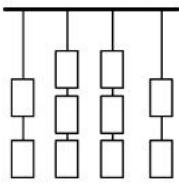

<!-- question-source:start -->
【66】（21-22 高三上·江西·阶段练习）某公司在元宵节组织了一次猜灯谜活动，主持人事先将 10 条不同灯谜分别装在了如图所示的 10 个灯笼中，猜灯谜的职员每次只能任选每列最下面的一个灯笼中的谜语来猜（无论猜中与否，选中的灯笼就拿掉），则这 10 条灯谜依次被选中的所有不同顺序方法数为 \_\_\_\_。（用数字作答）

<!-- question-source:end -->

![[Q00014288A1]]
