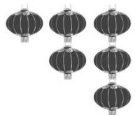

<!-- question-source:start -->
【68】（20-21 高三下·浙江·阶段练习）某次灯谜大会共设置 6 个不同的谜题, 分别藏在如图所示的 6 只灯笼里, 每只灯笼里仅放一个谜题. 并规定一名参与者每次只能取其中一串最下面的一只灯笼并解答里面的谜题, 直到答完全部 6 个谜题, 则一名参与者一共有\_\_\_\_种不同的答题顺序.

<!-- question-source:end -->

![[Q00014290A1]]
