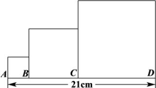

<!-- question-source:start -->
【88】(2021高二全国专题练习)如图所示,三个正方形的边AB、BC、CD的长组成等差数列,且AD=21cm,这三个正方形的面积之和是179cm².

（2）以 $AB$ 、 $BC$ 、 $CD$ 的长为等差数列的前三项，以第10项为边长的正方形的面积是多少？
<!-- question-source:end -->

![[Q00014629A1]]
