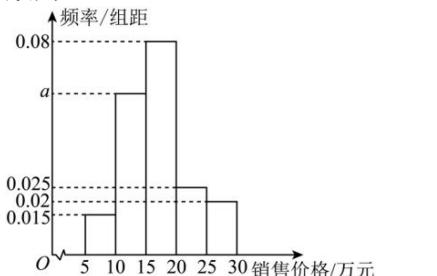

<!-- question-source:start -->
【3】（22-23高三下·河南新乡·开学考试）在2022年某地销售的汽车中随机选取1000台，对销售价格与销售数量进行统计，这1000台车辆的销售价格都不小于5万元，小于30万元，将销售价格分为五组：[5,10)，[10,15)，[15,20)，[20,25)，[25,30）（单位：万元）。统计后制成的频率分布直方图如图所示。在选取的1000台汽车中，销售价格在[10,20)内的车辆台数为（）

<!-- question-source:end -->

![[Q00015153A1]]
