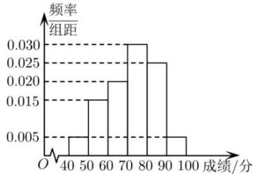

<!-- question-source:start -->
【4】某校高一年级 1000 名学生在一次考试中的成绩的频率分布直方图如图所示, 现用分层抽样的方法从成绩 40\~70 分的同学中共抽取 80 名同学, 则抽取成绩 50\~60 分的人数是（）

A. 20 B. 30 C. 40 D. 50
<!-- question-source:end -->

![[Q00015154A1]]
