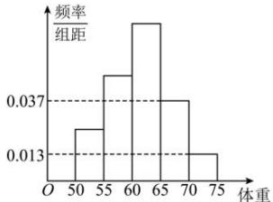

<!-- question-source:start -->
【6】（22-23 高一·江苏徐州·月考）为了解我校今年报考飞行员的学生的体重情况. 将所得的数据整理后, 作出了频率分布直方图（如图）, 已知图中从左到右的前3个小组的频率之比为1:2:3,第1小组的频数为4,则我校报考飞行员的学生总人数是（）

A. 40 B. 32 C. 28 D. 24
<!-- question-source:end -->

![[Q00015156A1]]
