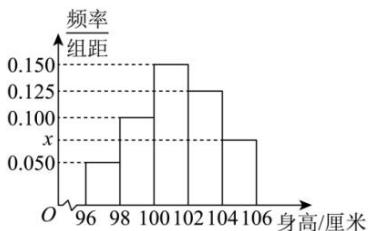

<!-- question-source:start -->
【7】（2024·甘肃·期末）某幼儿园根据部分同年龄段女童的身高数据绘制了频率分布直方图，其中身高的变化范围是[96,106]（单位：厘米），样本数据分组为[96,98],[98,100],[100,102],[102,104],[104,106].

（1）求出 $x$ 的值；

（2）已知样本中身高小于100厘米的人数是36，求出总样本量 $N$ 的数值；

（3）根据频率分布直方图提供的数据及（2）中的条件,求出样本中身高位于 $[98,104)$ 的人数.
<!-- question-source:end -->

![[Q00015157A1]]
