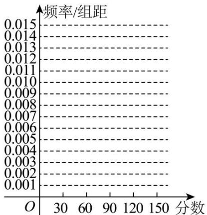

<!-- question-source:start -->
【8】某校高二年级期末统一测试, 随机抽取一部分学生的数学成绩, 分组统计如下表.

<table><tr><td>分组</td><td>频数</td><td>频率</td></tr><tr><td>[0,30)</td><td>3</td><td>0.03</td></tr><tr><td>[30,60)</td><td>3</td><td>0.03</td></tr><tr><td>[60,90)</td><td>37</td><td>0.37</td></tr><tr><td>[90,120)</td><td>m</td><td>n</td></tr><tr><td>[120,150]</td><td>15</td><td>0.15</td></tr><tr><td>合计</td><td>M</td><td>N</td></tr></table>

（1）求出表中 $m, n, M, N$ 的值，并根据表中所给数据在给出的坐标系中画出频率直方图；（2）若全校参加本次考试的学生有600人，试估计这次测试中全校成绩在90分以上的人数.
<!-- question-source:end -->

![[Q00015158A1]]
