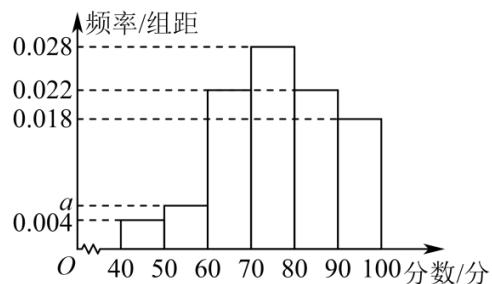

<!-- question-source:start -->
【9】（24-25·上海·课堂例题）某公司餐厅为了完善餐厅管理，提高餐厅服务质量，随机调查了50名就餐的公司职员，根据这50名职员对餐厅服务质量的评分，绘制出了如图所示的频率分布直方图，其中样本数据分组为[40,50)，[50,60)，…，[90,100].

（2）若采用分层随机抽样的方法从评分在 $[40,60)$ ， $[60,80)$ ， $[80,100]$ 的公司职员中抽取 10 人，则评分在 $[60,80)$ 内的职员应抽取多少人？
<!-- question-source:end -->

![[Q00015159A1]]
