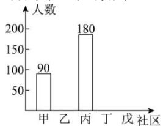
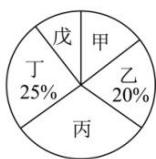

<!-- question-source:start -->
【11】（22-23 高一上·山东日照·月考）将某年级 600 名学生分配到甲、乙、丙、丁、戊这 5 个社区参加社会实践活动，每个人只能到一个社区。经统计，将到各个社区参加志愿者活动的学生人数绘制成如下不完整的两个统计图，则分到戊社区参加活动的学生人数为（）

A. 30 B. 45 C. 60 D. 75
<!-- question-source:end -->

![[Q00015161A1]]
