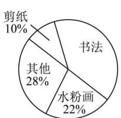
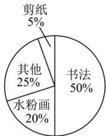

<!-- question-source:start -->
【12】（22-23 高一下·湖北武汉·月考）如图是庙山中学艺术节期间收到的高一和高二两个年级各类艺术作品的情况统计图：

高一

高二

已知高一收到的剪纸作品比高二的多20件,收到的书法作品比高二的少100件,则两年级收到的艺术作品的总数为（）
A. 1000 件 B. 1100 件
C. 1200 件 D. 1250 件
<!-- question-source:end -->

![[Q00015162A1]]
