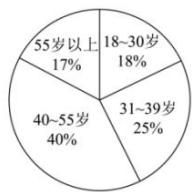
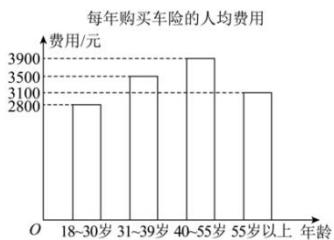

<!-- question-source:start -->
【13】（22-23 高一下·内蒙古通辽·月考）某统计机构对 1000 名拥有汽车的人进行了调查, 对得到的数据进行整理并制作了如图所示的统计图表, 下列关于样本的说法正确的是（）

拥有汽车的人群的年龄比例

A. 40\~45 岁之间的人群拥有汽车的人数最多
B. 40\~55 岁之间的人群每年购买车险的总费用, 比 18\~30 岁和 55 岁以上人群购买车险的总费用之和还要多
C. 55 岁以上人群每年购买车险的总费用最少
D. 30 岁以上人群拥有汽车的人数为 720
<!-- question-source:end -->

![[Q00015163A1]]
