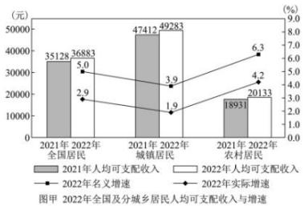
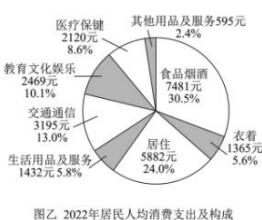

<!-- question-source:start -->
【14】（22-23 高一·山西运城）恩格尔系数是食品支出总额占个人消费支出总额的比重，恩格尔系数达 59% 以上为贫困，50～59% 为温饱，40～50% 为小康，30～40% 为富裕，低于 30% 为最富裕。国家统计局 2023 年 1 月 17 日发布了我国 2022 年居民收入和消费支出情况，根据统计图表如图甲、乙所示，下列说法不正确的是（）

A. 2022年城镇居民人均可支配收入增长额超过农村居民人均可支配收入增长额
B. 2022年城镇居民收入增长率快于农村居民
C. 从恩格尔系数看, 可认为我国在2022年达到富裕
D. 2022年全国居民人均消费支出构成中食品烟酒和居住占比超过 $50\%$
<!-- question-source:end -->

![[Q00015164A1]]
