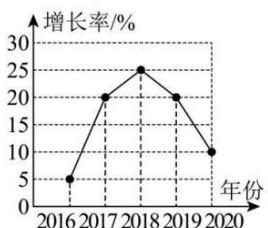
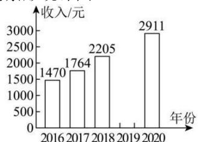

<!-- question-source:start -->
【15】（多选）（2024·高一·江苏·专题练习）某报告显示:我国农民工收入持续快速增长.某地区农民工人均月收入增长率如图①,并将人均月收入绘制成如图②的不完整的条形统计图.

①

②

根据以上统计图,以下说法正确的是（）

第二节 用样本总计总体（1）——统计图表
A. 2020 年农民工人均月收入的增长率是 10%
B. 2018 年农民工人均月收入是 2205 元
C. 小明认为“农民工 2019 年的人均月收入比 2018 年的少了”
D. 2016 年到 2020 年这五年中, 2020 年农民工人均月收入最高
<!-- question-source:end -->

![[Q00015165A1]]
