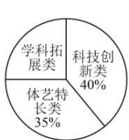
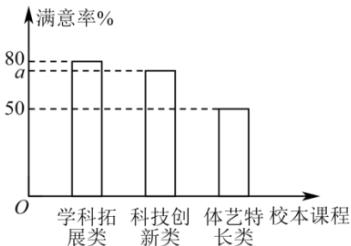

<!-- question-source:start -->
【16】（多选）（2024·高一·甘肃金昌·阶段练习）某校为了更好地支持学生个性发展，开设了学科拓展类、科技创新类、体艺特长类三种类型的校本课程，每位同学从中选择一门课程学习。现对该校5000名学生的选课情况进行了统计，如图1，并用分层随机抽样的方法从中抽取2%的学生对所选课程进行了满意率调查，如图2。则下列说法正确的是（）

图1

图2

A. 满意度调查中抽取的样本容量为 5000
B. 该校学生中选择学科拓展类课程的人数为 1250
C. 该校学生中对体艺特长类课程满意的人数约为 875
D. 若抽取的学生中对科技创新类课程满意的人数为 30, 则 a = 70
<!-- question-source:end -->

![[Q00015166A1]]
