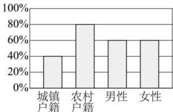

<!-- question-source:start -->
【17】（多选）（2024·高三·浙江杭州·专题练习）我国于2015年10月宣布实施普遍二孩政策，为了解户籍、性别对生育二胎选择倾向的影响，某地从育龄群体中随机抽取了容量为200的调查样本，其中城镇户籍与农村户籍各100人；男性120人，女性80人，绘制的不同群体中倾向选择生育二胎与倾向选择不生育二胎的人数比例图如图所示，其中阴影部分表示倾向选择生育二胎的对应比例，则下列叙述正确的是（）

A. 是否倾向选择生育二胎与户籍有关
B. 是否倾向选择生育二胎与性别无关
C. 调查样本中倾向选择生育二胎的群体中, 男性人数与女性人数相同
D. 倾向选择不生育二胎的群体中, 农村户籍人数多于城镇户籍人数
<!-- question-source:end -->

![[Q00015167A1]]
