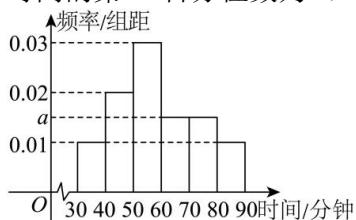

<!-- question-source:start -->
【11】为了解高中学生每天的体育活动时间, 某市教育部门随机抽取1000 高中学生进行调查, 把每天进行体育活动的时间按照时长（单位: 分钟）分成6组: $[30,40)$ , $[40,50)$ , $[50,60)$ , $[60,70)$ , $[70,80)$ , $[80,90]$ . 然后对统计数据整理得到如图所示的频率分布直方图, 则可估计这1000名学生每天体育活动时间的第25百分位数为（）

A. 47.5 B. 45.5 C. 43.5 D. 42.5
<!-- question-source:end -->

![[Q00015182A1]]
