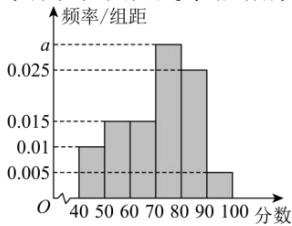

<!-- question-source:start -->
【12】（2024·高三·云南·阶段练习）为进一步提升物业管理和服务质量,某小区随机抽取100名住户开展了年度幸福指数测评活动,将其测评得分（均为整数）分成六组: $[40,50)$ , $[50,60)$ , ..., $[90,100]$ , 并绘制成如图所示的频率分布直方图. 由此估计此次测评中居民幸福指数的第75百分位数为\_\_\_\_.

<!-- question-source:end -->

![[Q00015183A1]]
