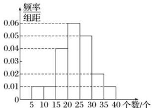

<!-- question-source:start -->
【13】（2023高三上·全国·专题练习）某校排球社的同学为训练动作组织了垫排球比赛，以下为根据排球社50位同学的垫球个数画的频率分布直方图，所有同学垫球数都在5\~40之间.估计垫球数的样本数据的第75百分位数是（）

A. 17.5 B. 18.75 C. 27 D. 28
<!-- question-source:end -->

![[Q00015184A1]]
